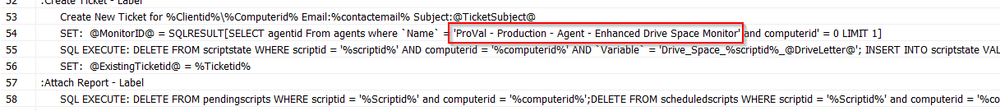

## Summary

This monitor replicates the functionality of the Internal Monitor: 'Enhanced Drive Space Monitor'. Its primary purpose is to identify machines for which tickets have been closed prematurely without effectively resolving the space issue on the respective machine. The monitor scans will output all of the machines that still have the low drive space issue, but for which no ticket has been generated. The monitor is designed to run daily to recreate those problem tickets.

**Note:** The monitor will not detect machines in maintenance mode.

## Dependencies

- [EPM - Disk - Script - Enhanced Disk Space Monitoring Process](/docs/8efd9cc2-b054-4dda-a690-bbe1d4bd16b3)
- [Internal Monitor - ProVal - Production - Agent - Enhanced Drive Space Monitor](/docs/f7235a0b-b6b6-456d-8af3-bd3471b1e70f)

## How to Configure

This monitor must be configured the same as the [Internal Monitor - ProVal - Production - Agent - Enhanced Drive Space Monitor](/docs/f7235a0b-b6b6-456d-8af3-bd3471b1e70f) with the same alert template. It will use the same group and computer-level EDFs.

Simply import this monitor and set the alert template that has been used by the [Internal Monitor - ProVal - Production - Agent - Enhanced Drive Space Monitor](/docs/f7235a0b-b6b6-456d-8af3-bd3471b1e70f).

## Caution

Ensure that the [EPM - Disk - Script - Enhanced Disk Space Monitoring Process](/docs/8efd9cc2-b054-4dda-a690-bbe1d4bd16b3) uses the same name as the [Internal Monitor - ProVal - Production - Agent - Enhanced Drive Space Monitor](/docs/f7235a0b-b6b6-456d-8af3-bd3471b1e70f) at line 54. Otherwise, both monitors will not be able to detect the tickets.

