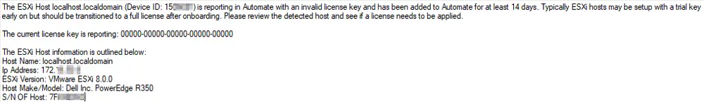

## Summary

The purpose of the monitor set is to detect ESXi hosts with expired or trial version license keys.

## Dependencies

[Script - Ticket Creation - VMWare ESXi Monitoring](/docs/7fbdffc1-7472-4276-914d-1e5b845dcd3c)

## Target

Global

## Ticketing

**Subject:** `VM - ESXi - Invalid License Key Detected - \<ESXHostName>`

**Body:** `The ESXi Host @ESXHostName@ (Device ID: %result%) is reporting in Automate with an invalid license key and has been added to Automate for at least 14 days. Typically, ESXi hosts may be set up with a trial key early on but should be transitioned to a full license after onboarding. Please review the detected host and see if a license needs to be applied. The current license key is reporting: %fieldname%`

## Alert Template

**Name:** `△ Custom - Ticket Creation - ESXi Monitoring`

**The alert template should run the** [CWM - Automate - Script - Ticket Creation - VMWare ESXi Monitoring](/docs/7fbdffc1-7472-4276-914d-1e5b845dcd3c) **script on failure.**
