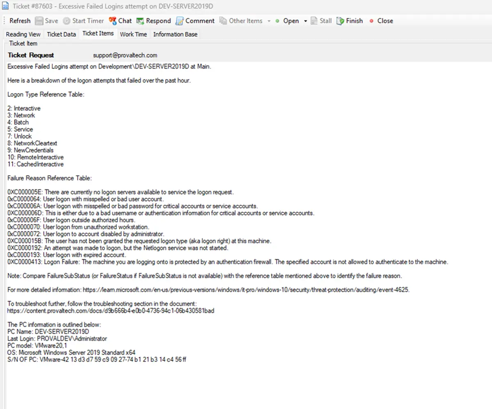

## Summary

Check the computer for security event log event ID 4625 where the count of occurrences is greater than 10 in the last 60 minutes.

The threshold can be modified by updating the value of the `$th` variable in the remote monitor's command. Change this value from 10 to the desired value after importing the remote monitor.

**The monitor set may not perform as expected for PowerShell versions older than 5.**

## Details

**Suggested "Limit to"**: Server Role - AD - Infrastructure Master  
**Suggested Alert Style**: Continuous  
**Suggested Alert Template**: △ Custom - Ticket Creation Computer - Failures Only  

| Check Action | Server Address | Check Type | Execute Info | Comparator | Interval | Result          |
|--------------|----------------|------------|---------------|------------|----------|------------------|
| System       | 127.0.0.1      | Run File   | **REDACTED**    | State Based | 3600     | `<Shown Below>`   |


## Dependencies

[Ticket Creation - Computer [Failures Only]](/docs/e14bf501-f10d-44d7-a19a-2284fd5c5cc9)

## Target

Domain Controllers  
  
  

## Alerting

**Subject:** `Excessive Failed Logins attempt on %COMPUTERNAME%`

**Alert Message on Success:** `There are no potential logon failures detected in the last hour on %CLIENTNAME%\%COMPUTERNAME% at %LOCATIONNAME%`

**Alert Message on Failure:**  
Excessive Failed Logins attempt on %CLIENTNAME%\%COMPUTERNAME% at %LOCATIONNAME%.

Here is a breakdown of the logon attempts that failed over the past hour.  
`%RESULT%`  

**Logon Type Reference Table:**  
```
2: Interactive
3: Network
4: Batch
5: Service
7: Unlock
8: NetworkCleartext
9: NewCredentials
10: RemoteInteractive
11: CachedInteractive
```

**Failure Reason Reference Table:**  
```
0XC000005E: There are currently no logon servers available to service the logon request.
0xC0000064: User logon with misspelled or bad user account.
0xC000006A: User logon with misspelled or bad password for critical accounts or service accounts.
0XC000006D: This is either due to a bad username or authentication information for critical accounts or service accounts.
0xC000006F: User logon outside authorized hours.
0xC0000070: User logon from unauthorized workstation.
0xC0000072: User logon to account disabled by administrator.
0XC000015B: The user has not been granted the requested logon type (aka logon right) at this machine.
0XC0000192: An attempt was made to logon, but the Netlogon service was not started.
0xC0000193: User logon with expired account.
0XC0000413: Logon Failure: The machine you are logging onto is protected by an authentication firewall. The specified account is not allowed to authenticate to the machine.
```

Note: Compare FailureSubStatus (or FailureStatus if FailureSubStatus is not available) with the reference table mentioned above to identify the failure reason.

For more detailed information: [Event 4625 Documentation](https://learn.microsoft.com/en-us/previous-versions/windows/it-pro/windows-10/security/threat-protection/auditing/event-4625)

**Sample Ticket:**  


## Implementation

[Import - Possible Excessive Failed Logins](/docs/5099131e-bdc7-470a-8bd1-011dfc54ef4e)