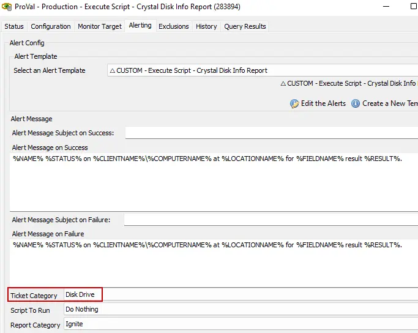
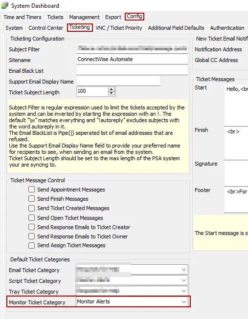

## Summary

The purpose of the internal monitor is to execute the [EPM - Disk - Script - Crystal Disk Info Report](/docs/651e701f-40d0-4657-817c-b81785d441ea) script once per week against the managed Windows machines.

**Note:** The script is supported for PowerShell V5+ only. Hence, the monitor set explicitly excludes operating systems older than Windows 10 or Server 2016. However, if you are certain that the PowerShell version for Server 2012 R2 servers in your environment is updated to v5+, then '**2012 R2**' can be removed from this line in the monitor set's additional field, and it will start running the script on those servers too.

## Dependencies

- [EPM - Disk - Script - Crystal Disk Info Report](/docs/651e701f-40d0-4657-817c-b81785d441ea)  
- [EPM - Disk - Custom Table - pvl_crystal_disk_info](/docs/89182385-f98c-4e8b-ab62-1df0c73bbb1c)  

## Target

Managed Windows Computers

## Alert Template

**Name:** △ CUSTOM - Execute Script - Crystal Disk Info Report

The [EPM - Disk - Script - Crystal Disk Info Report](/docs/651e701f-40d0-4657-817c-b81785d441ea) script should be imported before importing or creating the alert template, as the alert template should execute this script.

## Ticket Category

- ConnectWise Manage board, type, and priority for the ticket can be set by configuring the appropriate ticket category.
- The ticket will be created by the [EPM - Disk - Script - Crystal Disk Info Report](/docs/651e701f-40d0-4657-817c-b81785d441ea) script, and the ticket category can be set at the following levels:
  - In the script's global variables. Setting the relevant ticket category ID in these global variables will allow the script to create a ticket under those categories.  
  
  - At the group level. The ticket category can be set from the groups where the internal monitor is applied. This ticket category will only be picked if global variables are set to 0.  
  
  - On the global monitor set. The ticket category can be selected at the monitor set itself. This ticket category will only be picked if the group-level ticket category is not defined and global variables are set to 0.  
    
  - If the ticket category is not set from any of the above-mentioned places, then the ticket will be generated under the default ticket category.  
    

