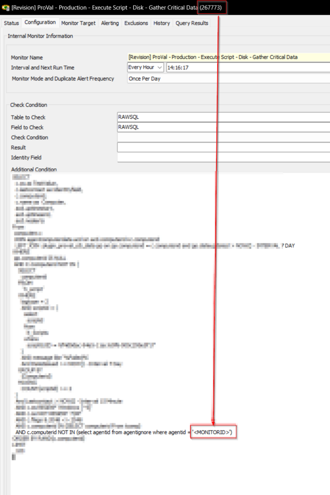

## Summary

The EPM - Disk - Internal Monitor - Execute Script - Disk - Gather Critical Data is an internal monitor component of the solution that runs the EPM - Disk - Script - Disk - Gather Critical Data script on non-virtual Windows workstations once a week. This script executes the EPM - Disk - Agnostic - Get-DiskInfo script, which gathers data about the physical disk, its performance, partitions, logical drives, and storage system. The monitor batches the process to run on 100 machines per hour and attempts to run the script twice a week on any computer identified by the monitor. The data gathered is stored in a custom MySQL table and displayed in a ConnectWise Automate dataview. The EPM - Disk - Internal Monitor - Execute Script - Disk - Gather Critical Data component enables the user to monitor and analyze the hard drive's performance, proactively identifying issues before they result in failure.

## Implementation

- Replace the `\\<MONITORID>` in the Additional Condition with the ID of the monitor set.  

  Before:  
    

  After:  
    

- Set the appropriate groups under the monitor target section. Suggested are Managed Windows Workstations group(s).  
    

## Dependencies

- [EPM - Disk - Script - Disk - Gather Critical Data](/docs/687261c3-e6d7-46bc-84f6-506007d47142)  
- [EPM - Disk - Custom Table - plugin_proval_cdi_data](/docs/7a224177-45ff-4f2e-a8fe-a734a642a539)  
- [CWM - Automate - Script - Ticket Creation - Computer](/docs/63beba3c-f4a6-41a5-98e2-d4e4ce885035)  

## Target

Managed Windows Workstations

## Alert Template

△ Custom - Autofix - Initiate script - Disk - Gather Critical Data  

Note: The alert template must be running the [EPM - Disk - Script - Disk - Gather Critical Data](/docs/687261c3-e6d7-46bc-84f6-506007d47142) script.

