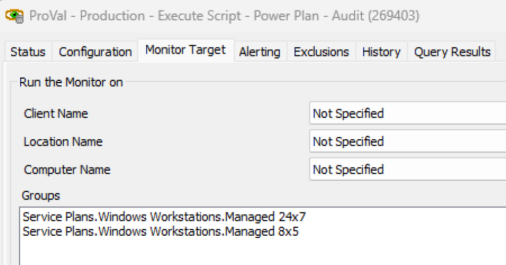
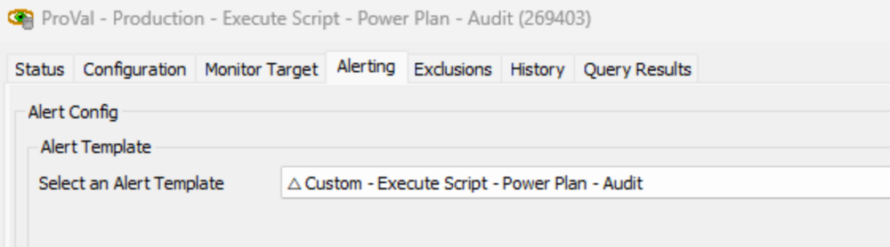
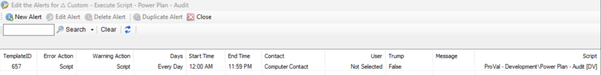

## Summary

The internal monitor executes the [EPM - Data Collection - Script - Power Plan - Audit [DV]](/docs/6e9ec56b-ba57-48cd-8dff-e659c30d2f3d) script once per week against the physical Windows workstations.

## Dependencies

- [EPM - Data Collection - Script - Power Plan - Audit [DV]](/docs/6e9ec56b-ba57-48cd-8dff-e659c30d2f3d)
- [EPM - Data Collection - Custom Table - pvl_powerplan_audit](/docs/9560f2db-f58f-4c07-a9da-2828deabc4cf)

## Target

Managed Workstations  

## Alert Template

**Name:** `△ Custom - Execute Script - Power Plan - Audit`  

  

The alert template should execute the [EPM - Data Collection - Script - Power Plan - Audit [DV]](/docs/6e9ec56b-ba57-48cd-8dff-e659c30d2f3d) script.  

  

