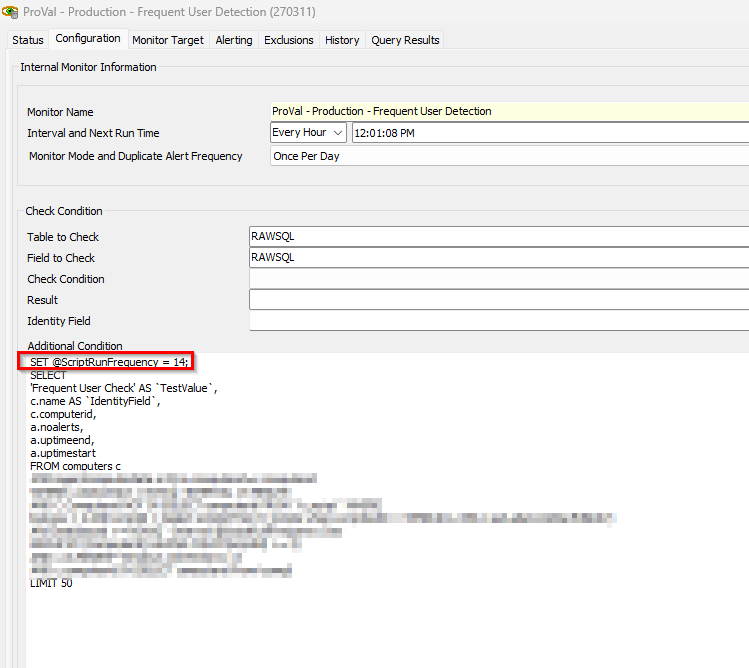

## Summary

This internal monitor is designed to detect online Windows workstation agents where user detection has not occurred in the last 14 days.

You can change the number of days in the monitor to set different script run frequencies, allowing you to customize it to any value, as the dates are compared from the stored value of the EDF "LogonUserCheckDate".

## Dependencies

[CWM - Automate - Script - Stitching Frequent Logon User (Set Computer Contact)](/docs/bef87782-0d9d-40f0-96c5-d30b589b57b4)

## Target

Windows Workstations

