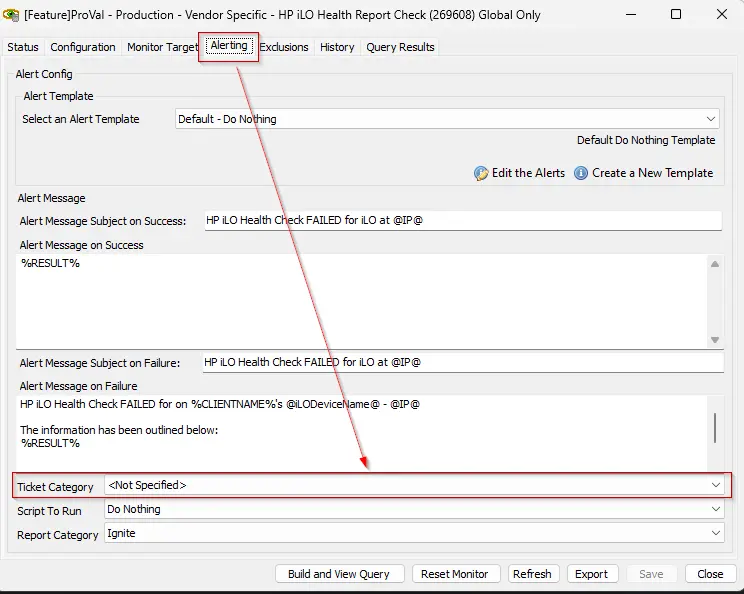

## Summary

Monitors for bad health conditions returned from the script [HP iLO - Health Report - Get](/docs/f28ef90e-ba80-4ba1-9bd6-e4aa4c2b549a) into the custom table [plugin_proval_ilo_health_report](/docs/d6e5e2a7-ecb8-4262-92a1-cc322b4af3b6).

## Dependencies

- [plugin_proval_ilo_health_report](/docs/d6e5e2a7-ecb8-4262-92a1-cc322b4af3b6)
- [HP iLO - Health Report - Get](/docs/f28ef90e-ba80-4ba1-9bd6-e4aa4c2b549a)
- [Get-HPiLOHealthReport](/docs/71faa943-e504-4e87-b8d1-39471af44780)
- [CWM - Automate - Script - Ticket Creation - HP iLO Health Check](/docs/5c6b4bbb-732d-4d97-af38-f10d51a8a96c)

## Target

Global - Should be run without explicitly defined targets.

## Alert Template

**Name:** `△ Custom - Ticket Creation - HP iLO Health Check`

The alert template should execute the [CWM - Automate - Script - Ticket Creation - HP iLO Health Check](/docs/5c6b4bbb-732d-4d97-af38-f10d51a8a96c) script.

## Ticket Category

The ticket category for the tickets can be controlled by the monitor set itself.



## Ticketing

**Subject:** `HP iLO Health Check FAILED for iLO at <IP Address of the iLO Device>`

**Summary:**

```
HP iLO Health Check FAILED for on <Name of the Client>'s <Name of the iLO Device> - <IP Address of the iLO Device>
```

```
The information has been outlined below:
SN: <Serial Number of the iLO Device> | Model: <Model of the iLO Device> | <Problem Detected with the iLO Device>
```

```
See details in the iLO and the iLO Health Report dataview.
```

**Note:** The ticket will be generated for the computer whose computer ID is stored in the title of the password entry for the iLO device. If the computer ID is not stored in the iLO password entry, then a client-level ticket will be created instead.