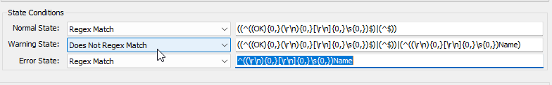

## Summary

This remote monitor will provide alerts on Hyper-V host snapshots that have turned 3 days old in the past hour and will continue to alert until a day threshold is surpassed.

## Details

**Suggested "Limit to"**: Hyper-V Hosts  
**Suggested Group**: `Service Plans/Windows Servers/Server Roles/Windows Servers Core Services/Windows Hyper-V Host`  
**Suggested Alert Style**: `Once`  
**Suggested Alert Template**: `△ Custom - Ticket Creation - Computer`  

| Check Action | Server Address | Check Type | Check Value | Comparator | Interval | Result |
|--------------|----------------|------------|-------------|------------|----------|--------|
| System       | Default        | Run File   | **REDACTED**| State Based | 3600     | Screenshot attached below |



## Target

Service Plans/Windows Servers/Server Roles/Windows Servers Core Services/Windows Hyper-V Host Group.

## Ticketing

**Subject:**  `Hyper-V - Aging Snapshot Detected on %Computername%`  

**Body:**  
```
The Hyper-V Host, %COMPUTERNAME%, has detected a VM snapshot that has an age of 3 days or older. It is important to delete unneeded snapshots since they can cause the server to use extra space over time. Please review the details below and remove the snapshot if it is no longer needed.

%RESULT%
```

**Sample %RESULT%:**  
```
VMName: TestVM
Name: Snapshot1
ParentSnapshotName:
SnapshotType: Standard
CreationTime: 7/16/2024 2:02 PM
```

## Implementation

[Import - Remote Monitor - HyperV - Snapshot Age > 3 Days](/docs/faf8b7d6-6685-43be-a223-0c6ce7195147)