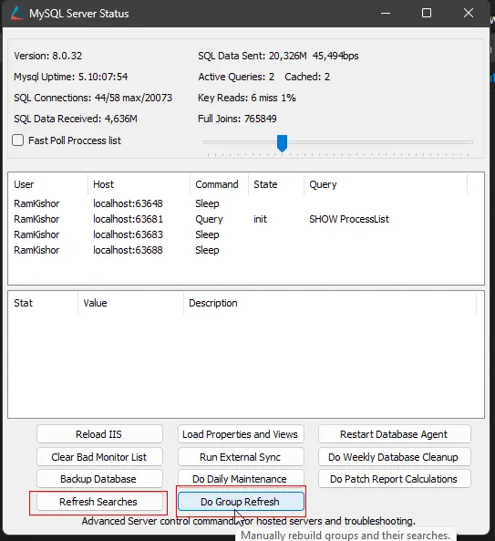
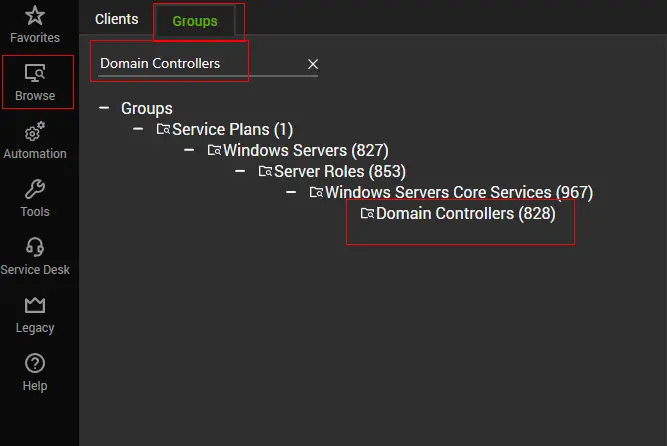
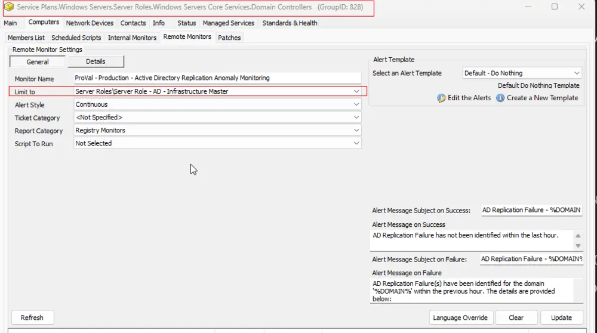

## Step 1
Run this SQL query from a RAWSQL monitor to import the required search.

```sql
INSERT INTO `sensorchecks` (`Name`, `SQL`, `QueryType`, `ListDATA`, `FolderID`, `GUID`, `SearchXML`) 
SELECT 'Server Role - AD - Infrastructure Master', 
'SELECT \n   computers.computerid as `Computer Id`,\n   computers.name as `Computer Name`,\n   clients.name as `Client Name`,\n   computers.domain as `Computer Domain`,\n   computers.username as `Computer User`,\n   IFNULL(IFNULL(edfAssigned1.Value,edfDefault1.value),\'0\') as `Computer - Extra Data Field - Default - Under MSP Contract`,\n   IFNULL(crd2.RoleDefinitionId,0) as `AD Infrastructure Master-2`,\n   IFNULL(IFNULL(edfAssigned3.Value,edfDefault3.value),\'0\') as `Computer - Extra Data Field - Default - Exclude MSP Contract`,\n   IF(INSTR(computers.os, \'server\')>0, 1, 0) as `Computer.OS.IsServer`\nFROM Computers \nLEFT JOIN inv_operatingsystem ON (Computers.ComputerId=inv_operatingsystem.ComputerId)\nLEFT JOIN Clients ON (Computers.ClientId=Clients.ClientId)\nLEFT JOIN Locations ON (Computers.LocationId=Locations.LocationID)\nLEFT JOIN ExtraFieldData edfAssigned1 ON (edfAssigned1.id=Computers.ComputerId and edfAssigned1.ExtraFieldId =(Select ExtraField.id FROM ExtraField WHERE LTGuid=\'45c2da7e-3bf5-11e1-92fd-c1ee63289e9e\'))\nLEFT JOIN ExtraFieldData edfDefault1 ON (edfDefault1.id=0 and edfDefault1.ExtraFieldId =(Select ExtraField.id FROM ExtraField WHERE LTGuid=\'45c2da7e-3bf5-11e1-92fd-c1ee63289e9e\'))\nLEFT JOIN ComputerRoleDefinitions crd2 ON (crd2.ComputerId=Computers.ComputerId And crd2.RoleDefinitionId=(Select RoleDefinitionId From RoleDefinitions Where RoleDetectionGuid=\'e90000d4-2b70-11e3-9392-08002788414b\') And (crd2.Type=1 OR (crd2.CurrentlyDetected=1 and crd2.Type<>2)))\nLEFT JOIN ExtraFieldData edfAssigned3 ON (edfAssigned3.id=Computers.ComputerId and edfAssigned3.ExtraFieldId =(Select ExtraField.id FROM ExtraField WHERE LTGuid=\'a72e229b-3bf5-11e1-92fd-c1ee63289e9e\'))\nLEFT JOIN ExtraFieldData edfDefault3 ON (edfDefault3.id=0 and edfDefault3.ExtraFieldId =(Select ExtraField.id FROM ExtraField WHERE LTGuid=\'a72e229b-3bf5-11e1-92fd-c1ee63289e9e\'))\n WHERE \n((((IFNULL(IFNULL(edfAssigned1.Value,edfDefault1.value),\'0\')<>0) AND (IFNULL(crd2.RoleDefinitionId,0) >0 ) AND (NOT ((IFNULL(IFNULL(edfAssigned3.Value,edfDefault3.value),\'0\')<>0))) AND (IF(INSTR(computers.os, \'server\')>0, 1, 0)<>0))))\n',
'4', 
'READONLY', 
'6', 
'430a4640-9c97-4344-bfe8-7a786b110729', 
'<LabTechAbstractSearch><asn><st>AndNode</st><cn><asn><st>AndNode</st><cn><asn><st>ComparisonNode</st><lon>Computer.Extra Data Field.Default.Under MSP Contract</lon><lok>Computer.Edf.45c2da7e-3bf5-11e1-92fd-c1ee63289e9e</lok><lmo>IsTrue</lmo><dv>NULL</dv><dk>NULL</dk></asn><asn><st>ComparisonNode</st><lon>Computer.LabTech.Roles</lon><lok>Computer.LabTech.Roles</lok><lmo>HasRole</lmo><dv>AD Infrastructure Master</dv><dk>e90000d4-2b70-11e3-9392-08002788414b</dk></asn><asn><st>NotNode</st><cn><asn><st>ComparisonNode</st><lon>Computer.Extra Data Field.Default.Exclude MSP Contract</lon><lok>Computer.Edf.a72e229b-3bf5-11e1-92fd-c1ee63289e9e</lok><lmo>IsTrue</lmo><dv>NULL</dv><dk>NULL</dk></asn></cn></asn><asn><st>ComparisonNode</st><lon>Computer.OS.IsServer</lon><lok>Computer.OS.IsServer</lok><lmo>IsTrue</lmo><dv>NULL</dv><dk>NULL</dk></asn></cn></asn></cn></asn></LabTechAbstractSearch>'
FROM (SELECT MIN(computerid) FROM computers) c 
WHERE (SELECT COUNT(*) FROM sensorchecks WHERE `GUID` = '430a4640-9c97-4344-bfe8-7a786b110729') = 0;
```

## Step 2
Run the provided SQL query to establish the `ProVal - Production - Active Directory Replication Anomaly Monitoring` remote monitor.

```sql
SET @SearchID = (SELECT MIN(sensid) FROM sensorchecks WHERE `GUID` = '430a4640-9c97-4344-bfe8-7a786b110729');
SET @Groupid = (SELECT MIN(groupid) FROM mastergroups WHERE `GUID` = '3ac455da-f1fb-11e1-b4ec-1231391d2d19');

INSERT INTO groupagents
    SELECT '' AS `AgentID`,
           `groupid` AS `GroupID`,
           @SearchID AS `SearchID`,
           'ProVal - Production - Active Directory Replication Anomaly Monitoring' AS `Name`,
           '6' AS `CheckAction`,
           '1' AS `AlertAction`,
           'AD Replication Failure - %DOMAIN%~~~AD Replication Failure has not been identified within the last hour.!!!AD Replication Failure - %DOMAIN%~~~AD Replication Failure(s) have been identified for the domain ''%DOMAIN%'' within the previous hour. The details are provided below:
%RESULT%
For a precise understanding of the error codes returned in the `LastError` property, please consult the following article: https://learn.microsoft.com/en-us/troubleshoot/windows-server/identity/common-active-directory-replication-errors' AS `AlertMessage`,
           '0' AS `ContactID`,
           '3600' AS `interval`,
           '127.0.0.1' AS `Where`,
           '7' AS `What`,
           'C:\\Windows\\System32\\WindowsPowerShell\\v1.0\\powershell.exe -ExecutionPolicy Bypass -Command "$LRS=((Get-ADReplicationPartnerMetadata -Target $((Get-ADdomainController).Domain)) | Sort-Object -Property LastReplicationSuccess -Descending | Select-Object -First 1).LastReplicationSuccess;$LRA=((Get-ADReplicationPartnerMetadata -Target $((Get-ADdomainController).Domain)) | Sort-Object -Property LastReplicationAttempt -Descending | Select-Object -First 1).LastReplicationAttempt;if (($LRS -lt $LRA) -and ($LRA -ge $((Get-Date).AddHours(-1)))){(Get-ADReplicationFailure -Target $((Get-ADdomainController).Domain) -Scope Domain -Erroraction SilentlyContinue| Where-Object {$_.FirstFailureTime -ge $((Get-Date).AddHours(-1)) })}"' AS `DataOut`,
           '16' AS `Comparor`,
           '10|((^((OK){0,}(\\r\\n){0,}[\\r\\n]{0,}\\s{0,})$)%7C(^$))|11|((^((OK){0,}(\\r\\n){0,}[\\r\\n]{0,}\\s{0,})$)%7C(^$))%7C(PartnerGuid)|10|PartnerGuid' AS `DataIn`,
           '' AS `IDField`,
           '0' AS `AlertStyle`,
           '0' AS `ScriptID`,
           '' AS `datacollector`,
           '21' AS `Category`,
           '0' AS `TicketCategory`,
           '1' AS `ScriptTarget`,
           UUID() AS `GUID`,
           'root' AS `UpdatedBy`,
           NOW() AS `UpdateDate`
    FROM mastergroups m
    WHERE m.groupid = @Groupid
      AND m.groupid NOT IN (SELECT DISTINCT groupid FROM groupagents WHERE `Name` = 'ProVal - Production - Active Directory Replication Anomaly Monitoring');
```

## Step 3
Perform `Refresh Searches` and `Do Group Refresh` from the `MySQL Server Status` tool.

  


## Step 4
Validate the presence of the `ProVal - Production - Active Directory Replication Anomaly Monitoring` remote monitor in the group `Domain Controllers`. The remote monitor should be limited to the `Server Role - AD - Infrastructure Master` search.

**Group:**  


**Search:**  


**Remote Monitor:**  


## Step 5
Apply the relevant alert template and ticket category to the remote monitor. It is recommended to utilize the `△ Custom - Ticket Creation Computer - Failures Only` alert template.