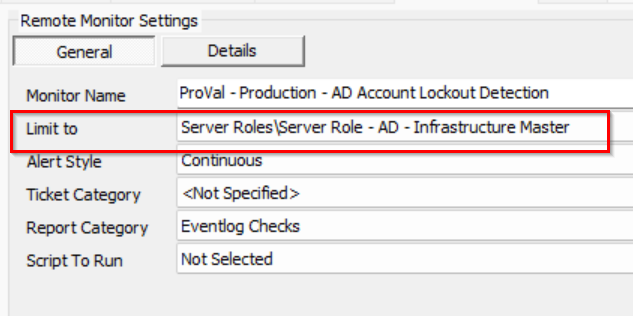

### Step 1
Import the Alert Template `△ Custom - Ticket Creation Computer - Failures Only`.

---

### Step 2
Validate that the [Ticket Creation - Computer [Failures Only]](/docs/e14bf501-f10d-44d7-a19a-2284fd5c5cc9) script was imported as well and that the alert template is executing this script for failures only.

---

### Step 3
Run this SQL query from a RAWSQL monitor set to create and set the remote monitor on the Domain Controllers group:

```sql
SET @Groupid = (SELECT Groupid FROM mastergroups WHERE `GUID` = '3ac455da-f1fb-11e1-b4ec-1231391d2d19');
SET @Searchid = (SELECT sensid FROM sensorchecks WHERE `GUID` = '430a4640-9c97-4344-bfe8-7a786b110729');
INSERT INTO groupagents 
SELECT '' as `AgentID`,
`groupid` as `GroupID`,
@Searchid as `SearchID`,
'ProVal - Production - AD Account Lockout Detection' as `Name`,
'6' as `CheckAction`,
'1' as `AlertAction`,
'AD Account LockOut Detected on %COMPUTERNAME%~~~%RESULT%.!!!AD Account LockOut Detected on %COMPUTERNAME%~~~Here are the details of the user(s) who were locked out:%RESULT%.' as `AlertMessage`,
'0' as `ContactID`,
'900' as `interval`,
'127.0.0.1' as `Where`,
'7' as `What`,
'C:\\Windows\\System32\\WindowsPowerShell\\v1.0\\powershell.exe -ExecutionPolicy Bypass -Command "$st = (Get-Date).AddMinutes(-15); $r = Get-winevent -erroraction silentlycontinue -FilterHashtable @{logname=\'security\'; id=4740; startTime=$st} | ForEach-Object {$ex = ([xml]$_.ToXml()).Event; $e = [ordered]@{EventDate = [DateTime]$ex.System.TimeCreated.SystemTime};$ex.EventData.ChildNodes | ForEach-Object{$e[$_.Name] = $_.\'#text\'};[PsCustomObject]$e}; if ($r) { $r | Select-Object  @{n=\'EventID\';e={\'4740\'}}, @{n=\'EventDate\';e={$_.eventdate}}, @{n=\'Username\';e={$_.TargetUserName}}, @{n=\'Endpoint\';e={$_.TargetDomainName}}, @{n=\'Domain\';e={$_.SubjectDomainName}}, @{n=\'DC\'; e={$_.SubjectUserName}} | Format-List }"' as `DataOut`,
'16' as `Comparor`,
'10|((^((OK){0,}(\\r\\n){0,}[\\r\\n]{0,}\\s{0,})$)%7C(^$))|11|((^((OK){0,}(\\r\\n){0,}[\\r\\n]{0,}\\s{0,})$)%7C(^$))%7C(^((\\r\\n){0,}[\\r\\n]{0,}\\s{0,})EventID)|10|^((\\r\\n){0,}[\\r\\n]{0,}\\s{0,})EventID' as `DataIn`,
'' as `IDField`,
'0' as `AlertStyle`,
'0' as `ScriptID`,
'' as `datacollector`,
'11' as `Category`,
'0' as `TicketCategory`,
'1' as `ScriptTarget`,
UUID() as `GUID`,
'root' as `UpdatedBy`,
(NOW()) as `UpdateDate`
FROM mastergroups m
WHERE m.groupid = @Groupid
AND m.groupid NOT IN (SELECT DISTINCT groupid FROM groupagents WHERE `Name` = 'ProVal - Production - AD Account Lockout Detection');
```

---

### Step 4
Check the `Domain Controllers` group and ensure that the monitor set is created and configured with the correct search.  
**Limit To:** `Server Role - AD - Infrastructure Master`  

  
  

---

### Step 5
Assign the required alert template. It is suggested to use `△ Custom - Ticket Creation Computer - Failures Only` for the best results.
