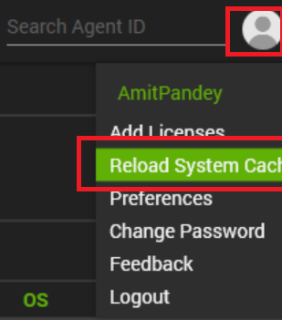

## Implementation

1. Obtain the group ID(s) of the group(s) that the remote monitor should be applied to.

2. Copy the following query and replace **YOUR COMMA SEPARATED LIST OF GROUPID(S)** with the Group ID(s) of the relevant groups:  
   (The string to replace can be found at the very bottom of the query, right after **WHERE**)

```sql
   INSERT INTO groupagents 
    SELECT '' as `AgentID`,
   `groupid` as `GroupID`,
   '0' as `SearchID`,
   'ProVal - Production - Set-PsRepository PSGallery [Change]' as `Name`,
   '6' as `CheckAction`,
   '1' as `AlertAction`,
   '<NoAlert>~~~<NoAlert>!!!<NoAlert>~~~<NoAlert>' as `AlertMessage`,
   '0' as `ContactID`,
   '86400' as `interval`,
   '127.0.0.1' as `Where`,
   '7' as `What`,
   'C:\\Windows\\System32\\WindowsPowerShell\\v1.0\\powershell.exe -ExecutionPolicy Bypass -Command "[Net.ServicePointManager]::SecurityProtocol = [Enum]::ToObject([Net.SecurityProtocolType], 3072); try { Set-PSRepository -Name PSGallery -InstallationPolicy Trusted -ErrorAction Stop } catch { try { Remove-Item "$env:localappdata\\Microsoft\\Windows\\PowerShell\\PowerShellGet\\PSRepositories.xml" -Force -ErrorAction Stop; Register-PSRepository -Default -ErrorAction Stop; if ( (Get-PSRepository -Name \'PsGallery\' -ErrorAction SilentlyContinue).InstallationPolicy -ne \'Trusted\' ) { Set-PSRepository -Name PSGallery -InstallationPolicy Trusted -ErrorAction Stop } } catch { return \\"Failed to set PSGallery as trusted repository. Reason: $($Error[0].Exception.Message)\\" }}" ' as `DataOut`,
   '16' as `Comparor`,
   '10|((^((OK){0,}(\\r\\n){0,}[\\r\\n]{0,}\\s{0,})$)%7C(^$))|11|((^((OK){0,}(\\r\\n){0,}[\\r\\n]{0,}\\s{0,})$)%7C(^$))%7C(^((\\r\\n){0,}[\\r\\n]{0,}\\s{0,})Failed to set PSGallery)|10|^((\\r\\n){0,}[\\r\\n]{0,}\\s{0,})Failed to set PSGallery' as `DataIn`,
   '' as `IDField`,
   '1' as `AlertStyle`,
   '0' as `ScriptID`,
   '' as `datacollector`,
   '21' as `Category`,
   '0' as `TicketCategory`,
   '1' as `ScriptTarget`,
   UUID() as `GUID`,
   'root' as `UpdatedBy`,
   (NOW()) as `UpdateDate`
   FROM mastergroups m
   WHERE m.groupid IN (YOUR COMMA SEPARATED LIST OF GROUPID(S))
   AND m.groupid NOT IN  (SELECT DISTINCT groupid FROM groupagents WHERE `Name` = 'ProVal - Production - Set-PsRepository PSGallery [Change]')
```

3. An example of a query with a group ID:  
```sql
   INSERT INTO groupagents 
    SELECT '' as `AgentID`,
   `groupid` as `GroupID`,
   '0' as `SearchID`,
   'ProVal - Production - Set-PsRepository PSGallery [Change]' as `Name`,
   '6' as `CheckAction`,
   '1' as `AlertAction`,
   '<NoAlert>~~~<NoAlert>!!!<NoAlert>~~~<NoAlert>' as `AlertMessage`,
   '0' as `ContactID`,
   '86400' as `interval`,
   '127.0.0.1' as `Where`,
   '7' as `What`,
   'C:\\Windows\\System32\\WindowsPowerShell\\v1.0\\powershell.exe -ExecutionPolicy Bypass -Command "[Net.ServicePointManager]::SecurityProtocol = [Enum]::ToObject([Net.SecurityProtocolType], 3072); try { Set-PSRepository -Name PSGallery -InstallationPolicy Trusted -ErrorAction Stop } catch { try { Remove-Item "$env:localappdata\\Microsoft\\Windows\\PowerShell\\PowerShellGet\\PSRepositories.xml" -Force -ErrorAction Stop; Register-PSRepository -Default -ErrorAction Stop; if ( (Get-PSRepository -Name \'PsGallery\' -ErrorAction SilentlyContinue).InstallationPolicy -ne \'Trusted\' ) { Set-PSRepository -Name PSGallery -InstallationPolicy Trusted -ErrorAction Stop } } catch { return \\"Failed to set PSGallery as trusted repository. Reason: $($Error[0].Exception.Message)\\" }}" ' as `DataOut`,
   '16' as `Comparor`,
   '10|((^((OK){0,}(\\r\\n){0,}[\\r\\n]{0,}\\s{0,})$)%7C(^$))|11|((^((OK){0,}(\\r\\n){0,}[\\r\\n]{0,}\\s{0,})$)%7C(^$))%7C(^((\\r\\n){0,}[\\r\\n]{0,}\\s{0,})Failed to set PSGallery)|10|^((\\r\\n){0,}[\\r\\n]{0,}\\s{0,})Failed to set PSGallery' as `DataIn`,
   '' as `IDField`,
   '1' as `AlertStyle`,
   '0' as `ScriptID`,
   '' as `datacollector`,
   '21' as `Category`,
   '0' as `TicketCategory`,
   '1' as `ScriptTarget`,
   UUID() as `GUID`,
   'root' as `UpdatedBy`,
   (NOW()) as `UpdateDate`
   FROM mastergroups m
   WHERE m.groupid IN (2,3,855,856)
   AND m.groupid NOT IN  (SELECT DISTINCT groupid FROM groupagents WHERE `Name` = 'ProVal - Production - Set-PsRepository PSGallery [Change]')
```

4. Now execute your query using a RAWSQL monitor set. Once the query is executed, reload the control center.  
     
   Then re-open the group where the monitor is created.

5. Locate your remote monitor by opening the group(s) remote monitors tab, then apply the appropriate alert template.