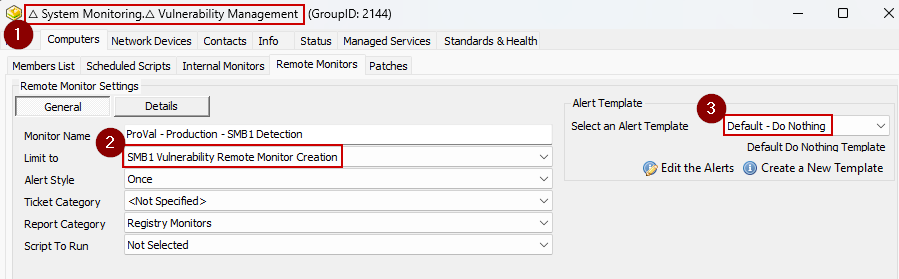

## Step 1: 

Execute the following mySQL queries from a RAWSQL monitor set:

### Insert EDFs

#### Insert EDFs
```sql
INSERT IGNORE INTO `extrafield` (`Form`, `Name`, `Sort`, `NoBreak`, `FType`, `Section`, `UnEditable`, `Collapsed`, `Fill`, `LtGuid`, `IsPassword`, `IsEncrypted`, `IsHidden`, `IsRestricted`, `ViewPermissions`, `EditPermissions`) VALUES (3, 'SMB1 Vulnerability', 0, 0, 2, 'Vulnerability', 0, 0, 'Disabled~Audit with Autofix~Audit Only|Select any option to perform the CVE vulnerability detection or remediation.|2', 'c12fcc47-764f-48dd-a200-98b99a6f5c8d', 0, 0, 0, 0, '', '');
INSERT IGNORE INTO `extrafield` (`Form`, `Name`, `Sort`, `NoBreak`, `FType`, `Section`, `UnEditable`, `Collapsed`, `Fill`, `LtGuid`, `IsPassword`, `IsEncrypted`, `IsHidden`, `IsRestricted`, `ViewPermissions`, `EditPermissions`) VALUES (1, 'SMB1 Vulnerability', 0, 0, 2, 'Vulnerability', 0, 0, 'Disabled~Audit with Autofix~Audit Only|Select any option to perform the CVE vulnerability detection or remediation.|2', '61accb37-b780-4659-9a77-04eff1e68b71', 0, 0, 0, 0, '', '');
INSERT IGNORE INTO `extrafield` (`Form`, `Name`, `Sort`, `NoBreak`, `FType`, `Section`, `UnEditable`, `Collapsed`, `Fill`, `LtGuid`, `IsPassword`, `IsEncrypted`, `IsHidden`, `IsRestricted`, `ViewPermissions`, `EditPermissions`) VALUES (2, 'SMB1 Vulnerability', 0, 0, 2, 'Vulnerability', 0, 0, 'Disabled~Audit with Autofix~Audit Only|Select any option to perform the CVE vulnerability detection or remediation.|2', '77e6376d-3a70-454e-b6d0-d10261177218', 0, 0, 0, 0, '', '');
INSERT IGNORE INTO `extrafield` (`Form`, `Name`, `Sort`, `NoBreak`, `FType`, `Section`, `UnEditable`, `Collapsed`, `Fill`, `LtGuid`, `IsPassword`, `IsEncrypted`, `IsHidden`, `IsRestricted`, `ViewPermissions`, `EditPermissions`) VALUES (1, 'SMBv1 Logging', 0, 0, 0, 'Vulnerability', 0, 0, '', '212c7108-e5c8-498a-8918-237024b92a85', 0, 0, 0, 0, '', '');
INSERT IGNORE INTO `extrafield` (`Form`, `Name`, `Sort`, `NoBreak`, `FType`, `Section`, `UnEditable`, `Collapsed`, `Fill`, `LtGuid`, `IsPassword`, `IsEncrypted`, `IsHidden`, `IsRestricted`, `ViewPermissions`, `EditPermissions`) VALUES (1, 'SMBv1 Status', 0, 0, 0, 'Vulnerability', 0, 0, '', '016ae959-b517-4041-8386-5fe62c808309', 0, 0, 0, 0, '', '');
INSERT IGNORE INTO `extrafield` (`Form`, `Name`, `Sort`, `NoBreak`, `FType`, `Section`, `UnEditable`, `Collapsed`, `Fill`, `LtGuid`, `IsPassword`, `IsEncrypted`, `IsHidden`, `IsRestricted`, `ViewPermissions`, `EditPermissions`) VALUES (1, 'SMBv1 Detection Date', 0, 0, 0, 'Vulnerability', 0, 0, '', '955e2797-5885-48c1-ae93-b86097fe1dfc', 0, 0, 0, 0, '', '');
INSERT IGNORE INTO `extrafield` (`Form`, `Name`, `Sort`, `NoBreak`, `FType`, `Section`, `UnEditable`, `Collapsed`, `Fill`, `LtGuid`, `IsPassword`, `IsEncrypted`, `IsHidden`, `IsRestricted`, `ViewPermissions`, `EditPermissions`) VALUES (1, 'SMBv1 Vulnerability', 0, 0, 0, 'Vulnerability', 0, 0, '', '61accb37-b780-4659-9a77-04eff1e68b71', 0, 0, 0, 0, '', '');
```

### Insert Search: Vulnerability Management

#### Insert Search
```sql
INSERT INTO `sensorchecks` 
SELECT 
'' as `SensID`,
'Vulnerability Management'  as `Name`, 
'SELECT \n   computers.computerid as `Computer Id`,\n   computers.name as `Computer Name`,\n   clients.name as `Client Name`,\n   computers.domain as `Computer Domain`,\n   computers.username as `Computer User`,\n   IFNULL(IFNULL(edfAssigned1.Value,edfDefault1.value),\'0\') as `Computer - Extra Data Field - Default - Onboarding Complete`,\n   IF(INSTR(IFNULL(inv_operatingsystem.Name, Computers.OS), \'windows\')>0, 1, IF(INSTR(IFNULL(inv_operatingsystem.Name, Computers.OS), \'darwin\') >0, 2, 3)) as `Computer.OS.Type`,\n   IFNULL(IFNULL(edfAssigned2.Value,edfDefault2.value),\'0\') as `Computer - Extra Data Field - Default - Exclude MSP Contract`,\n   IF(INSTR(computers.os, \'server\')>0, 1, 0) as `Computer.OS.IsServer`,\n   IFNULL(IFNULL(edfAssigned3.Value,edfDefault3.value),\'\') as `Computer - Location - Extra Data Field - Default - Server Service Plan`,\n   IFNULL(IFNULL(edfAssigned4.Value,edfDefault4.value),\'\') as `Computer - Location - Extra Data Field - Default - Server Service Plan`,\n   IFNULL(IFNULL(edfAssigned5.Value,edfDefault5.value),\'\') as `Computer - Location - Extra Data Field - Default - Server Service Plan`,\n   IFNULL(IFNULL(edfAssigned6.Value,edfDefault6.value),\'\') as `Computer - Location - Extra Data Field - Default - Workstation Service Plan`,\n   IFNULL(IFNULL(edfAssigned7.Value,edfDefault7.value),\'\') as `Computer - Location - Extra Data Field - Default - Workstation Service Plan`,\n   IFNULL(IFNULL(edfAssigned8.Value,edfDefault8.value),\'\') as `Computer - Location - Extra Data Field - Default - Workstation Service Plan`\nFROM Computers \nLEFT JOIN inv_operatingsystem ON (Computers.ComputerId=inv_operatingsystem.ComputerId)\nLEFT JOIN Clients ON (Computers.ClientId=Clients.ClientId)\nLEFT JOIN Locations ON (Computers.LocationId=Locations.LocationID)\nLEFT JOIN ExtraFieldData edfAssigned1 ON (edfAssigned1.id=Computers.ComputerId and edfAssigned1.ExtraFieldId =(Select ExtraField.id FROM ExtraField WHERE LTGuid=\'553438e0-b7e1-11e0-aac1-9d777f14e852\'))\nLEFT JOIN ExtraFieldData edfDefault1 ON (edfDefault1.id=0 and edfDefault1.ExtraFieldId =(Select ExtraField.id FROM ExtraField WHERE LTGuid=\'553438e0-b7e1-11e0-aac1-9d777f14e852\'))\nLEFT JOIN ExtraFieldData edfAssigned2 ON (edfAssigned2.id=Computers.ComputerId and edfAssigned2.ExtraFieldId =(Select ExtraField.id FROM ExtraField WHERE LTGuid=\'a72e229b-3bf5-11e1-92fd-c1ee63289e9e\'))\nLEFT JOIN ExtraFieldData edfDefault2 ON (edfDefault2.id=0 and edfDefault2.ExtraFieldId =(Select ExtraField.id FROM ExtraField WHERE LTGuid=\'a72e229b-3bf5-11e1-92fd-c1ee63289e9e\'))\nLEFT JOIN ExtraFieldData edfAssigned3 ON (edfAssigned3.id=Locations.LocationId and edfAssigned3.ExtraFieldId =(Select ExtraField.id FROM ExtraField WHERE LTGuid=\'5ca92306-2d93-11e1-ac0f-3d76979114ae\'))\nLEFT JOIN ExtraFieldData edfDefault3 ON (edfDefault3.id=0 and edfDefault3.ExtraFieldId =(Select ExtraField.id FROM ExtraField WHERE LTGuid=\'5ca92306-2d93-11e1-ac0f-3d76979114ae\'))\nLEFT JOIN ExtraFieldData edfAssigned4 ON (edfAssigned4.id=Locations.LocationId and edfAssigned4.ExtraFieldId =(Select ExtraField.id FROM ExtraField WHERE LTGuid=\'5ca92306-2d93-11e1-ac0f-3d76979114ae\'))\nLEFT JOIN ExtraFieldData edfDefault4 ON (edfDefault4.id=0 and edfDefault4.ExtraFieldId =(Select ExtraField.id FROM ExtraField WHERE LTGuid=\'5ca92306-2d93-11e1-ac0f-3d76979114ae\'))\nLEFT JOIN ExtraFieldData edfAssigned5 ON (edfAssigned5.id=Locations.LocationId and edfAssigned5.ExtraFieldId =(Select ExtraField.id FROM ExtraField WHERE LTGuid=\'5ca92306-2d93-11e1-ac0f-3d76979114ae\'))\nLEFT JOIN ExtraFieldData edfDefault5 ON (edfDefault5.id=0 and edfDefault5.ExtraFieldId =(Select ExtraField.id FROM ExtraField WHERE LTGuid=\'5ca92306-2d93-11e1-ac0f-3d76979114ae\'))\nLEFT JOIN ExtraFieldData edfAssigned6 ON (edfAssigned6.id=Locations.LocationId and edfAssigned6.ExtraFieldId =(Select ExtraField.id FROM ExtraField WHERE LTGuid=\'55346207-b7e1-11e0-aac1-9d777f14e852\'))\nLEFT JOIN ExtraFieldData edfDefault6 ON (edfDefault6.id=0 and edfDefault6.ExtraFieldId =(Select ExtraField.id FROM ExtraField WHERE LTGuid=\'55346207-b7e1-11e0-aac1-9d777f14e852\'))\nLEFT JOIN ExtraFieldData edfAssigned7 ON (edfAssigned7.id=Locations.LocationId and edfAssigned7.ExtraFieldId =(Select ExtraField.id FROM ExtraField WHERE LTGuid=\'55346207-b7e1-11e0-aac1-9d777f14e852\'))\nLEFT JOIN ExtraFieldData edfDefault7 ON (edfDefault7.id=0 and edfDefault7.ExtraFieldId =(Select ExtraField.id FROM ExtraField WHERE LTGuid=\'55346207-b7e1-11e0-aac1-9d777f14e852\'))\nLEFT JOIN ExtraFieldData edfAssigned8 ON (edfAssigned8.id=Locations.LocationId and edfAssigned8.ExtraFieldId =(Select ExtraField.id FROM ExtraField WHERE LTGuid=\'55346207-b7e1-11e0-aac1-9d777f14e852\'))\nLEFT JOIN ExtraFieldData edfDefault8 ON (edfDefault8.id=0 and edfDefault8.ExtraFieldId =(Select ExtraField.id FROM ExtraField WHERE LTGuid=\'55346207-b7e1-11e0-aac1-9d777f14e852\'))\n WHERE \n((((IFNULL(IFNULL(edfAssigned1.Value,edfDefault1.value),\'0\')<>0) AND (IF(INSTR(IFNULL(inv_operatingsystem.Name, Computers.OS), \'windows\')>0, 1, IF(INSTR(IFNULL(inv_operatingsystem.Name, Computers.OS), \'darwin\') >0, 2, 3)) = \'1\') AND (NOT ((IFNULL(IFNULL(edfAssigned2.Value,edfDefault2.value),\'0\')<>0))) AND (((((IF(INSTR(computers.os, \'server\')>0, 1, 0)<>0) AND (IFNULL(IFNULL(edfAssigned3.Value,edfDefault3.value),\'\') <> \'None\') AND (IFNULL(IFNULL(edfAssigned4.Value,edfDefault4.value),\'\') <> \'Not Selected\') AND (IFNULL(IFNULL(edfAssigned5.Value,edfDefault5.value),\'\') <> \'No Contract\'))) OR (((IF(INSTR(computers.os, \'server\')>0, 1, 0)=0) AND (IFNULL(IFNULL(edfAssigned6.Value,edfDefault6.value),\'\') <> \'None\') AND (IFNULL(IFNULL(edfAssigned7.Value,edfDefault7.value),\'\') <> \'Not Selected\') AND (IFNULL(IFNULL(edfAssigned8.Value,edfDefault8.value),\'\') = \'No Contract\'))))))))\n' as `SQL`,
'4' as `QueryType`,
'Select||=||=||=|^Select|||||||^' as `ListData`,
'0' as `FolderID`,
'47d73828-38b1-4289-ae68-3017cf968ff7' as `GUID`,
'<LabTechAbstractSearch><asn><st>AndNode</st><cn><asn><st>AndNode</st><cn><asn><st>ComparisonNode</st><lon>Computer.Extra Data Field.Default.Onboarding Complete</lon><lok>Computer.Edf.553438e0-b7e1-11e0-aac1-9d777f14e852</lok><lmo>IsTrue</lmo><dv>NULL</dv><dk>NULL</dk></asn><asn><st>ComparisonNode</st><lon>Computer.OS.Type</lon><lok>Computer.OS.Type</lok><lmo>Equals</lmo><dv>Windows</dv><dk>1</dk></asn><asn><st>NotNode</st><cn><asn><st>ComparisonNode</st><lon>Computer.Extra Data Field.Default.Exclude MSP Contract</lon><lok>Computer.Edf.a72e229b-3bf5-11e1-92fd-c1ee63289e9e</lok><lmo>IsTrue</lmo><dv>NULL</dv><dk>NULL</dk></asn></cn></asn><asn><st>OrNode</st><cn><asn><st>AndNode</st><cn><asn><st>ComparisonNode</st><lon>Computer.OS.IsServer</lon><lok>Computer.OS.IsServer</lok><lmo>IsTrue</lmo><dv>NULL</dv><dk>NULL</dk></asn><asn><st>ComparisonNode</st><lon>Computer.Location.Extra Data Field.Default.Server Service Plan</lon><lok>Computer.Location.Edf.5ca92306-2d93-11e1-ac0f-3d76979114ae</lok><lmo>NotEqual</lmo><dv>None</dv><dk>None</dk></asn><asn><st>ComparisonNode</st><lon>Computer.Location.Extra Data Field.Default.Server Service Plan</lon><lok>Computer.Location.Edf.5ca92306-2d93-11e1-ac0f-3d76979114ae</lok><lmo>NotEqual</lmo><dv>Not Selected</dv><dk>Not Selected</dk></asn><asn><st>ComparisonNode</st><lon>Computer.Location.Extra Data Field.Default.Server Service Plan</lon><lok>Computer.Location.Edf.5ca92306-2d93-11e1-ac0f-3d76979114ae</lok><lmo>NotEqual</lmo><dv>No Contract</dv><dk>No Contract</dk></asn></cn></asn><asn><st>AndNode</st><cn><asn><st>ComparisonNode</st><lon>Computer.OS.IsServer</lon><lok>Computer.OS.IsServer</lok><lmo>IsFalse</lmo><dv>NULL</dv><dk>NULL</dk></asn><asn><st>ComparisonNode</st><lon>Computer.Location.Extra Data Field.Default.Workstation Service Plan</lon><lok>Computer.Location.Edf.55346207-b7e1-11e0-aac1-9d777f14e852</lok><lmo>NotEqual</lmo><dv>None</dv><dk>None</dk></asn><asn><st>ComparisonNode</st><lon>Computer.Location.Extra Data Field.Default.Workstation Service Plan</lon><lok>Computer.Location.Edf.55346207-b7e1-11e0-aac1-9d777f14e852</lok><lmo>NotEqual</lmo><dv>Not Selected</dv><dk>Not Selected</dk></asn><asn><st>ComparisonNode</st><lon>Computer.Location.Extra Data Field.Default.Workstation Service Plan</lon><lok>Computer.Location.Edf.55346207-b7e1-11e0-aac1-9d777f14e852</lok><lmo>Equals</lmo><dv>No Contract</dv><dk>No Contract</dk></asn></cn></asn></cn></asn></cn></asn></cn></asn></LabTechAbstractSearch>' as `SearchXML`,
(NULL) as `UpdatedBy`,
(NULL) as `UpdateDate`
FROM  (SELECT MIN(computerid) FROM computers) a
Where (SELECT count(*) From SensorChecks where `GUID` = '47d73828-38b1-4289-ae68-3017cf968ff7') = 0 ;
```
### Insert Search: SMB1 Vulnerability Remote Monitor Creation

#### Insert Search
```sql
INSERT INTO `sensorchecks` 
SELECT 
'' as `SensID`,
'SMB1 Vulnerability Remote Monitor Creation'  as `Name`, 
'SELECT \n   computers.computerid as `Computer Id`,\n   computers.name as `Computer Name`,\n   clients.name as `Client Name`,\n   computers.domain as `Computer Domain`,\n   computers.username as `Computer User`,\n   IFNULL(IFNULL(edfAssigned1.Value,edfDefault1.value),\'\') as `Computer - Client - Extra Data Field - Vulnerability - SMB1 Vulnerability`,\n   IFNULL(IFNULL(edfAssigned2.Value,edfDefault2.value),\'\') as `Computer - Location - Extra Data Field - Vulnerability - SMB1 Vulnerability`,\n   IFNULL(IFNULL(edfAssigned3.Value,edfDefault3.value),\'\') as `Computer - Extra Data Field - Vulnerability - SMB1 Vulnerability`,\n   IFNULL(IFNULL(edfAssigned4.Value,edfDefault4.value),\'\') as `Computer - Client - Extra Data Field - Vulnerability - SMB1 Vulnerability`,\n   IFNULL(IFNULL(edfAssigned5.Value,edfDefault5.value),\'\') as `Computer - Location - Extra Data Field - Vulnerability - SMB1 Vulnerability`,\n   IFNULL(IFNULL(edfAssigned6.Value,edfDefault6.value),\'\') as `Computer - Extra Data Field - Vulnerability - SMB1 Vulnerability`,\n   IFNULL(IFNULL(edfAssigned7.Value,edfDefault7.value),\'\') as `Computer - Client - Extra Data Field - Vulnerability - SMB1 Vulnerability`,\n   IFNULL(IFNULL(edfAssigned8.Value,edfDefault8.value),\'\') as `Computer - Location - Extra Data Field - Vulnerability - SMB1 Vulnerability`,\n   IFNULL(IFNULL(edfAssigned9.Value,edfDefault9.value),\'\') as `Computer - Extra Data Field - Vulnerability - SMB1 Vulnerability`\nFROM Computers \nLEFT JOIN inv_operatingsystem ON (Computers.ComputerId=inv_operatingsystem.ComputerId)\nLEFT JOIN Clients ON (Computers.ClientId=Clients.ClientId)\nLEFT JOIN Locations ON (Computers.LocationId=Locations.LocationID)\nLEFT JOIN ExtraFieldData edfAssigned1 ON (edfAssigned1.id=Clients.ClientId and edfAssigned1.ExtraFieldId =(Select ExtraField.id FROM ExtraField WHERE LTGuid=\'c12fcc47-764f-48dd-a200-98b99a6f5c8d\'))\nLEFT JOIN ExtraFieldData edfDefault1 ON (edfDefault1.id=0 and edfDefault1.ExtraFieldId =(Select ExtraField.id FROM ExtraField WHERE LTGuid=\'c12fcc47-764f-48dd-a200-98b99a6f5c8d\'))\nLEFT JOIN ExtraFieldData edfAssigned2 ON (edfAssigned2.id=Locations.LocationId and edfAssigned2.ExtraFieldId =(Select ExtraField.id FROM ExtraField WHERE LTGuid=\'02f643c0-259d-495b-a0b1-e58c347fda7c\'))\nLEFT JOIN ExtraFieldData edfDefault2 ON (edfDefault2.id=0 and edfDefault2.ExtraFieldId =(Select ExtraField.id FROM ExtraField WHERE LTGuid=\'02f643c0-259d-495b-a0b1-e58c347fda7c\'))\nLEFT JOIN ExtraFieldData edfAssigned3 ON (edfAssigned3.id=Computers.ComputerId and edfAssigned3.ExtraFieldId =(Select ExtraField.id FROM ExtraField WHERE LTGuid=\'77e6376d-3a70-454e-b6d0-d10261177218\'))\nLEFT JOIN ExtraFieldData edfDefault3 ON (edfDefault3.id=0 and edfDefault3.ExtraFieldId =(Select ExtraField.id FROM ExtraField WHERE LTGuid=\'77e6376d-3a70-454e-b6d0-d10261177218\'))\nLEFT JOIN ExtraFieldData edfAssigned4 ON (edfAssigned4.id=Clients.ClientId and edfAssigned4.ExtraFieldId =(Select ExtraField.id FROM ExtraField WHERE LTGuid=\'c12fcc47-764f-48dd-a200-98b99a6f5c8d\'))\nLEFT JOIN ExtraFieldData edfDefault4 ON (edfDefault4.id=0 and edfDefault4.ExtraFieldId =(Select ExtraField.id FROM ExtraField WHERE LTGuid=\'c12fcc47-764f-48dd-a200-98b99a6f5c8d\'))\nLEFT JOIN ExtraFieldData edfAssigned5 ON (edfAssigned5.id=Locations.LocationId and edfAssigned5.ExtraFieldId =(Select ExtraField.id FROM ExtraField WHERE LTGuid=\'02f643c0-259d-495b-a0b1-e58c347fda7c\'))\nLEFT JOIN ExtraFieldData edfDefault5 ON (edfDefault5.id=0 and edfDefault5.ExtraFieldId =(Select ExtraField.id FROM ExtraField WHERE LTGuid=\'02f643c0-259d-495b-a0b1-e58c347fda7c\'))\nLEFT JOIN ExtraFieldData edfAssigned6 ON (edfAssigned6.id=Computers.ComputerId and edfAssigned6.ExtraFieldId =(Select ExtraField.id FROM ExtraField WHERE LTGuid=\'77e6376d-3a70-454e-b6d0-d10261177218\'))\nLEFT JOIN ExtraFieldData edfDefault6 ON (edfDefault6.id=0 and edfDefault6.ExtraFieldId =(Select ExtraField.id FROM ExtraField WHERE LTGuid=\'77e6376d-3a70-454e-b6d0-d10261177218\'))\nLEFT JOIN ExtraFieldData edfAssigned7 ON (edfAssigned7.id=Clients.ClientId and edfAssigned7.ExtraFieldId =(Select ExtraField.id FROM ExtraField WHERE LTGuid=\'c12fcc47-764f-48dd-a200-98b99a6f5c8d\'))\nLEFT JOIN ExtraFieldData edfDefault7 ON (edfDefault7.id=0 and edfDefault7.ExtraFieldId =(Select ExtraField.id FROM ExtraField WHERE LTGuid=\'c12fcc47-764f-48dd-a200-98b99a6f5c8d\'))\nLEFT JOIN ExtraFieldData edfAssigned8 ON (edfAssigned8.id=Locations.LocationId and edfAssigned8.ExtraFieldId =(Select ExtraField.id FROM ExtraField WHERE LTGuid=\'02f643c0-259d-495b-a0b1-e58c347fda7c\'))\nLEFT JOIN ExtraFieldData edfDefault8 ON (edfDefault8.id=0 and edfDefault8.ExtraFieldId =(Select ExtraField.id FROM ExtraField WHERE LTGuid=\'02f643c0-259d-495b-a0b1-e58c347fda7c\'))\nLEFT JOIN ExtraFieldData edfAssigned9 ON (edfAssigned9.id=Computers.ComputerId and edfAssigned9.ExtraFieldId =(Select ExtraField.id FROM ExtraField WHERE LTGuid=\'77e6376d-3a70-454e-b6d0-d10261177218\'))\nLEFT JOIN ExtraFieldData edfDefault9 ON (edfDefault9.id=0 and edfDefault9.ExtraFieldId =(Select ExtraField.id FROM ExtraField WHERE LTGuid=\'77e6376d-3a70-454e-b6d0-d10261177218\'))\n WHERE \n((((((IFNULL(IFNULL(edfAssigned1.Value,edfDefault1.value),\'\') like \'Audit%\') AND (IFNULL(IFNULL(edfAssigned2.Value,edfDefault2.value),\'\') <> \'Disabled\') AND (IFNULL(IFNULL(edfAssigned3.Value,edfDefault3.value),\'\') <> \'Disabled\'))) OR (((NOT ((IFNULL(IFNULL(edfAssigned4.Value,edfDefault4.value),\'\') like \'Audit%\'))) AND (IFNULL(IFNULL(edfAssigned5.Value,edfDefault5.value),\'\') like \'Audit%\') AND (IFNULL(IFNULL(edfAssigned6.Value,edfDefault6.value),\'\') <> \'Disabled\'))) OR (((NOT ((IFNULL(IFNULL(edfAssigned7.Value,edfDefault7.value),\'\') like \'Audit%\'))) AND (NOT ((IFNULL(IFNULL(edfAssigned8.Value,edfDefault8.value),\'\') like \'Audit%\'))) AND (IFNULL(IFNULL(edfAssigned9.Value,edfDefault9.value),\'\') like \'Audit%\'))))))\n' as `SQL`,
'4' as `QueryType`,
'Select||=||=||=|^Select|||||||^' as `ListData`,
'0' as `FolderID`,
'0353b13c-69ec-484d-946e-7925fc9d096d' as `GUID`,
'<LabTechAbstractSearch><asn><st>AndNode</st><cn><asn><st>OrNode</st><cn><asn><st>AndNode</st><cn><asn><st>ComparisonNode</st><lon>Computer.Client.Extra Data Field.Vulnerability.SMB1 Vulnerability</lon><lok>Computer.Client.Edf.c12fcc47-764f-48dd-a200-98b99a6f5c8d</lok><lmo>TextLike</lmo><dv>Audit%</dv><dk>Audit%</dk></asn><asn><st>ComparisonNode</st><lon>Computer.Location.Extra Data Field.Vulnerability.SMB1 Vulnerability</lon><lok>Computer.Location.Edf.02f643c0-259d-495b-a0b1-e58c347fda7c</lok><lmo>NotEqual</lmo><dv>Disabled</dv><dk>Disabled</dk></asn><asn><st>ComparisonNode</st><lon>Computer.Extra Data Field.Vulnerability.SMB1 Vulnerability</lon><lok>Computer.Edf.77e6376d-3a70-454e-b6d0-d10261177218</lok><lmo>NotEqual</lmo><dv>Disabled</dv><dk>Disabled</dk></asn></cn></asn><asn><st>AndNode</st><cn><asn><st>NotNode</st><cn><asn><st>ComparisonNode</st><lon>Computer.Client.Extra Data Field.Vulnerability.SMB1 Vulnerability</lon><lok>Computer.Client.Edf.c12fcc47-764f-48dd-a200-98b99a6f5c8d</lok><lmo>TextLike</lmo><dv>Audit%</dv><dk>Audit%</dk></asn></cn></asn><asn><st>ComparisonNode</st><lon>Computer.Location.Extra Data Field.Vulnerability.SMB1 Vulnerability</lon><lok>Computer.Location.Edf.02f643c0-259d-495b-a0b1-e58c347fda7c</lok><lmo>TextLike</lmo><dv>Audit%</dv><dk>Audit%</dk></asn><asn><st>ComparisonNode</st><lon>Computer.Extra Data Field.Vulnerability.SMB1 Vulnerability</lon><lok>Computer.Edf.77e6376d-3a70-454e-b6d0-d10261177218</lok><lmo>NotEqual</lmo><dv>Disabled</dv><dk>Disabled</dk></asn></cn></asn><asn><st>AndNode</st><cn><asn><st>NotNode</st><cn><asn><st>ComparisonNode</st><lon>Computer.Client.Extra Data Field.Vulnerability.SMB1 Vulnerability</lon><lok>Computer.Client.Edf.c12fcc47-764f-48dd-a200-98b99a6f5c8d</lok><lmo>TextLike</lmo><dv>Audit%</dv><dk>Audit%</dk></asn></cn></asn><asn><st>NotNode</st><cn><asn><st>ComparisonNode</st><lon>Computer.Location.Extra Data Field.Vulnerability.SMB1 Vulnerability</lon><lok>Computer.Location.Edf.02f643c0-259d-495b-a0b1-e58c347fda7c</lok><lmo>TextLike</lmo><dv>Audit%</dv><dk>Audit%</dk></asn></cn></asn><asn><st>ComparisonNode</st><lon>Computer.Extra Data Field.Vulnerability.SMB1 Vulnerability</lon><lok>Computer.Edf.77e6376d-3a70-454e-b6d0-d10261177218</lok><lmo>TextLike</lmo><dv>Audit%</dv><dk>Audit%</dk></asn></cn></asn></cn></asn></cn></asn></LabTechAbstractSearch>' as `SearchXML`,
(NULL) as `UpdatedBy`,
(NULL) as `UpdateDate`
FROM  (SELECT MIN(computerid) FROM computers) a
Where (SELECT count(*) From SensorChecks where `GUID` = '0353b13c-69ec-484d-946e-7925fc9d096d') = 0;
```
### Insert Group:  △ System Monitoring

```sql
INSERT INTO `mastergroups`  
SELECT
'' as `GroupID`,
'0' as `ParentID`,
',' as `Parents`,
',' as Children,
'0' as `Depth`,
 '△ System Monitoring' as `Name`,
 '△ System Monitoring' as `FullName`,
 '0' as `Permissions`,
 '0' as `Template`,
'0' as `AutoJoinScript`,
'2' as `Master`,
'0' as `LimitToParent`,
'0' as `Control`,
 '0' as `ControlID`,
 '' as `Notes`,
 '0' as `MaintenanceID`,
 (NOW()) as `MaintWindowApplied`,
 '5' as `GroupType`,
 '5' as `Priority`,
 '1749280f-9114-11ed-9c83-000c295e5f17' as `GUID`,
 (NULL) as `AssetID`,
 (NULL) as `NetworkPermissions`, 
 '0' as `NetworkJoin`,
 '0' as `NetworkJoinOptions`,
 (NULL) as  `ContactPermissions`, 
 '0' as `ContactJoin`, 
 '0' as `ContactJoinOptions`
FROM  (SELECT MIN(computerid) FROM computers) a
Where (SELECT count(*) From MasterGroups where `GUID` =  '1749280f-9114-11ed-9c83-000c295e5f17' ) = 0 ;
```

### Insert Group: △ System Monitoring.△ Vulnerability Management

```sql
SET @Searchid = (SELECT sensid from sensorchecks where `GUID` = '47d73828-38b1-4289-ae68-3017cf968ff7') ;
SET @Parentid = (SELECT MIN(groupid) FROM mastergroups WHERE `GUID` = '1749280f-9114-11ed-9c83-000c295e5f17') ;
SET @Parents = (SELECT CONCAT(',',MIN(groupid),',') FROM mastergroups WHERE `GUID` = '1749280f-9114-11ed-9c83-000c295e5f17') ;
INSERT INTO `mastergroups`  
SELECT
'' as `GroupID`,
@ParentID as `ParentID`,
@Parents as `Parents`,
',' as Children,
'1' as `Depth`,
 '△ Vulnerability Management' as `Name`,
 '△ System Monitoring.△ Vulnerability Management' as `FullName`,
 '0' as `Permissions`,
 '0' as `Template`,
@SearchID as `AutoJoinScript`,
'2' as `Master`,
'1' as `LimitToParent`,
'0' as `Control`,
 '0' as `ControlID`,
 '' as `Notes`,
 '0' as `MaintenanceID`,
 (NOW()) as `MaintWindowApplied`,
 '4' as `GroupType`,
 '5' as `Priority`,
 'eaf01ee9-2c88-41e7-8f54-1b6a1eb80914' as `GUID`,
 (NULL) as `AssetID`,
 (NULL) as `NetworkPermissions`, 
 '0' as `NetworkJoin`,
 '0' as `NetworkJoinOptions`,
 (NULL) as  `ContactPermissions`, 
 '0' as `ContactJoin`, 
 '0' as `ContactJoinOptions`
FROM  (SELECT MIN(computerid) FROM computers) a
Where (SELECT count(*) From MasterGroups where `GUID` =  'eaf01ee9-2c88-41e7-8f54-1b6a1eb80914' ) = 0 ;
```

### Insert Remote Monitor: ProVal - Production - SMB1 Detection

```sql
SET @Groupid = (SELECT GroupID From mastergroups WHERE guid = 'eaf01ee9-2c88-41e7-8f54-1b6a1eb80914') ;
SET @Searchid = (SELECT sensid from sensorchecks where GUID = '0353b13c-69ec-484d-946e-7925fc9d096d');
SET @alertaction = 1;
INSERT INTO groupagents 
SELECT '' as `AgentID`,
`groupid` as `GroupID`,
@Searchid as `SearchID`,
'ProVal - Production - SMB1 Detection' as `Name`,
'6' as `CheckAction`,
@alertaction as `AlertAction`,
'[No Alerting]~~~%STATUS% on %CLIENTNAME%\\%COMPUTERNAME% at %LOCATIONNAME% for %FIELDNAME% result %RESULT%.!!![No Alerting]~~~%STATUS% on %CLIENTNAME%\\%COMPUTERNAME% at %LOCATIONNAME% for %FIELDNAME% result %RESULT%.' as `AlertMessage`,
'0' as `ContactID`,
'7200' as `interval`,
'127.0.0.1' as `Where`,
'7' as `What`,
'C:\\Windows\\System32\\WindowsPowerShell\\v1.0\\powershell.exe -ExecutionPolicy Bypass -nologo -noprofile -Command "$ErroractionPreference= \'SilentlyContinue\';  $ver = [Version](get-WmiObject -Class Win32_OperatingSystem).version; "$($ver.Major).$($ver.Minor)"; if($ver -ge [version]\'6.3\') {if ( ( (Get-SmbServerConfiguration).EnableSMB1Protocol )  -ne \'True\') {return \'False\'} else {return \'True\'} } else { $s =  (Get-Item HKLM:\\SYSTEM\\CurrentControlSet\\Services\\LanmanServer\\Parameters | ForEach-Object {Get-ItemProperty $_.pspath -Name SMB1} );  if ( ( -not $s ) -or ( $s -contains 1 )) {return \'True\'} else {return \'False\'} }"' as `DataOut`,
'9' as `Comparor`,
'True' as `DataIn`,
'' as `IDField`,
'1' as `AlertStyle`,
'0' as `ScriptID`,
'' as `datacollector`,
'21' as `Category`,
'0' as `TicketCategory`,
'1' as `ScriptTarget`,
UUID() as `GUID`,
'root' as `UpdatedBy`,
(NOW()) as `UpdateDate`
FROM mastergroups m
WHERE m.groupid = @Groupid
AND m.groupid NOT IN  (SELECT DISTINCT groupid FROM groupagents WHERE `Name` = 'ProVal - Production - SMB1 Detection') ;
```

## Step 2

Locate your remote monitor by opening the group(s) remote monitors tab.



Please validate that the Alert Template is properly set to "`Default - Do Nothing`".