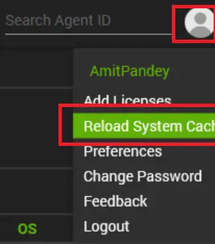

## Step 1
Obtain the group ID(s) of the group(s) that the remote monitor should be applied to.

---

## Step 2
Run this SQL query from a RAWSQL monitor set to import the required search:

```sql
INSERT INTO `sensorchecks` (
    `Name`, `SQL`, `QueryType`, `ListDATA`,
    `FolderID`, `GUID`, `SearchXML`
)
SELECT
    'VeeamBackupSvc',
    'SELECT \r\n   computers.computerid as `Computer Id`,\r\n   computers.name as `Computer Name`,\r\n   clients.name as `Client Name`,\r\n   computers.domain as `Computer Domain`,\r\n   computers.username as `Computer User`,\r\n   Services.Name as `Computer.Services.Name`\r\nFROM Computers \r\nLEFT JOIN inv_operatingsystem ON (Computers.ComputerId=inv_operatingsystem.ComputerId)\r\nLEFT JOIN Clients ON (Computers.ClientId=Clients.ClientId)\r\nLEFT JOIN Locations ON (Computers.LocationId=Locations.LocationID)\r\nLEFT JOIN Services ON (services.ComputerId = Computers.ComputerId)\r\n WHERE \r\n((Services.Name = \'VeeamBackupSvc\'))\r\n',
    '4',
    'Select||=||=||=|^Select|||||||^',
    '0',
    '4ab59b9b-b8c9-42dc-8bbf-a6eb71e15c37',
    '<LabTechAbstractSearch><asn><st>AndNode</st><cn><asn><st>ComparisonNode</st><lon>Computer.Services.Name</lon><lok>Computer.Services.Name</lok><lmo>Equals</lmo><dv>VeeamBackupSvc</dv><dk>VeeamBackupSvc</dk></asn></cn></asn></LabTechAbstractSearch>'
FROM
    (
        SELECT
            MIN(computerid)
        FROM
            computers
    ) a
WHERE
    (
        SELECT
            COUNT(0)
        FROM
            sensorchecks
        WHERE
            `GUID` = '4ab59b9b-b8c9-42dc-8bbf-a6eb71e15c37'
    ) = 0
```

---

## Step 3
Copy the following query and replace '**YOUR COMMA SEPARATED LIST OF GROUPID(S)**' with the Group ID(s) of the relevant groups:  
(The string to replace can be found at the very bottom of the query, right after **WHERE**)

```sql
SET @searchID = ( SELECT MAX(sensid) FROM sensorchecks WHERE `GUID` = '4ab59b9b-b8c9-42dc-8bbf-a6eb71e15c37' );
INSERT INTO groupagents 
 SELECT '' as `AgentID`,
`groupid` as `GroupID`,
@SearchID as `SearchID`,
'ProVal - Production - Veeam Service Monitor' as `Name`,
'6' as `CheckAction`,
'1' as `AlertAction`,
'Veeam Service Monitor - Failed - %ComputerName%~~~VeeamBackupSvc is running now.!!!Veeam Service Monitor - Failed - %ComputerName%~~~Veeam Service Monitor Failed on %CLIENTNAME%\\%COMPUTERNAME% at %LOCATIONNAME% 
%RESULT%
' as `AlertMessage`,
'0' as `ContactID`,
'300' as `interval`,
'127.0.0.1' as `Where`,
'7' as `What`,
'C:\\Windows\\System32\\WindowsPowerShell\\v1.0\\powershell.exe -ExecutionPolicy Bypass -Command "$ErrorActionPreference = \'SilentlyContinue\';$s = \'VeeamBackupSvc\';$ss = Get-Service $s;if ($ss) {if ((Get-Service $s).Status -ne \'Running\') {$v = (Get-Service | Where-Object {$_.Name -match \'Veeam\' -and $_.Name -ne $s -and $_.Status -ne \'Running\'});$p = \'Invoke-RestartService\';$b = \'https://file.provaltech.com/repo\';$d = \\"$b/script/$p.ps1\\";$wd = \\"C:\\ProgramData\\_Automation\\Script\\$p\\";$pp = \\"$wd\\$p.ps1\\";mkdir $wd 3>&1 2>&1 1>$null;[Net.ServicePointManager]::SecurityProtocol = [Enum]::ToObject([Net.SecurityProtocolType], 3072);try {(New-Object System.Net.WebClient).DownloadFile($d, $pp)} catch {return \'Script Download Failure\'};$r = & $pp -ServiceNames $s;if ((Get-Service $s).Status -ne \'Running\') {$rv = & $pp -ServiceNames $v};$rv = & $pp -ServiceNames $v;if ((Get-Service $s).Status -ne \'Running\') {$rs = & $pp -ServiceNames $s};if ((Get-Service $s).Status -ne \'Running\') {return \\"Failed to Start $($s). `n`nOutput of restarting Veeam* Services: $($rv). `n`nOutput of restarting $($s): $rs\\"}}}"' as `DataOut`,
'16' as `Comparor`,
'10|((^((OK){0,}(\\r\\n){0,}[\\r\\n]{0,}\\s{0,})$)%7C(^$))|5|Script Download Failure|10|Failed to Start' as `DataIn`,
'' as `IDField`,
'1' as `AlertStyle`,
'0' as `ScriptID`,
'' as `datacollector`,
'21' as `Category`,
'0' as `TicketCategory`,
'1' as `ScriptTarget`,
UUID() as `GUID`,
'root' as `UpdatedBy`,
(NOW()) as `UpdateDate`
FROM mastergroups m
WHERE m.groupid IN (YOUR COMMA SEPARATED LIST OF GROUPID(S))
AND m.groupid NOT IN  (SELECT DISTINCT groupid FROM groupagents WHERE `Name` = 'ProVal - Production - Veeam Service Monitor')
```

---

## Step 4
An example of a query with a group ID:

```sql
SET @searchID = ( SELECT MAX(sensid) FROM sensorchecks WHERE `GUID` = '4ab59b9b-b8c9-42dc-8bbf-a6eb71e15c37' );
INSERT INTO groupagents 
 SELECT '' as `AgentID`,
`groupid` as `GroupID`,
@SearchID as `SearchID`,
'ProVal - Production - Veeam Service Monitor' as `Name`,
'6' as `CheckAction`,
'1' as `AlertAction`,
'Veeam Service Monitor - Failed - %ComputerName%~~~VeeamBackupSvc is running now.!!!Veeam Service Monitor - Failed - %ComputerName%~~~Veeam Service Monitor Failed on %CLIENTNAME%\\%COMPUTERNAME% at %LOCATIONNAME% 
%RESULT%
' as `AlertMessage`,
'0' as `ContactID`,
'300' as `interval`,
'127.0.0.1' as `Where`,
'7' as `What`,
'C:\\Windows\\System32\\WindowsPowerShell\\v1.0\\powershell.exe -ExecutionPolicy Bypass -Command "$ErrorActionPreference = \'SilentlyContinue\';$s = \'VeeamBackupSvc\';$ss = Get-Service $s;if ($ss) {if ((Get-Service $s).Status -ne \'Running\') {$v = (Get-Service | Where-Object {$_.Name -match \'Veeam\' -and $_.Name -ne $s -and $_.Status -ne \'Running\'});$p = \'Invoke-RestartService\';$b = \'https://file.provaltech.com/repo\';$d = \\"$b/script/$p.ps1\\";$wd = \\"C:\\ProgramData\\_Automation\\Script\\$p\\";$pp = \\"$wd\\$p.ps1\\";mkdir $wd 3>&1 2>&1 1>$null;[Net.ServicePointManager]::SecurityProtocol = [Enum]::ToObject([Net.SecurityProtocolType], 3072);try {(New-Object System.Net.WebClient).DownloadFile($d, $pp)} catch {return \'Script Download Failure\'};$r = & $pp -ServiceNames $s;if ((Get-Service $s).Status -ne \'Running\') {$rv = & $pp -ServiceNames $v};$rv = & $pp -ServiceNames $v;if ((Get-Service $s).Status -ne \'Running\') {$rs = & $pp -ServiceNames $s};if ((Get-Service $s).Status -ne \'Running\') {return \\"Failed to Start $($s). `n`nOutput of restarting Veeam* Services: $($rv). `n`nOutput of restarting $($s): $rs\\"}}}"' as `DataOut`,
'16' as `Comparor`,
'10|((^((OK){0,}(\\r\\n){0,}[\\r\\n]{0,}\\s{0,})$)%7C(^$))|5|Script Download Failure|10|Failed to Start' as `DataIn`,
'' as `IDField`,
'1' as `AlertStyle`,
'0' as `ScriptID`,
'' as `datacollector`,
'21' as `Category`,
'0' as `TicketCategory`,
'1' as `ScriptTarget`,
UUID() as `GUID`,
'root' as `UpdatedBy`,
(NOW()) as `UpdateDate`
FROM mastergroups m
WHERE m.groupid IN (855,856)
AND m.groupid NOT IN  (SELECT DISTINCT groupid FROM groupagents WHERE `Name` = 'ProVal - Production - Veeam Service Monitor')
```

---

## Step 5
Now execute your query from a RAWSQL monitor set.  
Once the query is executed, reload the control center.



Then re-open the group where the monitor is created.  
The monitor will come up with the search '`VeeamBackupSvc`' added to the LIMIT.


---

## Step 6
Locate your remote monitor by opening the group(s) remote monitors tab, then apply the appropriate alert template.