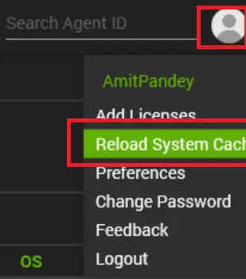
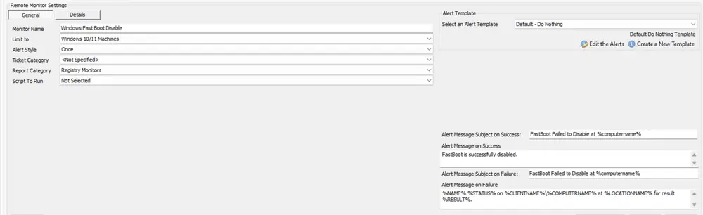
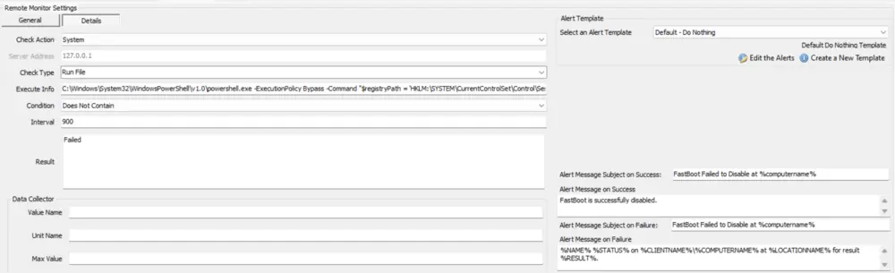

## Implementation

### Step 1
Obtain the group ID(s) of the group(s) that the remote monitor should be applied to.

### Step 2
Copy the following query and replace **YOUR COMMA SEPARATED LIST OF GROUPID(S)** with the Group ID(s) of the relevant groups:  
(The string to replace can be found at the very bottom of the query, right after **WHERE**)

```sql
# Insert Search
INSERT INTO `sensorchecks` 
SELECT 
'' as `SensID`,
'Windows 10/11 Machines' as `Name`, 
'SELECT \r\n   computers.computerid as `Computer Id`,\r\n   computers.name as `Computer Name`,\r\n   clients.name as `Client Name`,\r\n   computers.domain as `Computer Domain`,\r\n   computers.username as `Computer User`,\r\n   inv_operatingsystem.name as `Computer.OS.Name`\r\nFROM Computers \r\nLEFT JOIN inv_operatingsystem ON (Computers.ComputerId=inv_operatingsystem.ComputerId)\r\nLEFT JOIN Clients ON (Computers.ClientId=Clients.ClientId)\r\nLEFT JOIN Locations ON (Computers.LocationId=Locations.LocationID)\r\n WHERE \r\n((((inv_operatingsystem.name like \'%Windows 10%\') OR (inv_operatingsystem.name like \'%Windows 11%\'))))\r\n' as `SQL`,
'4' as `QueryType`,
'Select|||||||^' as `ListData`,
'0' as `FolderID`,
'89790899-2354-4e0f-81a5-ceb493359b21' as `GUID`,
'<LabTechAbstractSearch><asn><st>AndNode</st><cn><asn><st>OrNode</st><cn><asn><st>ComparisonNode</st><lon>Computer.OS.Name</lon><lok>Computer.OS.Name</lok><lmo>TextLike</lmo><dv>%Windows 10%</dv><dk>%Windows 10%</dk></asn><asn><st>ComparisonNode</st><lon>Computer.OS.Name</lon><lok>Computer.OS.Name</lok><lmo>TextLike</lmo><dv>%Windows 11%</dv><dk>%Windows 11%</dk></asn></cn></asn></cn></asn></LabTechAbstractSearch>' as `SearchXML`,
(NULL) as `UpdatedBy`,
(NULL) as `UpdateDate`
FROM  (SELECT MIN(computerid) FROM computers) a
Where (SELECT count(*) From SensorChecks where `GUID` = '89790899-2354-4e0f-81a5-ceb493359b21') = 0;
```

```sql
# Insert Remote Monitor with Limit to search
SET @SearchID = (SELECT sensid FROM sensorchecks where `GUID` = '89790899-2354-4e0f-81a5-ceb493359b21');
SET @TicketCategorySet = 0;
SET @DefaultCreateTicket = (SELECT alertactionid FROM alerttemplate WHERE NAME = 'Default - Do Nothing');
INSERT INTO groupagents 
  SELECT '' as `AgentID`,
`groupid` as `GroupID`,
@SearchID as `SearchID`,
'Windows Fast Boot Disable [Change]' as `Name`,
'6' as `CheckAction`,
@DefaultCreateTicket as `AlertAction`,
'FastBoot Failed to Disable at %computername%~~~FastBoot is successfully disabled.!!!FastBoot Failed to Disable at %computername%~~~%NAME% %STATUS% on %CLIENTNAME%\\%COMPUTERNAME% at %LOCATIONNAME% for result %RESULT%.' as `AlertMessage`,
'0' as `ContactID`,
'86400' as `interval`,
'127.0.0.1' as `Where`,
'7' as `What`,
'C:\\Windows\\System32\\WindowsPowerShell\\v1.0\\powershell.exe -ExecutionPolicy Bypass -Command "$registryPath = \'HKLM:\\SYSTEM\\CurrentControlSet\\Control\\Session Manager\\Power\';if (Test-Path $registryPath) {$hiberbootEnabled = Get-ItemProperty -Path $registryPath -Name HiberbootEnabled -ErrorAction SilentlyContinue;if($hiberbootEnabled.HiberbootEnabled -eq 1) {Set-ItemProperty -Path $registryPath -Name HiberbootEnabled -Value 0;$hiberbootEnabled = Get-ItemProperty -Path $registryPath -Name HiberbootEnabled -ErrorAction SilentlyContinue;if ($hiberbootEnabled.HiberbootEnabled -ne 0) {return \'Failed\'} else {return \'Success\'}} else {return \'Success\'}} else {return \'Success\'}"' as `DataOut`,
'9' as `Comparor`,
'Failed' as `DataIn`,
'' as `IDField`,
'1' as `AlertStyle`,
'0' as `ScriptID`,
'' as `datacollector`,
'21' as `Category`,
'0' as `TicketCategory`,
@TicketCategorySet as `ScriptTarget`,
UUID() as `GUID`,
'root' as `UpdatedBy`,
(NOW()) as `UpdateDate`
FROM mastergroups m
WHERE m.groupid IN (YOUR COMMA SEPARATED LIST OF GROUPID(S))
AND m.groupid NOT IN (SELECT DISTINCT groupid FROM groupagents WHERE `Name` = 'Windows Fast Boot Disable [Change]')
```

### Step 3
An example of a query with a group ID:

```sql
# Insert Search
INSERT INTO `sensorchecks` 
SELECT 
'' as `SensID`,
'Windows 10/11 Machines' as `Name`, 
'SELECT \r\n   computers.computerid as `Computer Id`,\r\n   computers.name as `Computer Name`,\r\n   clients.name as `Client Name`,\r\n   computers.domain as `Computer Domain`,\r\n   computers.username as `Computer User`,\r\n   inv_operatingsystem.name as `Computer.OS.Name`\r\nFROM Computers \r\nLEFT JOIN inv_operatingsystem ON (Computers.ComputerId=inv_operatingsystem.ComputerId)\r\nLEFT JOIN Clients ON (Computers.ClientId=Clients.ClientId)\r\nLEFT JOIN Locations ON (Computers.LocationId=Locations.LocationID)\r\n WHERE \r\n((((inv_operatingsystem.name like \'%Windows 10%\') OR (inv_operatingsystem.name like \'%Windows 11%\'))))\r\n' as `SQL`,
'4' as `QueryType`,
'Select|||||||^' as `ListData`,
'0' as `FolderID`,
'89790899-2354-4e0f-81a5-ceb493359b21' as `GUID`,
'<LabTechAbstractSearch><asn><st>AndNode</st><cn><asn><st>OrNode</st><cn><asn><st>ComparisonNode</st><lon>Computer.OS.Name</lon><lok>Computer.OS.Name</lok><lmo>TextLike</lmo><dv>%Windows 10%</dv><dk>%Windows 10%</dk></asn><asn><st>ComparisonNode</st><lon>Computer.OS.Name</lon><lok>Computer.OS.Name</lok><lmo>TextLike</lmo><dv>%Windows 11%</dv><dk>%Windows 11%</dk></asn></cn></asn></cn></asn></LabTechAbstractSearch>' as `SearchXML`,
(NULL) as `UpdatedBy`,
(NULL) as `UpdateDate`
FROM  (SELECT MIN(computerid) FROM computers) a
Where (SELECT count(*) From SensorChecks where `GUID` = '89790899-2354-4e0f-81a5-ceb493359b21') = 0;
```

```sql
# Insert Remote Monitor with Limit to search
SET @SearchID = (SELECT sensid FROM sensorchecks where `GUID` = '89790899-2354-4e0f-81a5-ceb493359b21');
SET @TicketCategorySet = 0;
SET @DefaultCreateTicket = (SELECT alertactionid FROM alerttemplate WHERE NAME = 'Default - Do Nothing');
INSERT INTO groupagents 
  SELECT '' as `AgentID`,
`groupid` as `GroupID`,
@SearchID as `SearchID`,
'Windows Fast Boot Disable [Change]' as `Name`,
'6' as `CheckAction`,
@DefaultCreateTicket as `AlertAction`,
'FastBoot Failed to Disable at %computername%~~~FastBoot is successfully disabled.!!!FastBoot Failed to Disable at %computername%~~~%NAME% %STATUS% on %CLIENTNAME%\\%COMPUTERNAME% at %LOCATIONNAME% for result %RESULT%.' as `AlertMessage`,
'0' as `ContactID`,
'86400' as `interval`,
'127.0.0.1' as `Where`,
'7' as `What`,
'C:\\Windows\\System32\\WindowsPowerShell\\v1.0\\powershell.exe -ExecutionPolicy Bypass -Command "$registryPath = \'HKLM:\\SYSTEM\\CurrentControlSet\\Control\\Session Manager\\Power\';if (Test-Path $registryPath) {$hiberbootEnabled = Get-ItemProperty -Path $registryPath -Name HiberbootEnabled -ErrorAction SilentlyContinue;if($hiberbootEnabled.HiberbootEnabled -eq 1) {Set-ItemProperty -Path $registryPath -Name HiberbootEnabled -Value 0;$hiberbootEnabled = Get-ItemProperty -Path $registryPath -Name HiberbootEnabled -ErrorAction SilentlyContinue;if ($hiberbootEnabled.HiberbootEnabled -ne 0) {return \'Failed\'} else {return \'Success\'}} else {return \'Success\'}} else {return \'Success\'}"' as `DataOut`,
'9' as `Comparor`,
'Failed' as `DataIn`,
'' as `IDField`,
'1' as `AlertStyle`,
'0' as `ScriptID`,
'' as `datacollector`,
'21' as `Category`,
'0' as `TicketCategory`,
@TicketCategorySet as `ScriptTarget`,
UUID() as `GUID`,
'root' as `UpdatedBy`,
(NOW()) as `UpdateDate`
FROM mastergroups m
WHERE m.groupid IN (1737)
AND m.groupid NOT IN (SELECT DISTINCT groupid FROM groupagents WHERE `Name` = 'Windows Fast Boot Disable [Change]')
```

### Step 4
Now execute your query from a RAWSQL monitor set. Once the query is executed, relaunch the control center.



Then re-open the group where the monitor is created. The monitor will come up with the search 'Windows 10/11 Machines' added to the LIMIT.

### Step 5
Locate your remote monitor by opening the group(s) remote monitors tab, then apply the appropriate alert template.

  
