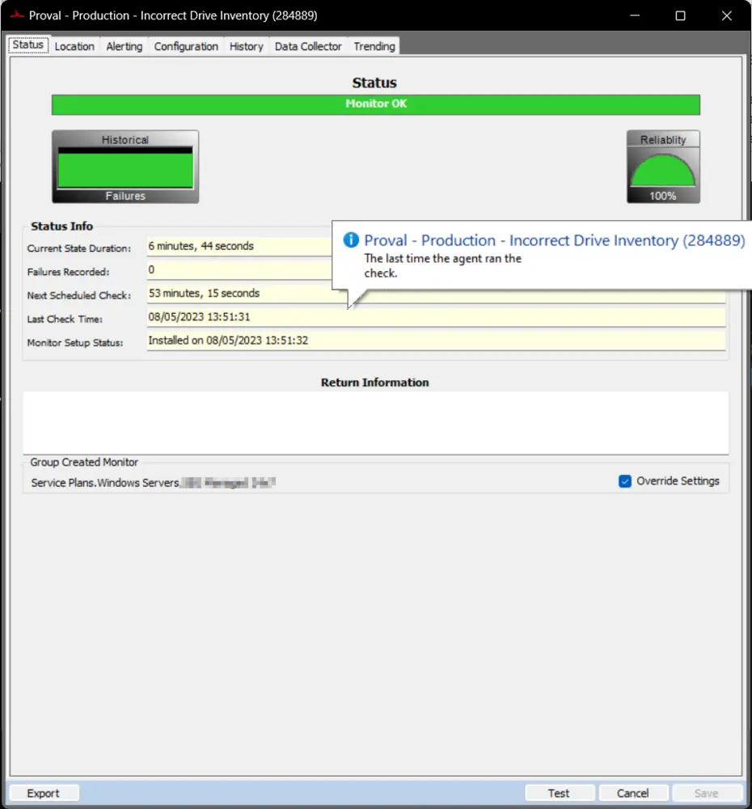
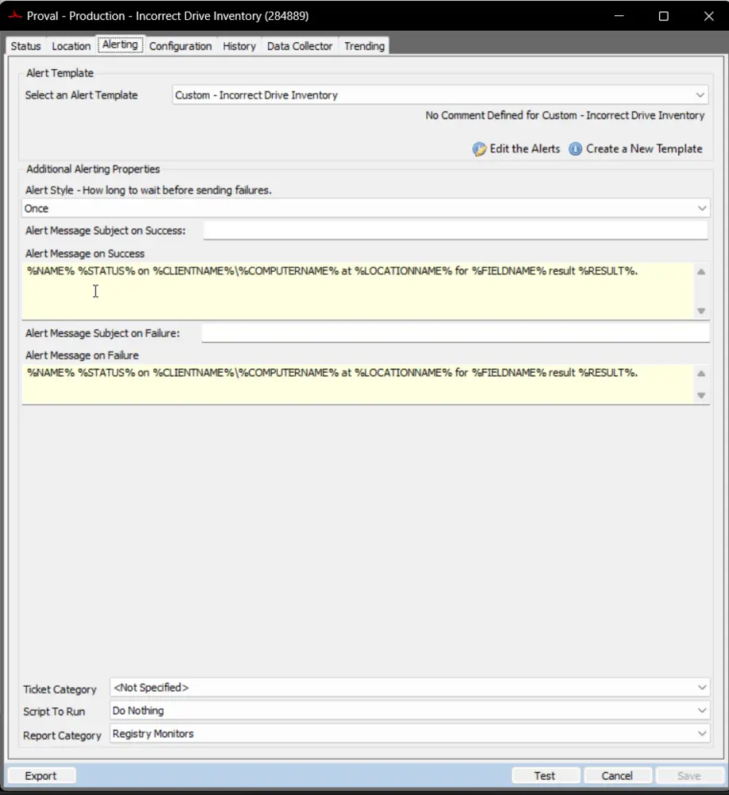
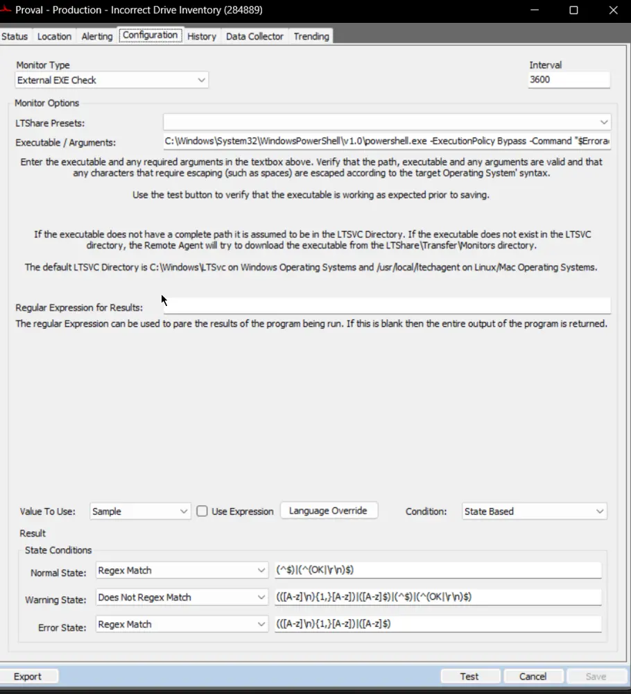

## Summary

**Issue:** Upgrade/Swap Agents Hard Drives or SSDs with imaged drives, and the model number in ConnectWise Automate® still reflects the original hard drive or SSD.

This document detects machines where [Automate is not pulling newly imaged HDD or SSD.](https://docs.connectwise.com/ConnectWise_Automate_Support_Wiki/100/Automate_Not_Pulling_NEW_Imaged_HDD_or_SSD)

It features a state-based monitor, and the WARNING state indicates PowerShell failures or that any security program is blocking PowerShell from reading the registry keys.

## Details

**Suggested "Limit to":** Managed Windows Machines

**Suggested Alert Style:** Once  
**Suggested Alert Template:** △ Custom - Incorrect Drive Inventory

## Dependencies

[CWM - Automate - Script - Incorrect Drive Inventory [Autofix]](/docs/59079938-6d59-48d6-aa45-b8c003456bc6)

## Target

- Service Plans.Windows Workstations.Managed 24x7
- Service Plans.Windows Workstations.Managed 8x5
- Service Plans.Windows Servers.Managed 8x5
- Service Plans.Windows Servers.Managed 24x7

## Screenshots

**Status Tab:**  

**Alerting Tab:**  

**Configuration Tab:**  
