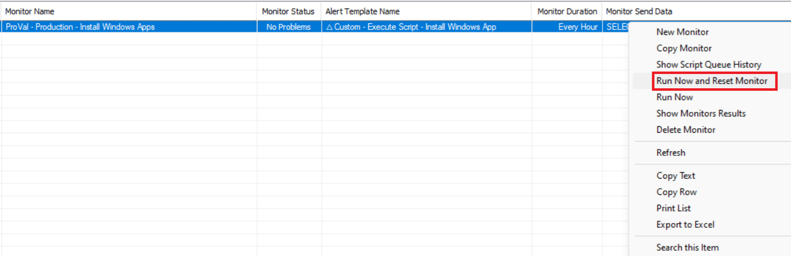

## Summary

This monitor is built to install the Windows App on the computers where the deployment EDFs are checked.
It is recommended to set this monitor alert frequency at every 30 days.

## Dependencies

- [Script - Install Windows App](/docs/dd28b731-7fbc-4345-8d0b-6875df1d5658)
- Alert Template `△ Custom - Execute Script - Install Windows App`
- [Solution - Install Windows App](/docs/0d8c4619-b666-44ec-93b1-2d00e4632865)

## Target

- Windows OS

## Implementation

- Import the [Script - Install Windows App](/docs/dd28b731-7fbc-4345-8d0b-6875df1d5658) 
- Import the monitor
- Import the Alert Template `△ Custom - Execute Script - Install Windows App`
- Apply the alert template to the monitor.
- Run now and reset the monitor  
  
- Enable the EDFs to start deployment.