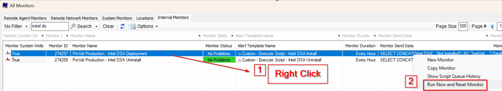

## Summary

This detects the online Windows Workstations that have an Intel Processor, the deployment EDF is selected at the client level, and the `Intel® Driver & Support Assistant` is not installed.

## Dependencies

- `Alert Template - △ Custom - Execute Script - Intel DSA Install`
- [Script - Intel DSA Install](/docs/956ab7bd-320c-49b9-be27-1783976994d2)
- [Intel® Driver & Support Assistant Solution](/docs/26bda8e8-6bca-46c3-894f-3eb838340982)

## Target

- Windows Workstations with Intel Processor

## Implementation

- Import the monitor
- Import the [Script - Intel DSA Install](/docs/956ab7bd-320c-49b9-be27-1783976994d2)
- Import the alert template - `△ Custom - Execute Script - Intel DSA Install`
- Apply the alert template - `△ Custom - Execute Script - Intel DSA Install` to the monitor
- Right click the monitor and then click `Run now and Reset`
  

## Changelog

### 2026-02-24

- Initial version of the document
