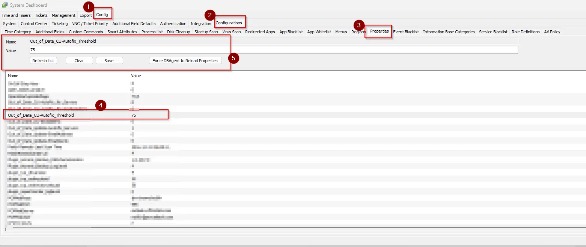
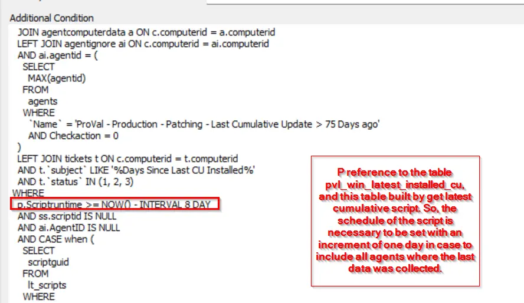
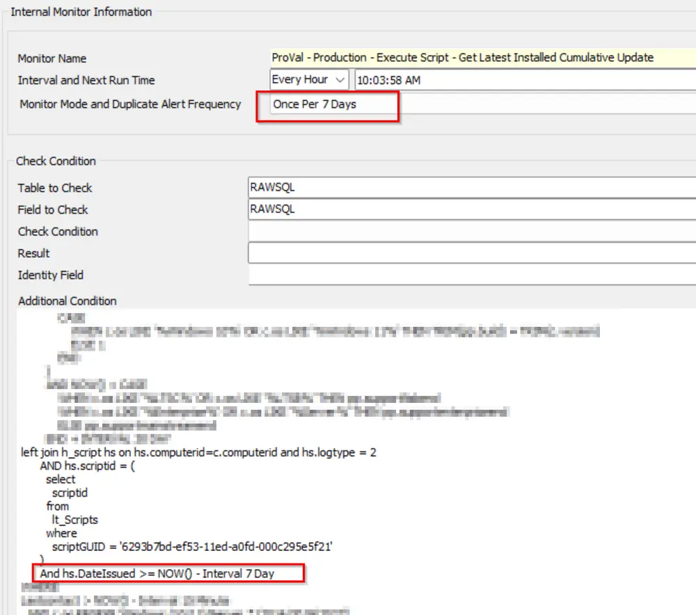

## Summary

This document identifies computers that have not installed a Cumulative Update in the last X days (configurable via the system property `Out_of_Date_CU-Autofix_Threshold`, default: 75 days), excluding End-of-Life (EOL) machines.

Adjust the `Out_of_Date_CU-Autofix_Threshold` system property value to modify the number of days since the last cumulative update before a ticket is generated.

The monitor set will not continue detecting computers for which a ticket has already been generated if it is using the suggested alert template `△ Custom - Autofix - Out of Date Cumulative Updates`.

This monitor has direct dependencies on the [Script - Get Latest Installed Cumulative Update](/docs/bd99d6b2-2d31-4611-9682-3c8518c53998) schedule.

The `p.Scriptruntime` days in the monitor need to be set with one increment day to the [Script - Get Latest Installed Cumulative Update](/docs/bd99d6b2-2d31-4611-9682-3c8518c53998) schedule, as shown below:

Please review the [Internal Monitor - Execute Script - Get Latest Installed Cumulative Update](/docs/4d2a667d-ba87-4148-ba5d-d6da484acccf) and obtain the value from the `hs.dateissued` days. Set it with one day added to the `p.scriptruntime` value in the monitor.

## Dependencies

- [Custom Table - pvl_win_latest_installed_cu](/docs/c03e4def-7efe-4a8b-99e9-d99ac2c65f5a)
- [Custom Table - plugin_proval_windows_os_support](/docs/938cd822-f6a3-4ee3-add2-62b407e45622)
- [Script - Out of Date Cumulative Updates [Autofix]*](/docs/dedb8564-bb1a-47b8-9525-61fc9e690cae)
- [Solution - Latest Installed Cumulative Update](/docs/991e926f-dcd2-4be3-9f3a-ea7ee9842da2/)

## Target

Global

## Alert Template

`△ Custom - Autofix - Out of Date Cumulative Updates`

The alert template executes the [CWM - Automate - Script - Out of Date Cumulative Updates [Autofix]*](/docs/dedb8564-bb1a-47b8-9525-61fc9e690cae) script.

## FAQ

**Q.** What happens if the machine hasn't logged in for several days, or if the interval of the [Script - Get Latest Installed Cumulative Update](/docs/bd99d6b2-2d31-4611-9682-3c8518c53998) is different from the `lastruntime` check in the table "[Custom Table - pvl_win_latest_installed_cu](/docs/c03e4def-7efe-4a8b-99e9-d99ac2c65f5a)"?

**A.** This monitor will ignore agents whose last contact date is older than 7 days from monitoring. It will also exclude agents where the [Script - Get Latest Installed Cumulative Update](/docs/bd99d6b2-2d31-4611-9682-3c8518c53998) has not run within the scheduled days period, which should match the `p.scriptruntime` set in the monitor.