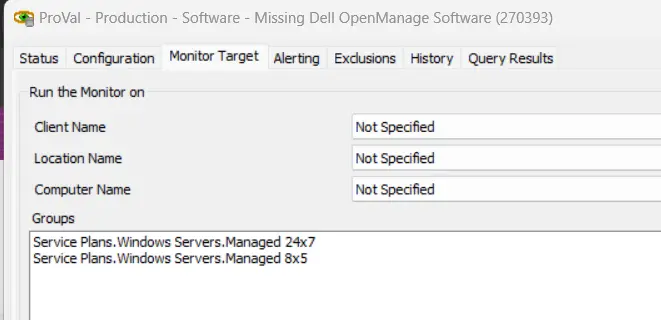

## Summary

This monitor checks for missing vendor software on Dell machines. It will flag any machines where "Dell OpenManage System Management Software" is not installed.

**Suggested Alert Template:** `△ Custom - Ticket Creation - Computer`

## Dependencies

[CWM - Automate - Script - Ticket Creation - Computer](/docs/63beba3c-f4a6-41a5-98e2-d4e4ce885035)

## Target

Managed Servers  

## Ticketing

- **Subject:** `SW - Missing Dell OpenManage on %Computername%(%computerid%)`
  
- **Summary:** To ensure proper monitoring of critical hardware components on this server, it is essential to install Dell OpenManage System Management Software. This software will enable the generation of accurate event log entries in the event of hardware failures. Please proceed with the installation as soon as possible.
