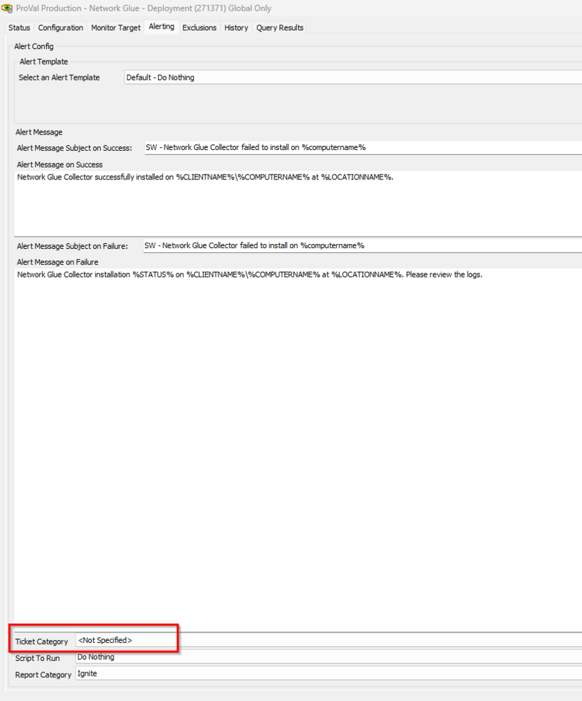

## Summary

This monitor performs the auto deployment of the Network Glue Collector. It depends on the EDFs mentioned in this document for the deployment.

## Dependencies

[Script - Network Glue Collector - Install](/docs/11b30dcb-74c1-4736-a495-5908ce17117a)

## EDFs

| Name                        | Level   | Type  | Editable | Description                                                                                                                         |
|-----------------------------|---------|-------|----------|-------------------------------------------------------------------------------------------------------------------------------------|
| Network Glue Activation Key  | Client  | Text  | Yes      | This is required to be set with the individual clients' activation key found in their IT Glue Networks page to enable auto deployment. |
| Network Glue Deployment      | Client  | Flag  | Yes      | This checkbox at the client level is needed to allow the deployment of the Network Glue Collector to the endpoints of the client.     |
| Network Glue Exclusion       | Location| Flag  | Yes      | This checkbox at the location level will exclude the deployment of the Network Glue Collector to the endpoints of the location.       |
| Network Glue Exclusion       | Computer| Flag  | Yes      | This checkbox at the computer level will exclude the deployment of the Network Glue Collector from the endpoint.                    |

## Target

Windows Machines

## Ticketing

**_To enable ticketing, please set the ticket category in the monitor._**  
  
**_The script will then handle the ticket creation:_** [ - Network Glue Collector - Install](/docs/11b30dcb-74c1-4736-a495-5908ce17117a)