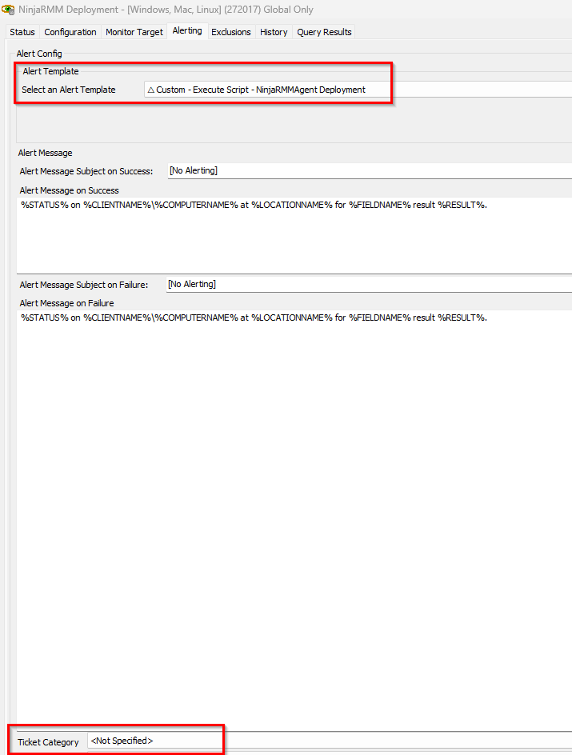

## Summary

This monitor is designed to set the automatic deployment of the NinjaRMMAgent where the Ninja Deployment is enabled.

## Dependencies
`Alert Template:` △ Custom - Execute Script - NinjaRMMAgent Deployment   
[Script - NinjaRMM Deployment - [Windows, Mac, Linux]](/docs/372559cc-5af7-4075-a442-ef7909712fea)  
[Solution - NinjaRMM Agent Deployment ](/docs/c42dc847-beeb-4064-80de-3ce936a2ead7)  
## Target

Global

## Implementation

To enable ticketing please set the `Ticket Category` in the monitor:

The ticket creation will be then handled by the Autofix script.