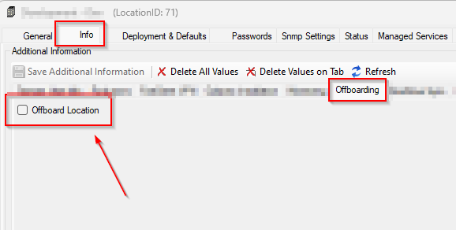
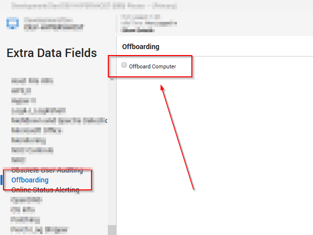

## Summary

The purpose of this monitor is to detect the machines opted for offboarding. The monitor will detect the online machine if the client-level EDF **`Offboard Client`**, the location-level EDF **`Offboard Location`**, or the computer-level EDF **`Offboard Computer`** is selected.

## Dependencies

- [CWM - Automate - Script - Offboarding Wrapper](/docs/1fef1360-cfd3-4a3f-8444-207c09fb5a78)

- Select **`Offboard Client`** EDF to select the whole client for offboarding  
  

- Select **`Offboard Location`** EDF to select the whole location for offboarding  
  

- Select **`Offboard Computer`** EDF to select the machine for offboarding  
  

## Target

All Operating Systems

## Alert Template

- **`△ Custom - Execute Script - Offboarding Wrapper`**

