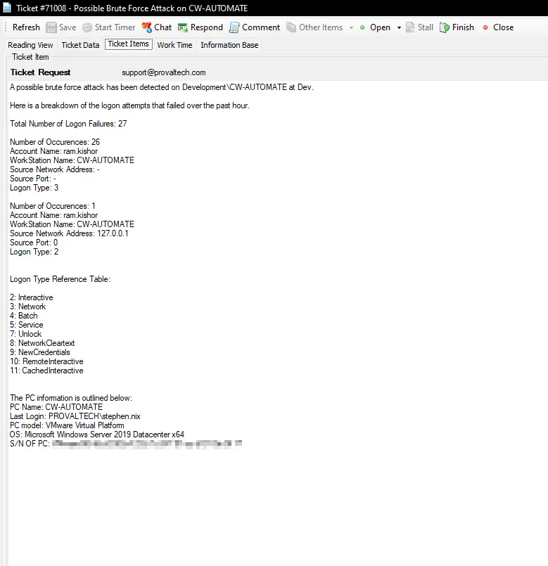
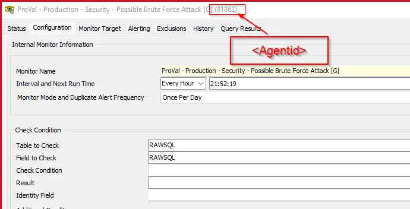

## Summary

This internal monitor checks the event log database table where the source event is Microsoft-Windows-Security-Auditing and `eventid = 4625`. It identifies instances where the count of occurrences is greater than 10 in the last 60 minutes.

**Alert Template:** ~Custom - Ticket Creation Computer

**Ticket Subject:** Possible Brute Force Attack on %computername%

**Alert Message on Success:** There are no potential brute force or logon failures detected in the last hour on %CLIENTNAME%\%COMPUTERNAME% at %LOCATIONNAME%.

**Alert Message on Failure:**

A possible brute force attack has been detected on %CLIENTNAME%\%COMPUTERNAME% at %LOCATIONNAME%. 

Here is a breakdown of the logon attempts that failed over the past hour:

**Total Number of Logon Failures:** @RESULT@

@FIELDNAME@

**Logon Type Reference Table:**  
- 2: Interactive  
- 3: Network  
- 4: Batch  
- 5: Service  
- 7: Unlock  
- 8: NetworkCleartext  
- 9: NewCredentials  
- 10: RemoteInteractive  
- 11: CachedInteractive  

**Sample Ticket:**  

## Target

**Servers:** Domain Controllers

## Implementation  

1. Import the monitor set.  
2. Import the Alert Template (~Custom - Ticket creation computer), if it is not already present.  
3. Replace `\<agentid>` in the additional condition with the ID of your monitor set.  

## Dependencies

[CWM - Automate - Script - Ticket Creation - Computer](/docs/63beba3c-f4a6-41a5-98e2-d4e4ce885035)

## FAQ

#### **General Troubleshooting Steps**

**Identify the Account Type:**

- Domain Account: Check in Active Directory Users and Computers (ADUC).

- Local Account: Use Computer Management > Local Users and Groups.
- Service Account: Check services or scheduled tasks using the account.
- Unknown Account: Investigate for potential brute-force or enumeration attacks.
Review Event Logs:

Look for Event ID 4625 in the Security log.

Pay attention to:

Status/SubStatus codes

Logon Type

Source IP/Workstation

Target Account Name

#### **🛠️ Error Code Specific Troubleshooting**

| Error Code   | Meaning                          | Action Steps                                                                 |
|--------------|----------------------------------|------------------------------------------------------------------------------|
| 0xC000006A   | Bad password                     | - Check if the password was recently changed.   - Reset the password if needed.   - Investigate repeated attempts (possible brute-force). |
| 0xC000006D   | Bad username or auth info        | - Verify username.   - Check for typos or outdated credentials.   - Investigate source of repeated failures. |
| 0xC0000064   | Bad or misspelled username       | - Confirm the account exists.   - Investigate for enumeration attempts.   |
| 0xC000005E   | No logon servers available       | - Check domain controller availability.   - Ensure network connectivity.   - Restart Netlogon service. |
| 0xC000006F   | Logon outside authorized hours   | - Review account restrictions in AD.   - Adjust allowed logon hours if needed. |
| 0xC0000070   | Unauthorized workstation         | - Check workstation restrictions in AD.   - Update allowed workstations.  |
| 0xC0000072   | Account disabled                 | - Enable the account in AD.   - Investigate why it was disabled.         |
| 0xC000015B   | Logon type not granted           | - Check Group Policy or Local Security Policy.   - Grant appropriate logon rights. |
| 0xC0000192   | Netlogon service not started     | - Start the Netlogon service.   - Set it to automatic.                   |
| 0xC0000193   | Expired account                  | - Extend or renew the account expiration date.                              |
| 0xC0000413   | Auth firewall restriction        | - Review firewall or security policies.   - Allow the account to authenticate. |

#### **🔧 Service Account Specific Checks**

Find Services Using the Account:

Run: Get-WmiObject win32_service | Where-Object { $_.StartName -like "*accountname*" }
Or check manually in Services.msc.
Update Password:

Change the password in AD.

Update it in all services, scheduled tasks, and applications using it.

#### **🚨 If the Account is Unknown or Suspicious**

Investigate Source IP: Use firewall logs or SIEM tools.
Check for Patterns: Repeated failures from the same IP or targeting multiple accounts.
Block IP or Account: If malicious, take immediate action.
Enable Account Lockout Policies: To prevent brute-force attacks.
