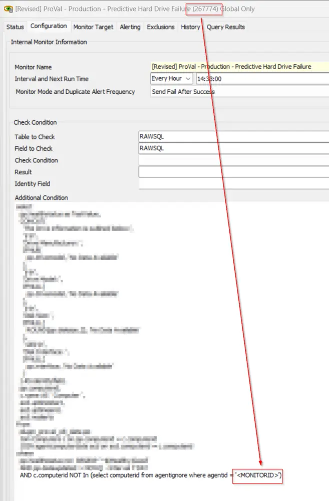
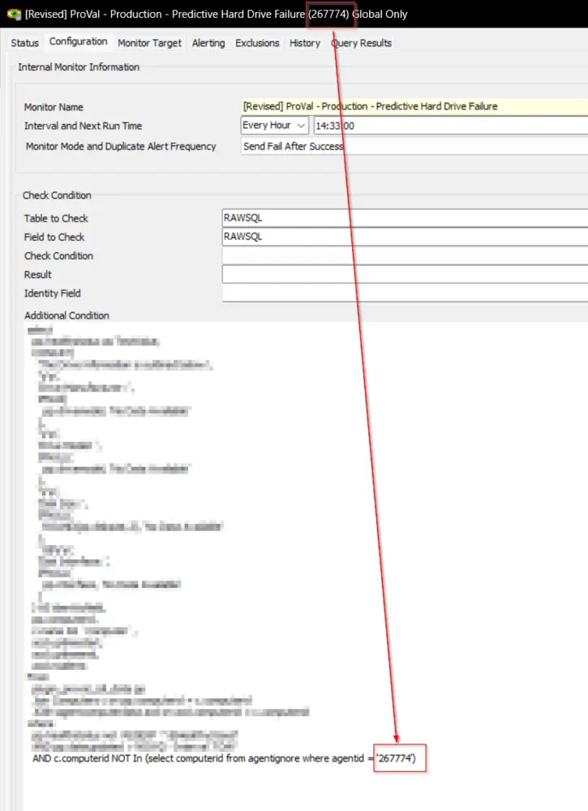

## Summary

The EPM - Disk - Internal Monitor - Predictive Hard Drive Failure is an internal monitoring component of the solution that detects potential hard drive failures. It alerts the user about any machine where the EPM - Disk - Script - Disk - Gather Critical Data script has detected errors over the past 7 days. This monitor helps predict potential hard drive failures and enables proactive maintenance, preventing data loss or system failure.

## Dependencies

- [EPM - Disk - Script - Disk - Gather Critical Data](/docs/687261c3-e6d7-46bc-84f6-506007d47142)
- [EPM - Disk - Internal Monitor - Execute Script - Disk - Gather Critical Data](/docs/9568d3f6-e271-45c8-9554-3a476f7eb5e4)
- [EPM - Disk - Custom Table - plugin_proval_cdi_data](/docs/7a224177-45ff-4f2e-a8fe-a734a642a539)
- [CWM - Automate - Script - Ticket Creation - Computer](/docs/63beba3c-f4a6-41a5-98e2-d4e4ce885035)

## Implementation

- Replace the `<MONITORID>` in the Additional Condition with the ID of the monitor set.  
  Before:  
    
  After:  
  

## Target

Global, as the monitor set is limited to the machines detected within the [EPM - Disk - Custom Table - plugin_proval_cdi_data](/docs/7a224177-45ff-4f2e-a8fe-a734a642a539) table.

## Ticketing

**Subject:**  
`DRV - Predictive HDD failure detected on %COMPUTERNAME% at %CLIENTNAME%`

**Ticket Body on Failure:**  
`A predictive failure has been detected on this machine - %COMPUTERNAME% at %CLIENTNAME%  
Current Status - %RESULT%  
%FIELDNAME%`

**Ticket Body on Success:**  
`This computer is no longer detected as being a predictive failure.`

**%FIELDNAME%:**  
`The Drive information is outlined below:`  
```
Drive Manufacturer: <Drive Manufacturer>
Drive Model: <Drive Model>
Disk Size: <Disk Size in GB>
Disk Interface: <Disk Interface>
```

## Alert Template

△ Custom - Ticket Creation - Computer