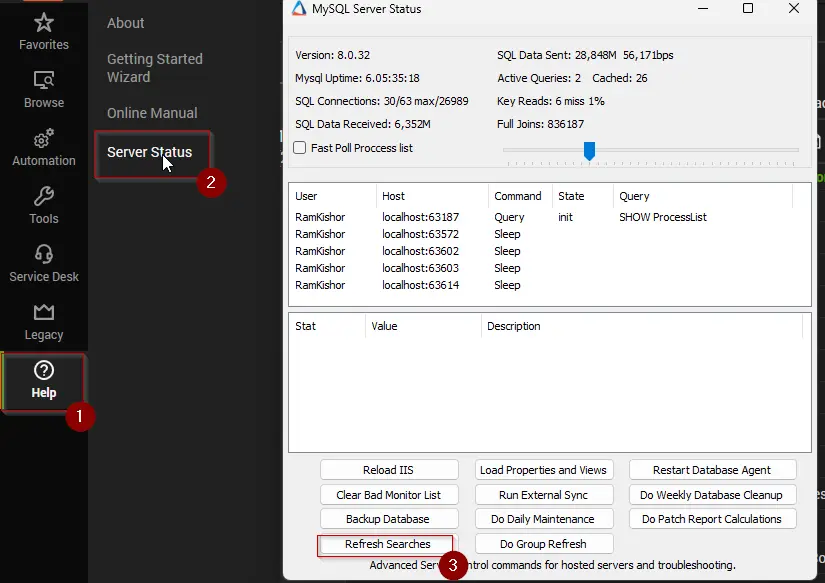
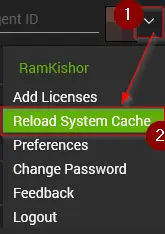

## Summary

Identifies Windows machines where RDP is enabled or not completely disabled.

## Details

**Suggested "Limit to"**: `RDP Access Check Enabled`  
**Suggested Alert Style**: `Once`  
**Suggested Alert Template**: `△ Custom - Ticket Creation - Computer`

| Check Action | Server Address | Check Type | Condition | Interval | Result |
| ------------ | -------------- | ---------- | ---------- | -------- | ------ |
| System       | 127.0.0.1 | Run File  | Does Not Contain  | 86400 | Disabled |

## Dependencies

[Disable RDP Access](/docs/fb6cbd98-ea27-498d-b6c8-dd7f020ed232)

## Target

Managed Windows Servers and Workstations

## EDF

| Name | Level | Type | Section | Description |
| ---- | ----- | ---- | ------- | ----------- |
| Exclude RDP Access Check | Computer | Check Box | Exclusions | Flag this EDF to exclude the computer from RDP Access Check monitoring |

## Ticketing

**Ticket Subject:** `RDP Enabled on %COMPUTERNAME%`

**Ticket Body:** `RDP is either enabled or not completely disabled on %COMPUTERNAME%. Please run the "Disable RDP Access" script to ensure RDP is completely disabled.`

## Implementation

### Step 1

Import the [Disable RDP Access](/docs/fb6cbd98-ea27-498d-b6c8-dd7f020ed232) script using the ProSync plugin.

### Step 2

Run the following SQL query in a `RAWSQL Monitor` to create the `Exclude RDP Access Check` EDF.

```SQL
INSERT IGNORE INTO
    `extrafield` (
        `Form`,
        `Name`,
        `Sort`,
        `NoBreak`,
        `FType`,
        `Section`,
        `UnEditable`,
        `Collapsed`,
        `Fill`,
        `LtGuid`,
        `IsPassword`,
        `IsEncrypted`,
        `IsHidden`,
        `IsRestricted`,
        `ViewPermissions`,
        `EditPermissions`
    )
VALUES (
        1,
        'Exclude RDP Access Check',
        0,
        0,
        1,
        'Exclusions',
        0,
        0,
        '|Flag this EDF to exclude the computer from RDP Access Check monitoring|',
        'e77ba3fe-dea5-442f-a838-885ddb4a8b72',
        0,
        0,
        0,
        0,
        '',
        ''
    );
CALL v_ExtraData(1, 'Computers');
```

### Step 3

Run the following SQL query in a `RAWSQL Monitor` to create the `RDP Access Check Enabled` Search.

```SQL
INSERT INTO
    `SensorChecks` (
        `Name`,
        `SQL`,
        `QueryType`,
        `ListDATA`,
        `FolderID`,
        `GUID`,
        `SearchXML`
    )
SELECT
    'RDP Access Check Enabled' AS `Name`,
    'SELECT \r\n   computers.computerid as `Computer Id`,\r\n   computers.name as `Computer Name`,\r\n   clients.name as `Client Name`,\r\n   computers.domain as `Computer Domain`,\r\n   computers.username as `Computer User`,\r\n   IFNULL(IFNULL(edfAssigned1.Value,edfDefault1.value),\'0\') as `Computer - Extra Data Field - Exclusions - Exclude RDP Access Check`\r\nFROM Computers \r\nLEFT JOIN inv_operatingsystem ON (Computers.ComputerId=inv_operatingsystem.ComputerId)\r\nLEFT JOIN Clients ON (Computers.ClientId=Clients.ClientId)\r\nLEFT JOIN Locations ON (Computers.LocationId=Locations.LocationID)\r\nLEFT JOIN ExtraFieldData edfAssigned1 ON (edfAssigned1.id=Computers.ComputerId and edfAssigned1.ExtraFieldId =(Select ExtraField.id FROM ExtraField WHERE LTGuid=\'e77ba3fe-dea5-442f-a838-885ddb4a8b72\'))\r\nLEFT JOIN ExtraFieldData edfDefault1 ON (edfDefault1.id=0 and edfDefault1.ExtraFieldId =(Select ExtraField.id FROM ExtraField WHERE LTGuid=\'e77ba3fe-dea5-442f-a838-885ddb4a8b72\'))\r\n WHERE \r\n((IFNULL(IFNULL(edfAssigned1.Value,edfDefault1.value),\'0\')=0))\r\n' AS `SQL`,
    '4' AS `QueryType`,
    'Select||=||=||=|^Select|||||||^' AS `ListDATA`,
    '0' AS `FolderID`,
    '1c7d4098-547c-4d69-8b60-9c5711dbc23f' AS `GUID`,
    '<LabTechAbstractSearch><asn><st>AndNode</st><cn><asn><st>ComparisonNode</st><lon>Computer.Extra Data Field.Exclusions.Exclude RDP Access Check</lon><lok>Computer.Edf.e77ba3fe-dea5-442f-a838-885ddb4a8b72</lok><lmo>IsFalse</lmo><dv>NULL</dv><dk>NULL</dk></asn></cn></asn></LabTechAbstractSearch>' AS `SearchXML`
FROM (
        SELECT MIN(computerid)
        FROM computers
    ) a
WHERE (
        SELECT COUNT(*)
        FROM SensorChecks
        WHERE
            `GUID` = '1c7d4098-547c-4d69-8b60-9c5711dbc23f'
    ) = 0;
```

### Step 4

`Help` `>` `Server Status` `>` `Refresh Searches`  


### Step 5

**Reload System Cache**  


### Step 6

Obtain the groupid(s) of the group(s) that the remote monitor should be applied to.

### Step 7

Copy the following query and replace **YOUR COMMA SEPARATED LIST OF GROUPID(S)** with the groupid(s) of the relevant groups. (The string to replace can be found at the very bottom of the query, right after **WHERE**).

```SQL
SET @searchid = (SELECT sensid FROM sensorchecks WHERE `GUID` = '1c7d4098-547c-4d69-8b60-9c5711dbc23f');

INSERT INTO groupagents 
 SELECT '' as `AgentID`,
`groupid` as `GroupID`,
@searchid as `SearchID`,
'ProVal - Production - RDP Access Check' as `Name`,
'6' as `CheckAction`,
'1' as `AlertAction`,
'RDP Enabled on %COMPUTERNAME%~~~RDP is disabled.!!!RDP Enabled on %COMPUTERNAME%~~~RDP is either enabled or not completely disabled on %COMPUTERNAME%. Please run the "Disable RDP Access" script to ensure RDP is completely disabled.' as `AlertMessage`,
'0' as `ContactID`,
'86400' as `interval`,
'127.0.0.1' as `Where`,
'7' as `What`,
'C:\\Windows\\System32\\WindowsPowerShell\\v1.0\\powershell.exe -ExecutionPolicy Bypass -NoLogo -NonInteractive -NoProfile -Command "$ErrorActionPreference = \'SilentlyContinue\'; $regValue = (Get-ItemProperty -Path \'HKLM:\\System\\CurrentControlSet\\Control\\Terminal Server\' -Name \'fDenyTSConnections\').fDenyTSConnections; $fireWallRule = (Get-NetFirewallRule -DisplayGroup \'Remote Desktop\').Enabled; if ($fireWallRule -match \'True\' -or $regValue -ne \'1\') { return \'Enabled\' } else { return \'Disabled\' }"' as `DataOut`,
'5' as `Comparor`,
'Disabled' as `DataIn`,
'' as `IDField`,
'1' as `AlertStyle`,
'0' as `ScriptID`,
'' as `datacollector`,
'21' as `Category`,
'0' as `TicketCategory`,
'1' as `ScriptTarget`,
(UUID()) as `GUID`,
'root' as `UpdatedBy`,
(NOW()) as `UpdateDate`
FROM mastergroups m
WHERE m.groupid IN (YOUR COMMA SEPARATED LIST OF GROUPID(S))
AND m.groupid NOT IN  (SELECT DISTINCT groupid FROM groupagents WHERE `Name` = 'ProVal - Production - RDP Access Check')
```

### Step 8

An example of the query with groupids and modified thresholds:

```SQL
SET @searchid = (SELECT sensid FROM sensorchecks WHERE `GUID` = '1c7d4098-547c-4d69-8b60-9c5711dbc23f');

INSERT INTO groupagents 
 SELECT '' as `AgentID`,
`groupid` as `GroupID`,
@searchid as `SearchID`,
'ProVal - Production - RDP Access Check' as `Name`,
'6' as `CheckAction`,
'1' as `AlertAction`,
'RDP Enabled on %COMPUTERNAME%~~~RDP is disabled.!!!RDP Enabled on %COMPUTERNAME%~~~RDP is either enabled or not completely disabled on %COMPUTERNAME%. Please run the "Disable RDP Access" script to ensure RDP is completely disabled.' as `AlertMessage`,
'0' as `ContactID`,
'86400' as `interval`,
'127.0.0.1' as `Where`,
'7' as `What`,
'C:\\Windows\\System32\\WindowsPowerShell\\v1.0\\powershell.exe -ExecutionPolicy Bypass -NoLogo -NonInteractive -NoProfile -Command "$ErrorActionPreference = \'SilentlyContinue\'; $regValue = (Get-ItemProperty -Path \'HKLM:\\System\\CurrentControlSet\\Control\\Terminal Server\' -Name \'fDenyTSConnections\').fDenyTSConnections; $fireWallRule = (Get-NetFirewallRule -DisplayGroup \'Remote Desktop\').Enabled; if ($fireWallRule -match \'True\' -or $regValue -ne \'1\') { return \'Enabled\' } else { return \'Disabled\' }"' as `DataOut`,
'5' as `Comparor`,
'Disabled' as `DataIn`,
'' as `IDField`,
'1' as `AlertStyle`,
'0' as `ScriptID`,
'' as `datacollector`,
'21' as `Category`,
'0' as `TicketCategory`,
'1' as `ScriptTarget`,
(UUID()) as `GUID`,
'root' as `UpdatedBy`,
(NOW()) as `UpdateDate`
FROM mastergroups m
WHERE m.groupid IN (855,856)
AND m.groupid NOT IN  (SELECT DISTINCT groupid FROM groupagents WHERE `Name` = 'ProVal - Production - RDP Access Check')
```

### Step 9

Check the concerned groups and ensure the monitor set is created and configured with the correct search.  
**Limit to:**  `RDP Access Check Enabled`

### Step 10

Apply required `Ticket Category` and `Alert Template` to the monitor.
