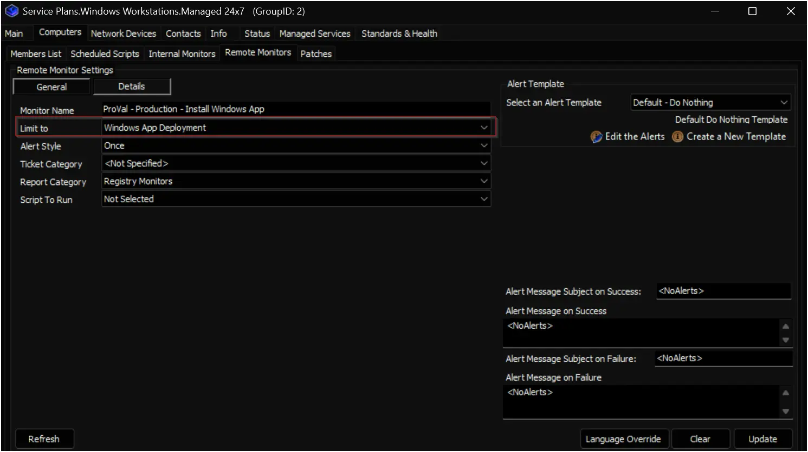

## Summary

This remote monitor detects Windows workstations where automatic deployment of the `Windows App` is enabled and the `Windows App` is either not installed or the desktop shortcut is missing or broken

## Details

**Suggested "Limit to"**: `Windows App Deployment`  
**Suggested Alert Style**: `Once`  
**Suggested Alert Template**: `Default - Do Nothing`

Insert the details of the monitor in the table below.

| Check Action | Server Address | Check Type | Execute Info | Comparator | Interval | Result |
|--------------|----------------|------------|---------------|------------|----------|--------|
| System       | 127.0.0.1      | Run File   | **REDACTED**  | Not Contains | 1800     | False |

## Dependencies

- [Script: Install Windows App](/docs/dd28b731-7fbc-4345-8d0b-6875df1d5658)
- [Solution: Install Windows App](/docs/0d8c4619-b666-44ec-93b1-2d00e4632865)

## Target

The remote monitor should be limited to the `Windows App Deployment` search on the **Managed Windows Workstations** service plan group(s).



## Implementation

### Step 1

Import the [Install Windows App](/docs/dd28b731-7fbc-4345-8d0b-6875df1d5658) script using the `ProSync` plugin.

### Step 2

Reload the system cache (`Ctrl + R`).

### Step 3

Run the script with the `SetEnvironment` parameter set to `1` to import the required EDFs.  


### Step 4

Reload the system cache (`Ctrl + R`).

### Step 5

Collect the group ID(s) for the group(s) where you want to apply this remote monitor.

### Step 6

Run the following SQL query to import the `Windows App Deployment` search.

```Sql
INSERT INTO `sensorchecks` 
SELECT 
'' as `SensID`,
'Windows App Deployment'  as `Name`, 
'SELECT \r\n   computers.computerid as `Computer Id`,\r\n   computers.name as `Computer Name`,\r\n   clients.name as `Client Name`,\r\n   computers.domain as `Computer Domain`,\r\n   computers.username as `Computer User`,\r\n   IFNULL(IFNULL(edfAssigned1.Value,edfDefault1.value),\'0\') as `Computer - Client - Extra Data Field - Software - Windows App`,\r\n   IFNULL(IFNULL(edfAssigned2.Value,edfDefault2.value),\'0\') as `Computer - Location - Extra Data Field - Exclusions - Exclude Windows App`,\r\n   IFNULL(IFNULL(edfAssigned3.Value,edfDefault3.value),\'0\') as `Computer - Extra Data Field - Exclusions - Exclude Windows App`,\r\n   IF(INSTR(IFNULL(inv_operatingsystem.Name, Computers.OS), \'windows\')>0, 1, IF(INSTR(IFNULL(inv_operatingsystem.Name, Computers.OS), \'darwin\') >0, 2, 3)) as `Computer.OS.Type`,\r\n   inv_operatingsystem.Server as `Computer.OS.IsServer`\r\nFROM Computers \r\nLEFT JOIN inv_operatingsystem ON (Computers.ComputerId=inv_operatingsystem.ComputerId)\r\nLEFT JOIN Clients ON (Computers.ClientId=Clients.ClientId)\r\nLEFT JOIN Locations ON (Computers.LocationId=Locations.LocationID)\r\nLEFT JOIN ExtraFieldData edfAssigned1 ON (edfAssigned1.id=Clients.ClientId and edfAssigned1.ExtraFieldId =(Select ExtraField.id FROM ExtraField WHERE LTGuid=\'736af4e6-7939-463f-b743-dc1dfa420911\'))\r\nLEFT JOIN ExtraFieldData edfDefault1 ON (edfDefault1.id=0 and edfDefault1.ExtraFieldId =(Select ExtraField.id FROM ExtraField WHERE LTGuid=\'736af4e6-7939-463f-b743-dc1dfa420911\'))\r\nLEFT JOIN ExtraFieldData edfAssigned2 ON (edfAssigned2.id=Locations.LocationId and edfAssigned2.ExtraFieldId =(Select ExtraField.id FROM ExtraField WHERE LTGuid=\'773f9b11-67cd-4510-8d06-ea9cf0788431\'))\r\nLEFT JOIN ExtraFieldData edfDefault2 ON (edfDefault2.id=0 and edfDefault2.ExtraFieldId =(Select ExtraField.id FROM ExtraField WHERE LTGuid=\'773f9b11-67cd-4510-8d06-ea9cf0788431\'))\r\nLEFT JOIN ExtraFieldData edfAssigned3 ON (edfAssigned3.id=Computers.ComputerId and edfAssigned3.ExtraFieldId =(Select ExtraField.id FROM ExtraField WHERE LTGuid=\'05361f65-7e68-40b5-8f2e-8caa0e91836f\'))\r\nLEFT JOIN ExtraFieldData edfDefault3 ON (edfDefault3.id=0 and edfDefault3.ExtraFieldId =(Select ExtraField.id FROM ExtraField WHERE LTGuid=\'05361f65-7e68-40b5-8f2e-8caa0e91836f\'))\r\n WHERE \r\n((((IFNULL(IFNULL(edfAssigned1.Value,edfDefault1.value),\'0\')<>0) AND (IFNULL(IFNULL(edfAssigned2.Value,edfDefault2.value),\'0\')=0) AND (IFNULL(IFNULL(edfAssigned3.Value,edfDefault3.value),\'0\')=0) AND (IF(INSTR(IFNULL(inv_operatingsystem.Name, Computers.OS), \'windows\')>0, 1, IF(INSTR(IFNULL(inv_operatingsystem.Name, Computers.OS), \'darwin\') >0, 2, 3)) = \'1\') AND (inv_operatingsystem.Server=0))))\r\n'' as `SQL`,
'4' as `QueryType`,
'Select||=||=||=|^Select|||||||^' as `ListData`,
'0' as `FolderID`,
'5227fdcf-d154-4278-a3bd-9e0a4a942f1a' as `GUID`,
'<LabTechAbstractSearch><asn><st>AndNode</st><cn><asn><st>AndNode</st><cn><asn><st>ComparisonNode</st><lon>Computer.Client.Extra Data Field.Software.Windows App</lon><lok>Computer.Client.Edf.736af4e6-7939-463f-b743-dc1dfa420911</lok><lmo>IsTrue</lmo><dv>NULL</dv><dk>NULL</dk></asn><asn><st>ComparisonNode</st><lon>Computer.Location.Extra Data Field.Exclusions.Exclude Windows App</lon><lok>Computer.Location.Edf.773f9b11-67cd-4510-8d06-ea9cf0788431</lok><lmo>IsFalse</lmo><dv>NULL</dv><dk>NULL</dk></asn><asn><st>ComparisonNode</st><lon>Computer.Extra Data Field.Exclusions.Exclude Windows App</lon><lok>Computer.Edf.05361f65-7e68-40b5-8f2e-8caa0e91836f</lok><lmo>IsFalse</lmo><dv>NULL</dv><dk>NULL</dk></asn><asn><st>ComparisonNode</st><lon>Computer.OS.Type</lon><lok>Computer.OS.Type</lok><lmo>Equals</lmo><dv>Windows</dv><dk>1</dk></asn><asn><st>ComparisonNode</st><lon>Computer.OS.IsServer</lon><lok>Computer.OS.IsServer</lok><lmo>IsFalse</lmo><dv>NULL</dv><dk>NULL</dk></asn></cn></asn></cn></asn></LabTechAbstractSearch>' as `SearchXML`,
(NULL) as `UpdatedBy`,
(NULL) as `UpdateDate`
FROM  (SELECT MIN(computerid) FROM computers) a
Where (SELECT count(*) From SensorChecks where `GUID` = '5227fdcf-d154-4278-a3bd-9e0a4a942f1a') = 0 ;
```

### Step 7

Copy the following query, then replace **YOUR COMMA SEPARATED LIST OF GROUPID(S)** with the group ID(s) for the relevant groups:  

>You can find the placeholder at the end of the query, immediately after **WHERE**.

```Sql
SET @searchId = (SELECT Min(sensID) From SensorChecks where `GUID` = '5227fdcf-d154-4278-a3bd-9e0a4a942f1a');
INSERT INTO groupagents 
 SELECT '' as `AgentID`,
`groupid` as `GroupID`,
@searchId as `SearchID`,
'ProVal - Production - Install Windows App' as `Name`,
'6' as `CheckAction`,
'1' as `AlertAction`,
'<NoAlerts>~~~<NoAlerts>!!!<NoAlerts>~~~<NoAlerts>' as `AlertMessage`,
'0' as `ContactID`,
'3600' as `interval`,
'127.0.0.1' as `Where`,
'7' as `What`,
'C:\\Windows\\System32\\WindowsPowerShell\\v1.0\\powershell.exe -ExecutionPolicy Bypass -Command "$ErrorActionPreference = \'SilentlyContinue\'; $ProgressPreference = \'SilentlyContinue\'; $isInstalled = $null -ne (Get-AppxPackage \'MicrosoftCorporationII.Windows365\' -AllUsers); $isShortcutConfigured = Test-Path -Path \'C:\\Users\\Public\\Desktop\\Windows App.lnk\'; if ($isShortcutConfigured) { $shell = New-Object -ComObject WScript.Shell; $shortcutPath = \'C:\\Users\\Public\\Desktop\\Windows App.lnk\'; $targetPath = $shell.CreateShortcut($shortcutPath).TargetPath; $isShortcutConfigured = Test-Path -Path $targetPath }; return (\'IsInstalled={0}|IsShortcutConfigured={1}|DataCollectionTime={2}\' -f $isInstalled, $isShortcutConfigured, (Get-Date).ToString(\'yyyy-MM-dd HH:mm:ss\'))"' as `DataOut`,
'9' as `Comparor`,
'False' as `DataIn`,
'' as `IDField`,
'1' as `AlertStyle`,
'0' as `ScriptID`,
'' as `datacollector`,
'21' as `Category`,
'0' as `TicketCategory`,
'1' as `ScriptTarget`,
(UUID()) as `GUID`,
'root' as `UpdatedBy`,
(NOW()) as `UpdateDate`
FROM mastergroups m
WHERE m.groupid IN (YOUR COMMA SEPARATED LIST OF GROUPID(S))
AND m.groupid NOT IN  (SELECT DISTINCT groupid FROM groupagents WHERE `Name` = 'ProVal - Production - Install Windows App')
```

**An example of a query with a group ID:**

```sql
SET @searchId = (SELECT Min(sensID) From SensorChecks where `GUID` = '5227fdcf-d154-4278-a3bd-9e0a4a942f1a');
INSERT INTO groupagents 
 SELECT '' as `AgentID`,
`groupid` as `GroupID`,
@searchId as `SearchID`,
'ProVal - Production - Install Windows App' as `Name`,
'6' as `CheckAction`,
'1' as `AlertAction`,
'<NoAlerts>~~~<NoAlerts>!!!<NoAlerts>~~~<NoAlerts>' as `AlertMessage`,
'0' as `ContactID`,
'3600' as `interval`,
'127.0.0.1' as `Where`,
'7' as `What`,
'C:\\Windows\\System32\\WindowsPowerShell\\v1.0\\powershell.exe -ExecutionPolicy Bypass -Command "$ErrorActionPreference = \'SilentlyContinue\'; $ProgressPreference = \'SilentlyContinue\'; $isInstalled = $null -ne (Get-AppxPackage \'MicrosoftCorporationII.Windows365\' -AllUsers); $isShortcutConfigured = Test-Path -Path \'C:\\Users\\Public\\Desktop\\Windows App.lnk\'; if ($isShortcutConfigured) { $shell = New-Object -ComObject WScript.Shell; $shortcutPath = \'C:\\Users\\Public\\Desktop\\Windows App.lnk\'; $targetPath = $shell.CreateShortcut($shortcutPath).TargetPath; $isShortcutConfigured = Test-Path -Path $targetPath }; return (\'IsInstalled={0}|IsShortcutConfigured={1}|DataCollectionTime={2}\' -f $isInstalled, $isShortcutConfigured, (Get-Date).ToString(\'yyyy-MM-dd HH:mm:ss\'))"' as `DataOut`,
'9' as `Comparor`,
'False' as `DataIn`,
'' as `IDField`,
'1' as `AlertStyle`,
'0' as `ScriptID`,
'' as `datacollector`,
'21' as `Category`,
'0' as `TicketCategory`,
'1' as `ScriptTarget`,
(UUID()) as `GUID`,
'root' as `UpdatedBy`,
(NOW()) as `UpdateDate`
FROM mastergroups m
WHERE m.groupid IN (2, 3)
AND m.groupid NOT IN  (SELECT DISTINCT groupid FROM groupagents WHERE `Name` = 'ProVal - Production - Install Windows App')
```

### Step 8

Run your updated query in a `RAWSQL` monitor set.

### Step 9

Reload the system cache (`Ctrl + R`).

### Step 10

Open the `Remote Monitors` tab for the target group(s) and verify that this monitor is limited to the `Windows App Deployment` search.

## Changelog

### 2026-03-17

- Initial version of the document
