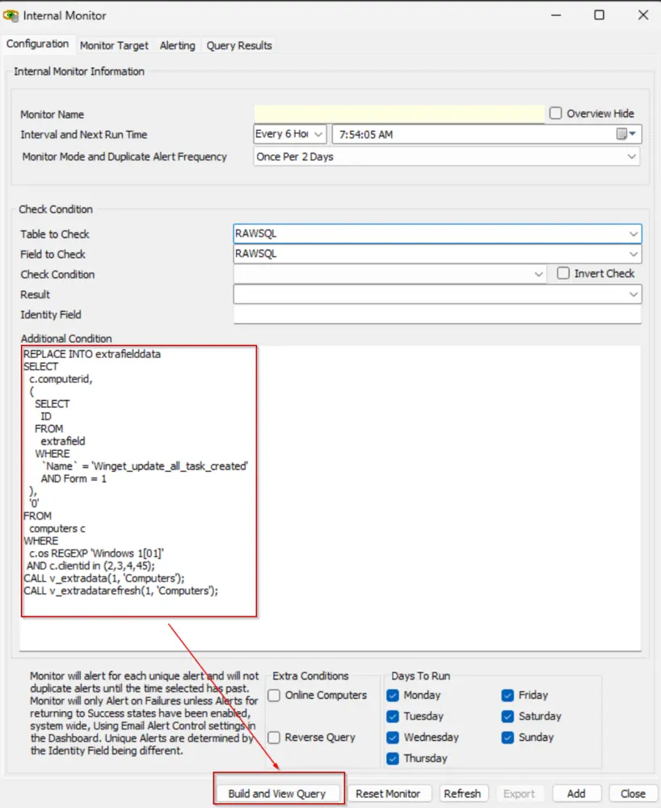
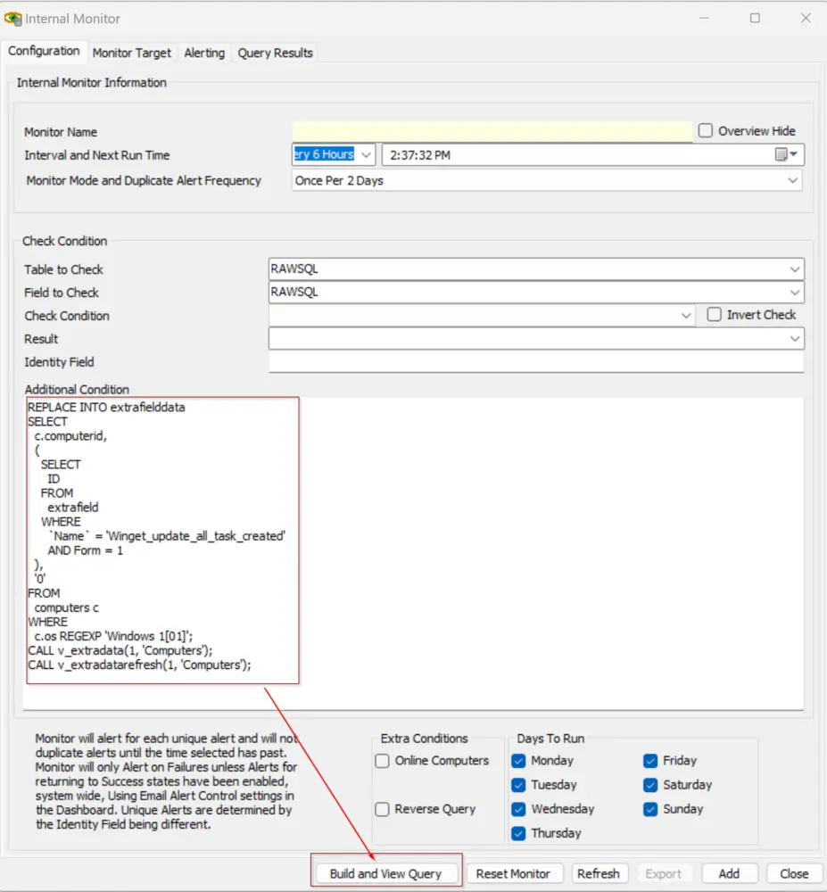

#### Launch RAWSQL Monitor

1. Launch a fresh RAWSQL monitor. A RAWSQL monitor set is an internal monitor featuring the string `RAWSQL` in both the `Table to Check` and `Field to Check` fields.  
   

#### For Client Level Changes

2. Copy the provided SQL query and replace `\\<Clientid(s)>` with a comma-separated list of clients to disable the user-level task.  

   ```sql
   REPLACE INTO extrafielddata 
   SELECT 
     c.computerid, 
     ( 
       SELECT 
         ID 
       FROM 
         extrafield 
       WHERE 
         `Name` = 'Winget_update_all_task_created' 
         AND Form = 1 
     ), 
     '0' 
   FROM 
     computers c 
   WHERE 
     c.os REGEXP 'Windows 1[01]' 
     AND c.clientid in (\\<strong><Clientid(s)>\\</strong>); 
   CALL v_extradata(1, 'Computers'); 
   CALL v_extradatarefresh(1, 'Computers');
   ```

   **Example:**

   ```sql
   REPLACE INTO extrafielddata 
   SELECT 
     c.computerid, 
     ( 
       SELECT 
         ID 
       FROM 
         extrafield 
       WHERE 
         `Name` = 'Winget_update_all_task_created' 
         AND Form = 1 
     ), 
     '0' 
   FROM 
     computers c 
   WHERE 
     c.os REGEXP 'Windows 1[01]' 
     AND c.clientid in (2,3,4,45); 
   CALL v_extradata(1, 'Computers'); 
   CALL v_extradatarefresh(1, 'Computers');
   ```

     
   

#### For Environment Level Changes

3. Run the provided SQL query using the RAWSQL monitor. Paste the query into the `Additional Condition` field and click the `Build and View Query` button to execute it.

   ```sql
   REPLACE INTO extrafielddata 
   SELECT 
     c.computerid, 
     ( 
       SELECT 
         ID 
       FROM 
         extrafield 
       WHERE 
         `Name` = 'Winget_update_all_task_created' 
         AND Form = 1 
     ), 
     '0' 
   FROM 
     computers c 
   WHERE 
     c.os REGEXP 'Windows 1[01]'; 
   CALL v_extradata(1, 'Computers'); 
   CALL v_extradatarefresh(1, 'Computers');
   ```

     
   

#### Reload System Cache

4. Reload the system cache to ensure all changes are updated.  
   