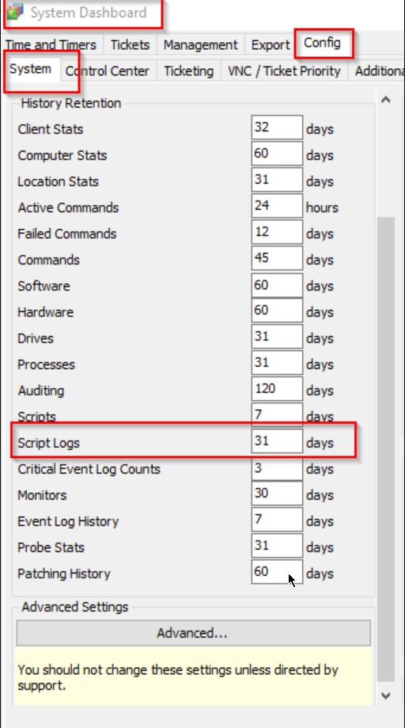
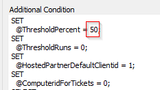
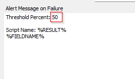
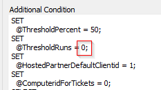
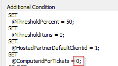
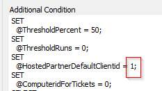
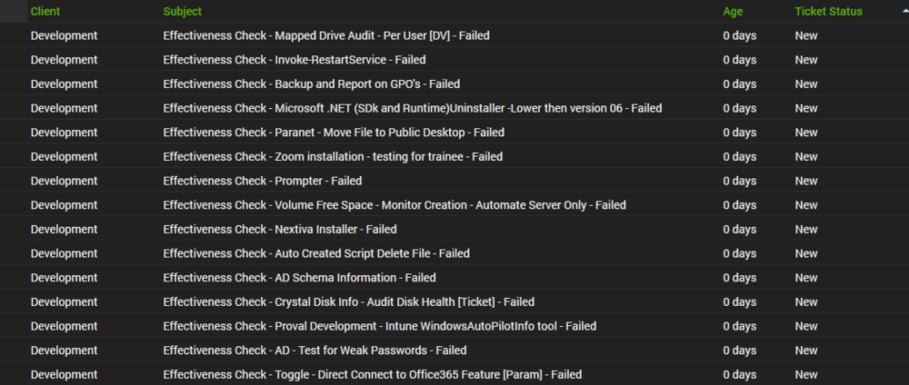
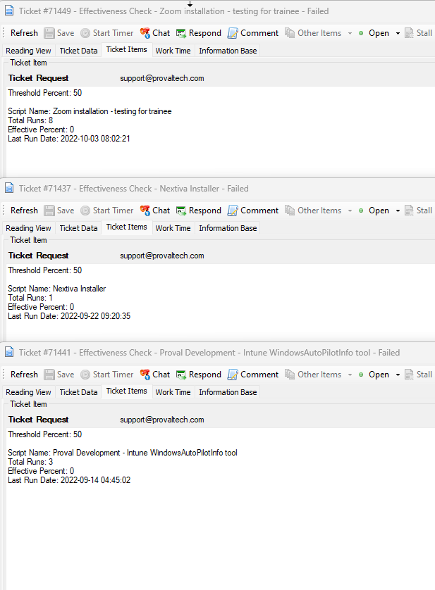

## Summary

The monitor will create a ticket for scripts that have a success/effectiveness rate of less than X over the set script log retention days.

The script log retention days can be seen at the Automate location below:

50 is the default threshold. The value for the `@ThresholdPercent` in the extra condition of the monitor set can be adjusted to update the threshold. If you set this number to 30, the monitor set will look for scripts for which the effectiveness is less than 30.

Make sure to change this number in the Alert Message on Failure section under the alerting tab accordingly.

The monitor's default behavior is to detect all scripts, regardless of how many times they have been executed. Update the value for the `@ThresholdRuns` from 0 to the required number if you want the monitor set to catch scripts with a minimum number of executions. By setting this number to 10, the monitor set will only identify scripts that have run at least 10 times.

### For On-Prem Partners

The default nature of the monitor is to create all the tickets against the Automate server. If you would like to generate the tickets for another computer, then set a number for the `@ComputeridForTickets` variable.

### For Hosted Partners

The default nature of the monitor is to create all the tickets for the oldest computer of client ID 1. If you would like to generate the tickets for another computer, then set a number for the `@ComputeridForTickets` variable.

If you would like to generate the ticket for the minimum client ID of another client, then set another number/id for the `@HostedPartnersDefaultClientid` variable.

**Note:** Do not remove the semicolons (;) while making changes.

### Alerting Tab:

- **Ticket Subject:** Effectiveness Check - Script Name - Failed

- **Ticket Body for Failures:**
  - Threshold Percent: 50
  - Total Runs: TotalNumberOfScriptRuns  
  - Effective Percent: Effective Percent  
  - Last Run Date: LastRunDateofScript.

#### Sample Screenshot Ticket Subject:

#### Sample Screenshot Ticket Body:

**The above screenshot contains the ticket body from three tickets.**

**Recommended Alert Template:** Default Create Ticket

## Target

Global

