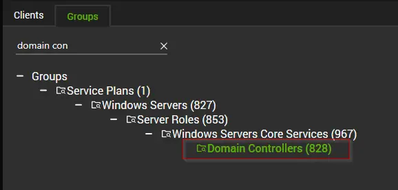
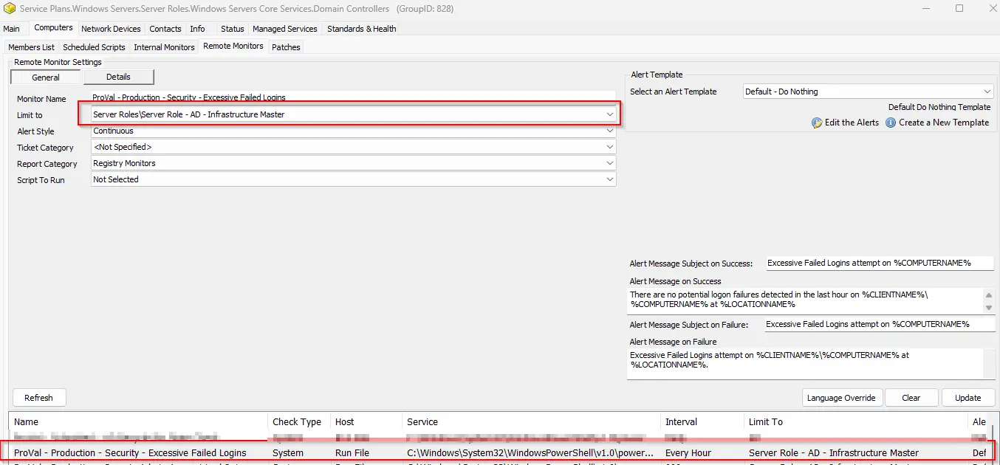
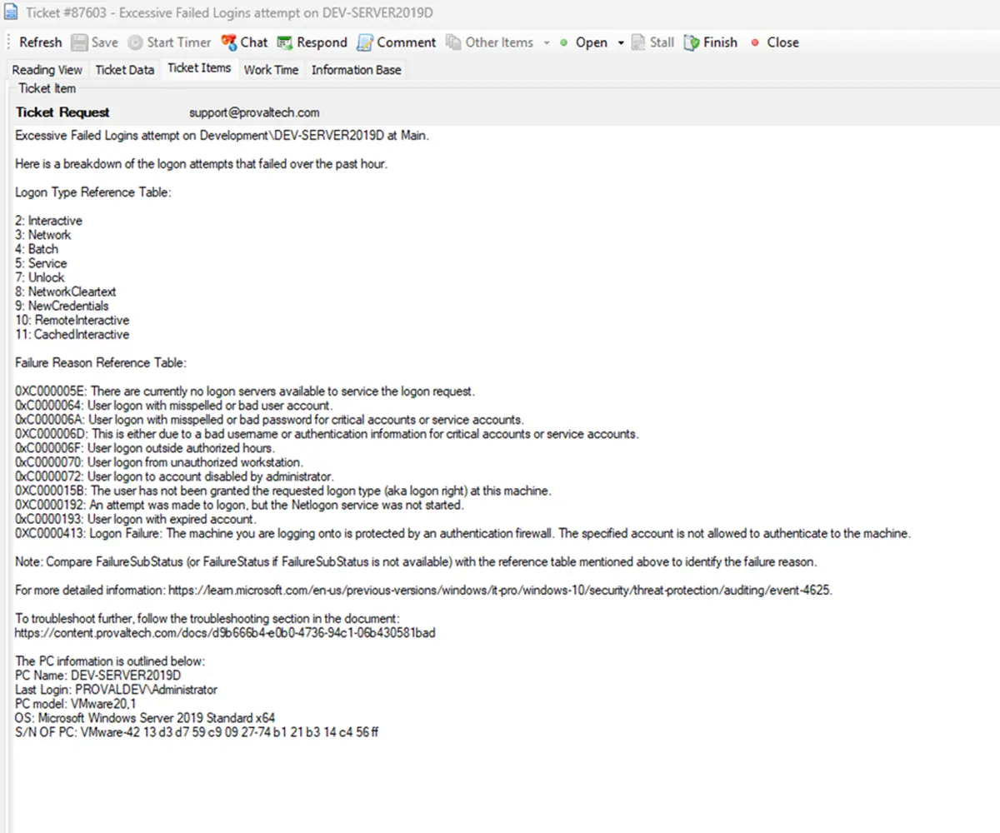

## Summary

This remote monitor checks the computer for security event log event ID `4625` where the count of occurrences is greater than 10 in the last 60 minutes.

The threshold can be modified by updating the value of the `$th` variable in the remote monitor's command. Change this value from 10 to the desired value after importing the remote monitor.

**The monitor set may not perform as expected for PowerShell versions older than 5.**

## Details

**Suggested "Limit to"**: Server Role - AD - Infrastructure Master  
**Suggested Alert Style**: Continuous  
**Suggested Alert Template**: △ Custom - Ticket Creation Computer - Failures Only  

| Check Action | Server Address | Check Type | Execute Info | Comparator | Interval | Result          |
|--------------|----------------|------------|---------------|------------|----------|------------------|
| System       | 127.0.0.1      | Run File   | **REDACTED**    | State Based | 3600     | `<Shown Below>`   |


## Dependencies

`Alert Template:` [Ticket Creation - Computer [Failures Only]](/docs/e14bf501-f10d-44d7-a19a-2284fd5c5cc9)

## Target

Domain Controllers  
  
  

## Alerting

**Subject:** `Excessive Failed Logins attempt on %COMPUTERNAME%`

**Alert Message on Success:** `There are no potential logon failures detected in the last hour on %CLIENTNAME%\%COMPUTERNAME% at %LOCATIONNAME%`

**Alert Message on Failure:**  
Excessive Failed Logins attempt on %CLIENTNAME%\%COMPUTERNAME% at %LOCATIONNAME%.


Here is a breakdown of the logon attempts that failed over the past hour.  
`%RESULT%`  

**Logon Type Reference Table:**  
```
2: Interactive
3: Network
4: Batch
5: Service
7: Unlock
8: NetworkCleartext
9: NewCredentials
10: RemoteInteractive
11: CachedInteractive
```

**Failure Reason Reference Table:**  
```
0XC000005E: There are currently no logon servers available to service the logon request.
0xC0000064: User logon with misspelled or bad user account.
0xC000006A: User logon with misspelled or bad password for critical accounts or service accounts.
0XC000006D: This is either due to a bad username or authentication information for critical accounts or service accounts.
0xC000006F: User logon outside authorized hours.
0xC0000070: User logon from unauthorized workstation.
0xC0000072: User logon to account disabled by administrator.
0XC000015B: The user has not been granted the requested logon type (aka logon right) at this machine.
0XC0000192: An attempt was made to logon, but the Netlogon service was not started.
0xC0000193: User logon with expired account.
0XC0000413: Logon Failure: The machine you are logging onto is protected by an authentication firewall. The specified account is not allowed to authenticate to the machine.
```

Note: Compare FailureSubStatus (or FailureStatus if FailureSubStatus is not available) with the reference table mentioned above to identify the failure reason.

For more detailed information: https://learn.microsoft.com/en-us/previous-versions/windows/it-pro/windows-10/security/threat-protection/auditing/event-4625

To troubleshoot further, follow the troubleshooting section in the document: 
https://content.provaltech.com/docs/d9b666b4-e0b0-4736-94c1-06b430581bad

**Sample Ticket:**  


## Implementation

[Import - Possible Brute Force Attack](/docs/5099131e-bdc7-470a-8bd1-011dfc54ef4e)


## Troubleshooting

#### **General Troubleshooting Steps:**

**1. Identify the Account Type:**

- `Domain Account:` Check in Active Directory Users and Computers (ADUC).

- `Local Account:` Use Computer Management > Local Users and Groups.
- `Service Account:` Check services or scheduled tasks using the account.
- `Unknown Account:` Investigate for potential brute-force or enumeration attacks.  

**2. Review Event Logs:**

- Look for Event ID `4625` in the Security log.

**3. Pay attention to:**

- Status/SubStatus codes

- Logon Type

- Source IP/Workstation

- Target Account Name

#### **4. Error Code Specific Troubleshooting:**

| Error Code   | Meaning                          |    Action Steps                                                                 |
|--------------|----------------------------------|------------------------------------------------------------------------------|
| 0xC000006A   | Bad password                     |<ol><li>Check if the password was recently changed.</li><li> Reset the password if needed.</li><li> Investigate repeated attempts (possible brute-force).</li></ol>|
| 0xC000006D   | Bad username or auth info        | <ol><li>Verify username.</li><li>Check for typos or outdated credentials.</li><li>Investigate source of repeated failures.</li></ol> |
| 0xC0000064   | Bad or misspelled username       | <ol><li>Confirm the account exists.</li><li>Investigate for enumeration attempts.</li></ol>  |
| 0xC000005E   | No logon servers available       | <ol><li>Check domain controller availability.</li><li>Ensure network connectivity.</li><li>Restart Netlogon service.</li></ol>|
| 0xC000006F   | Logon outside authorized hours   | <ol><li>Review account restrictions in AD.</li><li>Adjust allowed logon hours if needed.</li></ol> |
| 0xC0000070   | Unauthorized workstation         | <ol><li>Check workstation restrictions in AD.</li><li> Update allowed workstations.</li></ol> |
| 0xC0000072   | Account disabled                 | <ol><li>Enable the account in AD.</li><li>Investigate why it was disabled.</li></ol>   |
| 0xC000015B   | Logon type not granted           | <ol><li>Check Group Policy or Local Security Policy.</li><li> Grant appropriate logon rights.</li></ol>|
| 0xC0000192   | Netlogon service not started     | <ol><li>Start the Netlogon service.</li><li>Set it to automatic.</li></ol>                 |
| 0xC0000193   | Expired account                  | <ol><li>Extend or renew the account expiration date.</li></ol>        |
| 0xC0000413   | Auth firewall restriction        | <ol><li>Review firewall or security policies.</li><li>Allow the account to authenticate.</li></ol>|


#### **5. Service Account Specific Checks:**

- Find Services Using the Account.

- Run: `Get-WmiObject win32_service | Where-Object { $_.StartName -like "*accountname*" }`  
Or check manually in Services.msc.

**6. Update Password:**

- Change the password in AD.

- Update it in all services, scheduled tasks, and applications using it.

#### **7. If the Account is Unknown or Suspicious**

- `Investigate Source IP:` Use firewall logs or SIEM tools.  
- `Check for Patterns:` Repeated failures from the same IP or targeting multiple accounts.
- `Block IP or Account:` If malicious, take immediate action.  
- `Enable Account Lockout Policies:` To prevent brute-force attacks.