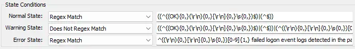
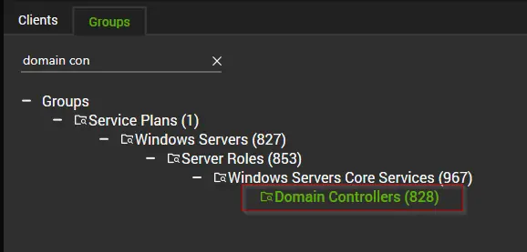
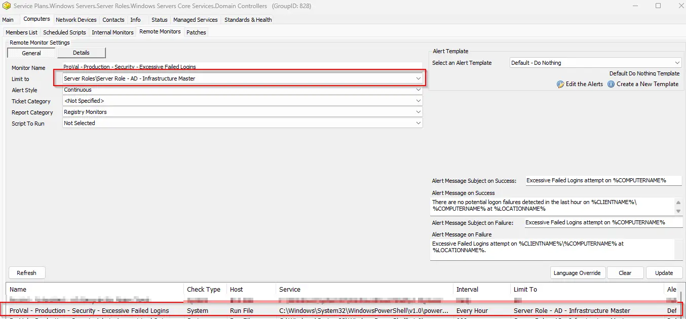
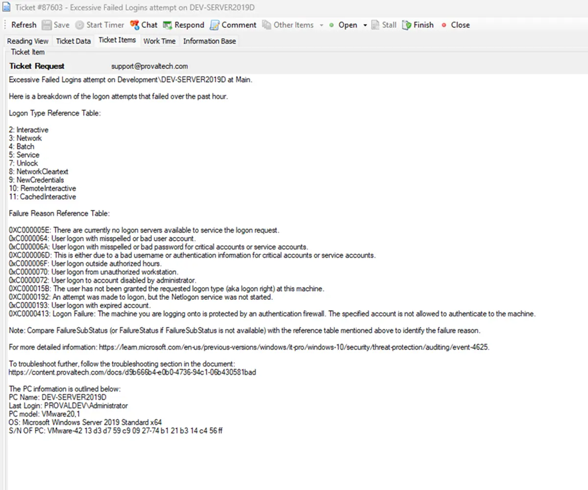

## Summary

Check the computer for security event log event ID 4625 where the count of occurrences is greater than 10 in the last 60 minutes.

The threshold can be modified by updating the value of the `$th` variable in the remote monitor's command. Change this value from 10 to the desired value after importing the remote monitor.

**The monitor set may not perform as expected for PowerShell versions older than 5.**

## Details

**Suggested "Limit to"**: Server Role - AD - Infrastructure Master  
**Suggested Alert Style**: Continuous  
**Suggested Alert Template**: △ Custom - Ticket Creation Computer - Failures Only  

| Check Action | Server Address | Check Type | Execute Info | Comparator | Interval | Result          |
|--------------|----------------|------------|---------------|------------|----------|------------------|
| System       | 127.0.0.1      | Run File   | **REDACTED**    | State Based | 3600     | `<Shown Below>`   |




## Dependencies

[Ticket Creation - Computer [Failures Only]](/docs/e14bf501-f10d-44d7-a19a-2284fd5c5cc9)

## Target

Domain Controllers  
  
  

## Alerting

**Subject:** `Possible Brute Force Attack on %COMPUTERNAME%`

**Alert Message on Success:** `There are no potential brute force or logon failures detected in the last hour on %CLIENTNAME%//%COMPUTERNAME% at %LOCATIONNAME%`

**Alert Message on Failure:**  
A possible brute force attack has been detected on %CLIENTNAME%//%COMPUTERNAME% at %LOCATIONNAME%.  
Here is a breakdown of the logon attempts that failed over the past hour.  
`%RESULT%`  

**Logon Type Reference Table:**  
```
2: Interactive
3: Network
4: Batch
5: Service
7: Unlock
8: NetworkCleartext
9: NewCredentials
10: RemoteInteractive
11: CachedInteractive
```

**Failure Reason Reference Table:**  
```
0XC000005E: There are currently no logon servers available to service the logon request.
0xC0000064: User logon with misspelled or bad user account.
0xC000006A: User logon with misspelled or bad password for critical accounts or service accounts.
0XC000006D: This is either due to a bad username or authentication information for critical accounts or service accounts.
0xC000006F: User logon outside authorized hours.
0xC0000070: User logon from unauthorized workstation.
0xC0000072: User logon to account disabled by administrator.
0XC000015B: The user has not been granted the requested logon type (aka logon right) at this machine.
0XC0000192: An attempt was made to logon, but the Netlogon service was not started.
0xC0000193: User logon with expired account.
0XC0000413: Logon Failure: The machine you are logging onto is protected by an authentication firewall. The specified account is not allowed to authenticate to the machine.
```

Note: Compare FailureSubStatus (or FailureStatus if FailureSubStatus is not available) with the reference table mentioned above to identify the failure reason.

For more detailed information: [Event 4625 Documentation](https://learn.microsoft.com/en-us/previous-versions/windows/it-pro/windows-10/security/threat-protection/auditing/event-4625)

To troubleshoot further, follow the troubleshooting section in the document: 
https://content.provaltech.com/docs/d9b666b4-e0b0-4736-94c1-06b430581bad

**Sample Ticket:**  


## Implementation

[Import - Possible Brute Force Attack](/docs/5099131e-bdc7-470a-8bd1-011dfc54ef4e)

## Troubleshooting

## FAQ

#### **General Troubleshooting Steps:**

**1. Identify the Account Type:**

- `Domain Account:` Check in Active Directory Users and Computers (ADUC).

- `Local Account:` Use Computer Management > Local Users and Groups.
- `Service Account:` Check services or scheduled tasks using the account.
- `Unknown Account:` Investigate for potential brute-force or enumeration attacks.  

**2. Review Event Logs:**

- Look for Event ID `4625` in the Security log.

**3. Pay attention to:**

- Status/SubStatus codes

- Logon Type

- Source IP/Workstation

- Target Account Name

#### **Error Code Specific Troubleshooting:**

| Error Code   | Meaning                          | Action Steps                                                                 |
|--------------|----------------------------------|------------------------------------------------------------------------------|
| 0xC000006A   | Bad password                     | - Check if the password was recently changed.  	- Reset the password if needed.  	- Investigate repeated attempts (possible brute-force). |
| 0xC000006D   | Bad username or auth info        | - Verify username.  	- Check for typos or outdated credentials.  - Investigate source of repeated failures. |
| 0xC0000064   | Bad or misspelled username       | - Confirm the account exists.  	- Investigate for enumeration attempts.   |
| 0xC000005E   | No logon servers available       | - Check domain controller availability.  	- Ensure network connectivity.  - Restart Netlogon service. |
| 0xC000006F   | Logon outside authorized hours   | - Review account restrictions in AD.  	- Adjust allowed logon hours if needed. |
| 0xC0000070   | Unauthorized workstation         | - Check workstation restrictions in AD.  	- Update allowed workstations.  |
| 0xC0000072   | Account disabled                 | - Enable the account in AD.  	- Investigate why it was disabled.         |
| 0xC000015B   | Logon type not granted           | - Check Group Policy or Local Security Policy.  	- Grant appropriate logon rights. |
| 0xC0000192   | Netlogon service not started     | - Start the Netlogon service.  	- Set it to automatic.                   |
| 0xC0000193   | Expired account                  | - Extend or renew the account expiration date.                              |
| 0xC0000413   | Auth firewall restriction        | - Review firewall or security policies.  	- Allow the account to authenticate. |


#### **Service Account Specific Checks:**

- Find Services Using the Account:

- Run: `Get-WmiObject win32_service | Where-Object { $_.StartName -like "*accountname*" }`  
Or check manually in Services.msc.

**Update Password:**

- Change the password in AD.

- Update it in all services, scheduled tasks, and applications using it.

#### **If the Account is Unknown or Suspicious**

- `Investigate Source IP:` Use firewall logs or SIEM tools.
Check for Patterns: Repeated failures from the same IP or targeting multiple accounts.
- `Block IP or Account:` If malicious, take immediate action.
Enable Account Lockout Policies: To prevent brute-force attacks.