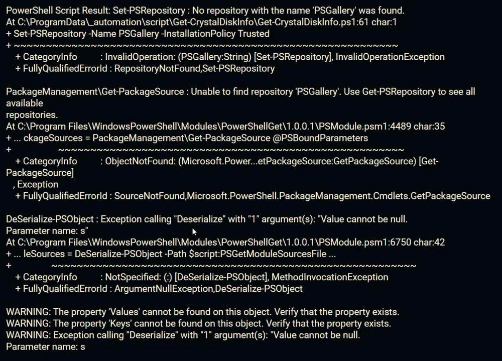

## Summary

This remote monitor attempts to set `PSGallery` as a trusted PowerShell repository if it is not already configured. You might have encountered this error at least once; this remote monitor attempts to resolve it.

This monitor will make changes to all systems it is deployed to.  

**What will change?**  
This monitor will check to see if the PSGallery is a trusted repository and will set it properly if needed.  
This automatically installs the prerequisite that is needed by a lot of ProVal content.

*This action will happen regardless of what alert template is set against the monitor.*  
*Monitors that make changes to the environment can be difficult to audit actions taken. Use with caution.*

## Details

**Suggested "Limit to"**: Windows Machines (PowerShell 5.0+)  
**Suggested Alert Style**: Once  
**Suggested Alert Template**: Default - Do Nothing  

Insert the details of the monitor in the table below.

| Check Action | Server Address | Check Type | Execute Info | Condition | Interval |
|--------------|----------------|-------------|---------------|-----------|----------|
| System       | 127.0.0.1      | Run File    | **REDACTED**  | State Based| 86400    |

## Target

Managed Windows Machines

## Implementation

[Import - Remote Monitor - Set-PsRepository PSGallery](/docs/5cb1373f-6cdc-4576-8b3e-e8bfc4d664de)