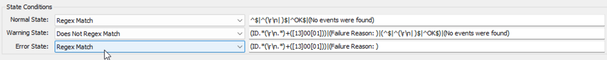

## Summary

The remote monitor activates SMB1 Server Auditing if it is not already enabled, generating event logs when any computer attempts to connect using the SMB1 protocol. Subsequently, it reviews the event logs to identify any instances of client connection attempts using the SMB1 protocol within the last hour.

This monitoring mechanism serves to identify servers or environments where the SMB1 protocol is still in use before any protocol disabling procedures are implemented.

**Note:** The ticket created by the monitor set will not be automatically closed.

## Details

**Suggested "Limit to":** Search: SMB1 Server Enabled [Remote Monitor]  
**Suggested Alert Style:** Continuous  
**Suggested Alert Template:** `△ Custom - Ticket Creation Computer - Failures Only`

Insert the details of the monitor in the table below.

| Check Action | Server Address | Check Type | Execute Info | Comparator  | Interval | Result                                                            |
| ------------ | -------------- | ---------- | ------------ | ----------- | -------- | ----------------------------------------------------------------- |
| System       | 127.0.0.1      | Run File   | **REDACTED** | State Based | 3600     |  |

## Dependencies

- [CWM - Automate - Script - Ticket Creation - Computer [Failures Only]](/docs/e14bf501-f10d-44d7-a19a-2284fd5c5cc9)
- [EPM - Windows Configuration - Remote Monitor - SMB1 Detection](/docs/de67816f-e6ff-4fed-92e1-26fd5ae5359d)

## Target

SMB1 Server Enabled [Remote Monitor]

## Ticketing

**Subject:** `SMB1 Traffic Detected on %COMPUTERNAME%`

**Body:**  
`SMB1 Traffic detected on %CLIENTNAME%/%COMPUTERNAME% in the past 1 hour.  
Details: `  
`%RESULT%`

## Implementation

[Implement - Remote Monitor - SMB1 Traffic Detection](/docs/e6d09f37-fd0f-42a6-98a5-449f65673296)