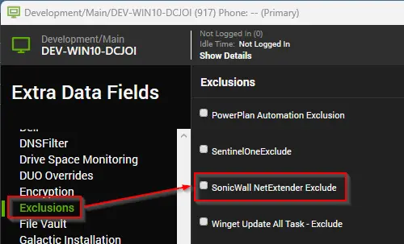

## Summary

This internal monitor detects the online Windows agent where the SonicWall NetExtender is installed for the upgrade. It depends on the client-based EDF 'SonicWall NetExtender Deployment' to check for the SonicWall NetExtender Install/Update. It also relies on the location-based and computer-based EDF 'SonicWall NetExtender Exclude' to exclude particular locations or agents from the deployed clients.

This monitor is also set up to grab the latest version of SonicWall NetExtender from the system property created from [Script - Application - Latest Version](/docs/ffb77c6c-8dd7-4ca5-82a2-327b1658cbde). This monitor should be paired with the other internal monitor [Monitor - SonicWall NetExtender - Latest Version Detection](/docs/62ad1299-3e65-4bf7-a415-307fdf9a162c).

## Dependencies

- [Script - SonicWall NetExtender - Install/Update](/docs/823c8e22-0b24-4cf9-9e25-4048d2973b98)
- [Script - Application - Latest Version](/docs/ffb77c6c-8dd7-4ca5-82a2-327b1658cbde)
- [Monitor - SonicWall NetExtender - Latest Version Detection](/docs/62ad1299-3e65-4bf7-a415-307fdf9a162c)
- [Solution - SonicWall NetExtender - Install/Update](/docs/70d9b103-f73f-4e68-a4aa-d2651e44d09a)

## EDFs

| EDF Name                                                                                     | Type            | Section  |Function                                                                                                                                                                                                                                                                                                                                                       |
|----------------------------------------------------------------------------------------------|-----------------|-----------------|----------------------------------------------------------------------------------------------------------------------------------------------------------------------------------------------------------------------------------------------------------------------------------------------------------------------------------------------------------------|
| SonicWall NetExtender Deployment                                                              | Client-EDF      |Security | This EDF needs to be checked for the monitor to detect the clients where the SonicWall NetExtender deployment is needed on their agents.                                                                                                                                                                          |
| SonicWall NetExtender Exclude                                                                 | Location-EDF  | Exclusions  | This EDF check at the location level will exclude the agents of the locations from the SonicWall NetExtender deployment.                                                                                                                                                                                                           |
| SonicWall NetExtender Exclude                                                                 | Computer-EDF |Exclusions   | This EDF check will exclude the agents from the SonicWall NetExtender deployment.                              |

## Target

Global