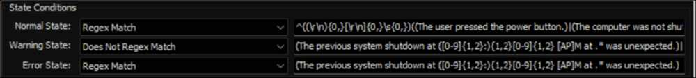

## Summary

The monitor set helps check if the computer had any recent unexpected shutdowns and provides basic details about them, offering insights into possible reasons.

**Requirement:** PowerShell v5+

## Details

**Suggested "Limit to":** Windows machines with PowerShell v5+ (Windows 10, 11, Server 2016, 2019, 2022)  
**Suggested Alert Style:** Continuous  
**Suggested Alert Template:** △ Custom - Ticket Creation Computer - Failures Only  

Insert the details of the monitor in the table below.

| Check Action | Server Address | Check Type | Execute Info | Condition   | Interval | Result              |
| ------------ | -------------- | ---------- | ------------ | ----------- | -------- | ------------------- |
| System       | 127.0.0.1      | Run File   | **REDACTED** | State Based | 3600     | \<Screenshot Below> |



## Dependencies

[CWM - Automate - Script - Ticket Creation - Computer [Failures Only]](/docs/e14bf501-f10d-44d7-a19a-2284fd5c5cc9)

## Target

Managed Windows machines with PowerShell v5+ (Windows 10, 11, Server 2016, 2019, 2022)

## Ticketing

**Subject:** `EV - Unexpected Shutdown Detected on %COMPUTERNAME%`

**Body:** `%RESULT%`

**Example 1:**

```
The previous system shutdown at 7:44:21 AM on 1/8/2024 was unexpected.
Event ID: 41
--------------------------------------
EventDate                      : 1/9/2024 2:47:50 AM
Computer                       : DEV-Win11-1
BugcheckCode                  : 0x000000a9
BugcheckParameter1 : 0x0
BugcheckParameter2 : 0x0
BugcheckParameter3 : 0x0
BugcheckParameter4 : 0x0
SleepInProgress : 0
PowerButtonTimestamp : 0
BootAppStatus : 0
Checkpoint : 0
ConnectedStandbyInProgress : false
SystemSleepTransitionsToOn : 0
CsEntryScenarioInstanceId : 0
BugcheckInfoFromEFI : false
CheckpointStatus : 0
CsEntryScenarioInstanceIdV2 : 0
LongPowerButtonPressDetected : false
LidReliability              : false
InputSuppressionState       : 0
PowerButtonSuppressionState  : 0
LidState                    : 1
----------------------------------------
Please review this article for more information on the detected BugCheckCode: [Event ID 41 Restart](https://learn.microsoft.com/en-us/troubleshoot/windows-client/performance/event-id-41-restart)
```

**Example 2:**

```
The previous system shutdown at 9:24:16 AM on 1/10/2024 was unexpected.
Event ID: 41
--------------------------------------
EventDate                      : 1/10/2024 3:17:30 PM
Computer                       : DEV-Win11-1
BugcheckCode                  : 0
BugcheckParameter1 : 0x0
BugcheckParameter2 : 0x0
BugcheckParameter3 : 0x0
BugcheckParameter4 : 0x0
SleepInProgress : 0
PowerButtonTimestamp : 0
BootAppStatus : 0
Checkpoint : 0
ConnectedStandbyInProgress : false
SystemSleepTransitionsToOn : 0
CsEntryScenarioInstanceId : 0
BugcheckInfoFromEFI : false
CheckpointStatus : 0
CsEntryScenarioInstanceIdV2 : 0
LongPowerButtonPressDetected : false
LidReliability              : false
InputSuppressionState       : 0
PowerButtonSuppressionState  : 0
LidState                    : 1
----------------------------------------
The computer was not shut down due to crashing or a user pressing the power button; the most likely cause was a power outage.
```

**Example 3:**

```
The previous system shutdown at 11:13:56 PM on 2/21/2024 was unexpected.
Event ID: 41
--------------------------------------
EventDate                      : 2/22/2024 12:14:50 AM
Computer                       : DEV-Win11-1
BugcheckCode                  : 0
BugcheckParameter1 : 0x0
BugcheckParameter2 : 0x0
BugcheckParameter3 : 0x0
BugcheckParameter4 : 0x0
SleepInProgress : 0
PowerButtonTimestamp : 2/21/2024 11:13:56 PM
BootAppStatus : 0
Checkpoint : 0
ConnectedStandbyInProgress : false
SystemSleepTransitionsToOn : 0
CsEntryScenarioInstanceId : 0
BugcheckInfoFromEFI : false
CheckpointStatus : 0
CsEntryScenarioInstanceIdV2 : 0
LongPowerButtonPressDetected : false
LidReliability              : false
InputSuppressionState       : 0
PowerButtonSuppressionState  : 0
LidState                    : 1
----------------------------------------
The user pressed the power button.
```

## Implementation

[Import - Remote Monitor - Unexpected Shutdown](/docs/9bf4d628-655e-4568-bea6-dfd0544a1a56)
