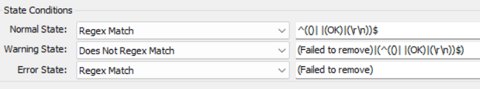

## Summary

The purpose of the remote monitor is to remove `Anydesk` from Windows machines.

## Details

**Suggested "Limit to"**: Windows OS  
**Suggested Alert Style**: Once  
**Suggested Alert Template**: △ Custom - Ticket Creation Computer  

Insert the details of the monitor in the table below.

| Check Action | Server Address | Check Type | Execute Info | Comparator  | Interval | Result                                                      |
| ------------ | -------------- | ---------- | ------------ | ----------- | -------- | ----------------------------------------------------------- |
| System       | 127.0.0.1      | Run File   | **REDACTED** | State Based | 3600     |  |

## Target

Windows OS

## Ticketing

**Subject**: `Anydesk Removal Failed on %CLIENTNAME%/%COMPUTERNAME%`  

**Ticket Body**: `Failed to remove Anydesk on %CLIENTNAME%/%COMPUTERNAME%`

## How To Import

[Implement - Remote Monitor - Uninstall Anydesk](/docs/8b658a17-cb91-457a-9efc-4b8f676b0fb0)