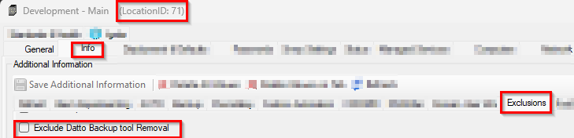
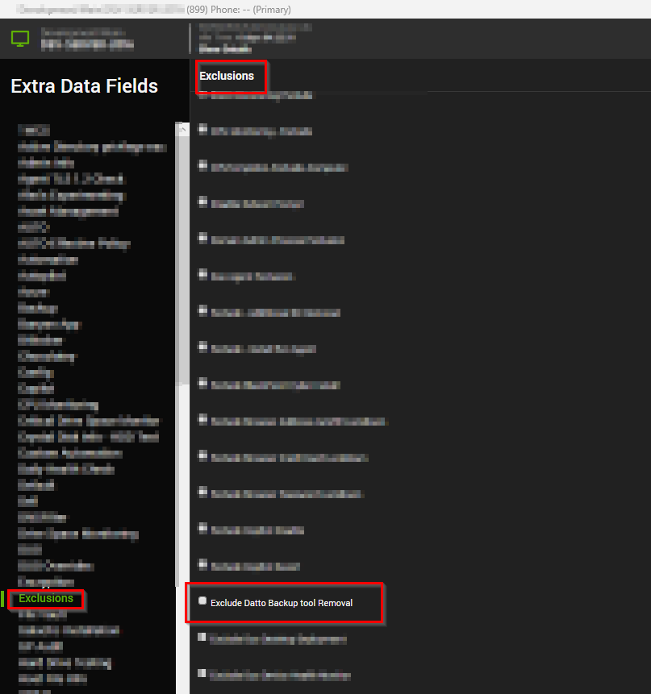

## Summary
This monitor runs every hour to check for the online Windows agents, where the client EDF `Uninstall Datto Backup tool` option are selected, and location/computer-level exclusion EDF `Exclude Datto Backup tool Removal` are not checked.

It also ensures the agent has the Datto Windows Agent or Datto Cloud Continuity installed.

It has an alert template "△ Custom - Execute Script - Uninstall Datto Windows|Cloud Continuity" applied.

## EDFs
| Name | Level | Type | Editable | Description |
| --------- | --------- | ------------ | --------- | -------------------------------------------- |
| `Uninstall Datto Backup tool` | Client | DropDown | Yes | This dropdown allows to select the `Datto Windows Agents` or `Datto Cloud Continuity` or `All` uninstallation |
| `Exclude Datto Backup tool Removal` | Location | Checkbox | Yes | This excludes the location from the uninstallation of Datto Windows Agents or Cloud Continuity |
| `Exclude Datto Backup tool Removal` | Computer | Checkbox | Yes | This exclude the computer from the uninstallation of Datto Windows Agents or Cloud Continuity |

## Dependencies

[Script - Uninstall Datto Backup Tool](/docs/c3ad2c46-6bae-4df4-980a-f937faf56dbc)

`Alert Template - △ Custom - Execute Script - Uninstall Datto Windows|Cloud Continuity`

## Target

Windows OS

## Implementation

- Import the monitor
- Set the `Alert Template - △ Custom - Execute Script - Uninstall Datto Windows|Cloud Continuity`.
- Select the option from the client level-EDF `Uninstall Datto Backup tool` where the Datto Windows Agent or Datto Cloud Continuity is required to uninstall.
  

- If the location or any computer required to be excluded from the detection of the monitor to perform the uninstallation of Datto Windows Agent or Datto Cloud Continuity, then check the location/computer level exclusion EDF `Exclude Datto Backup tool Removal`
  
  

- Once EDFs are set, the monitor will detect 20 online Windows agents every hour where the Datto Windows Agent or Datto Cloud Continuity are installed and perform the uninstallation by triggering the script [Script - Uninstall Datto Backup Tool](/docs/c3ad2c46-6bae-4df4-980a-f937faf56dbc) using `Alert Template - △ Custom - Execute Script - Uninstall Datto Windows|Cloud Continuity`.