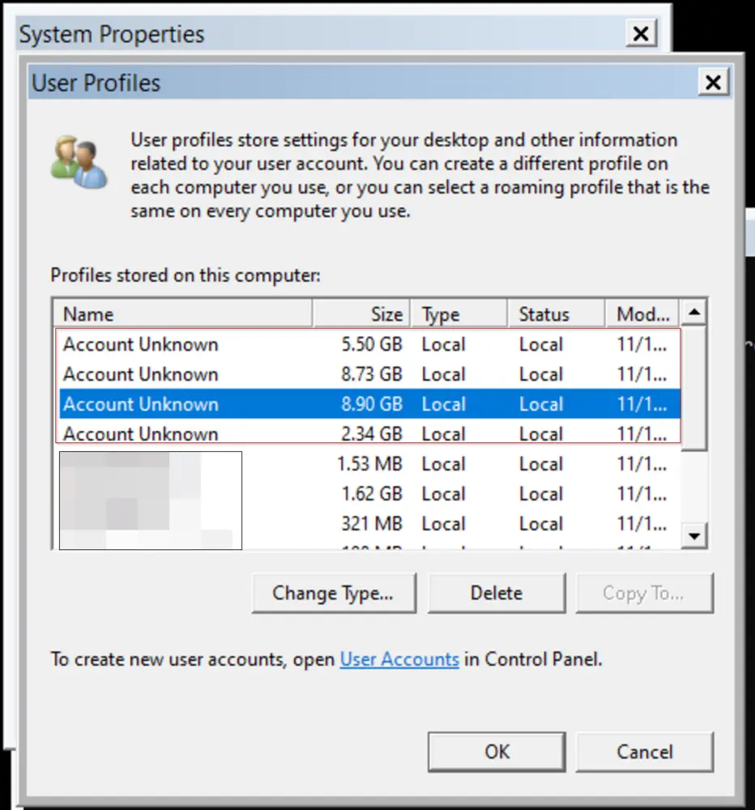

## Summary

The internal monitor identifies machines that have unknown user profiles. The data is collected by the [User Profile - Get Information](/docs/91d80bf6-68c8-4025-b285-d07390b860c8) script.



**Note:** The internal monitor does not depend on the [Domain Trust Relationship Check](/docs/bf518e9f-f93c-451b-a38a-5fc3472cc6f4) remote monitor. However, it will not detect the machines identified by the [Domain Trust Relationship Check](/docs/bf518e9f-f93c-451b-a38a-5fc3472cc6f4) remote monitor to prevent identifying machines that have a broken trust relationship with the domain. Since the [User Profile - Get Information](/docs/91d80bf6-68c8-4025-b285-d07390b860c8) script cannot properly retrieve accounts for these machines, it will add '(Inferred)' to the remote user names.

## Dependencies

- [EPM - Accounts - Script - User Profile - Get Information](/docs/91d80bf6-68c8-4025-b285-d07390b860c8)
- [EPM - Accounts - Custom Table - plugin_proval_userprofiles](/docs/7a87abf3-b410-491b-bbc1-534092e61f55)
- [CWM - Automate - Script - Ticket Creation - Computer](/docs/63beba3c-f4a6-41a5-98e2-d4e4ce885035)

## Target

Global

## Alert Template

`△ Custom - Ticket Creation - Computer`

## Ticketing

**Subject:** `Unknown User Profiles Detected on %ComputerName%`

**Body:**

```
%FIELDNAME% unknown user profiles detected on %ComputerName%  
Details:  
%RESULT%
```

**%FIELDNAME%:** Number of unknown profiles

**%RESULT%:** Information of unknown profiles.

**Example %RESULT%:**

```
Username: user1 (Inferred)
UserProfile: C:/Users/user1
ProfileSizeMB: 8090
UserSid: S-1-5-21-1327865892-1327865892-1327865892-12106

Username: user2 (Inferred)
UserProfile: C:/Users/user2
ProfileSizeMB: 1237
UserSid: S-1-5-21-1327865892-1327865892-1327865892-1758
```