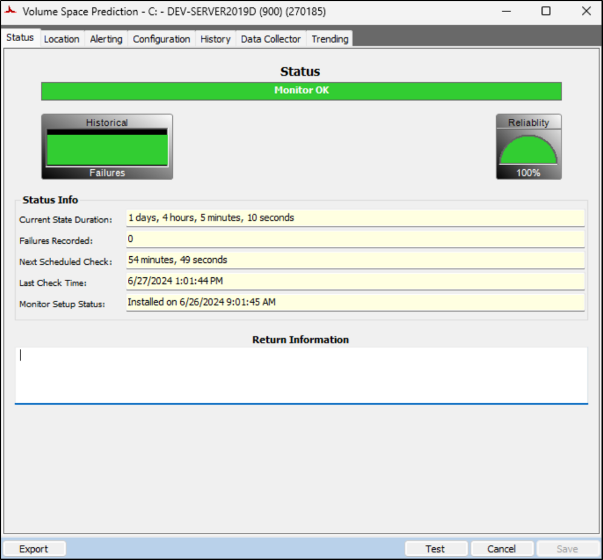
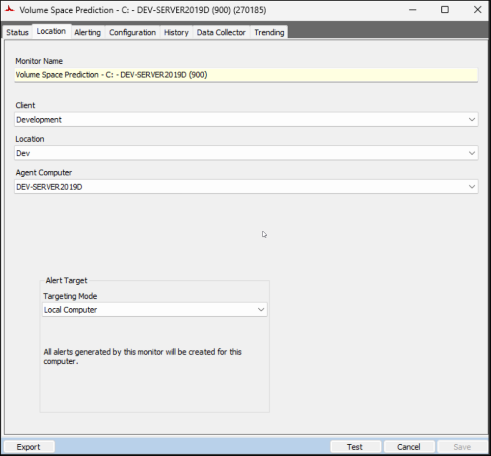
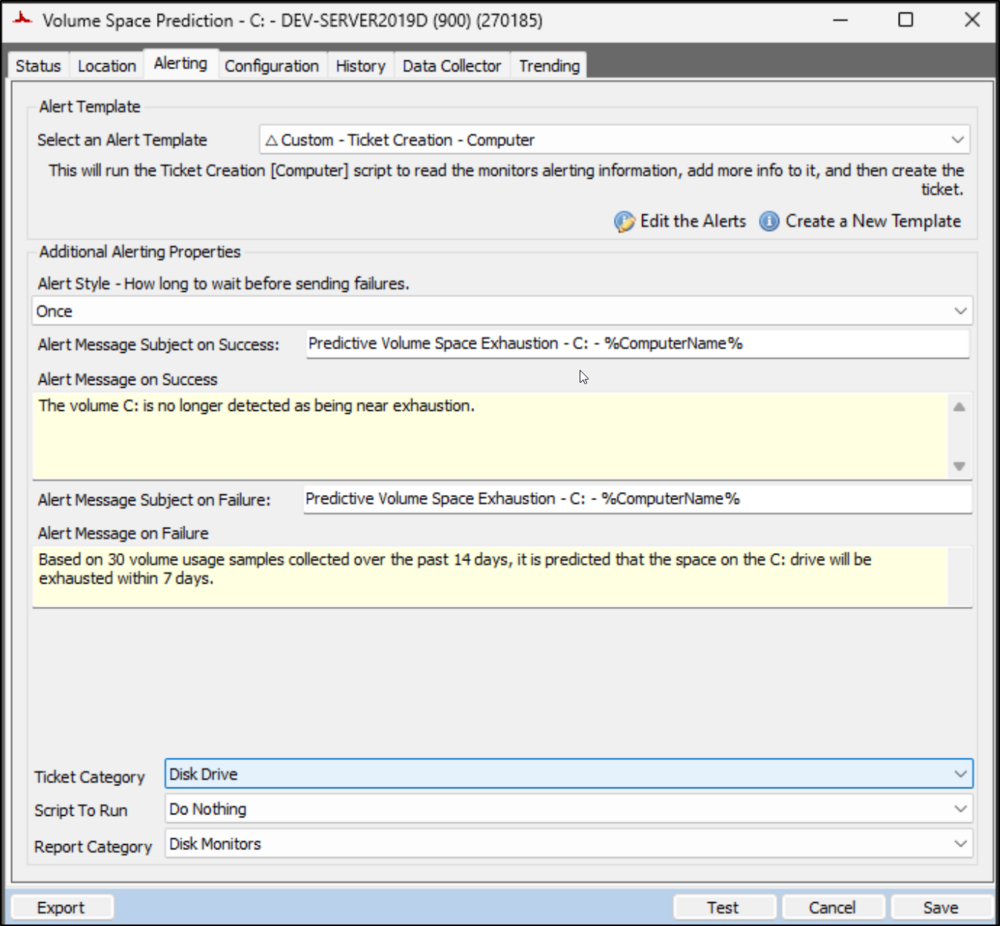
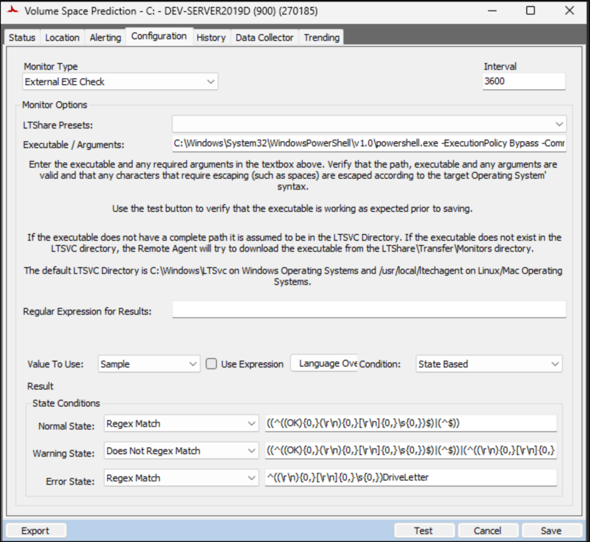
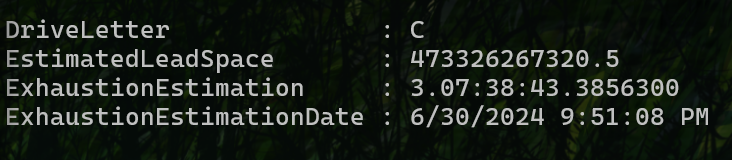

## Summary

The monitor set is generated by the [Predictive Volume Exhaustion Monitor Creation](/docs/d353ba91-e58f-4afb-b5da-1ac2eaeb2006) script. It utilizes the [Get-VolumeExhaustionEstimate](/docs/21bc13d3-b2fb-42d5-8f38-da9b43990e06) agnostic script to assess and provide an estimation of the number of days remaining before the drive space is entirely occupied, utilizing the trend data/samples gathered. The parameters for the script are configured according to the system properties detailed in the [script's](/docs/d353ba91-e58f-4afb-b5da-1ac2eaeb2006) documentation.

## Dependencies

[EPM - Disk - Script - Predictive Volume Exhaustion Monitor Creation](/docs/d353ba91-e58f-4afb-b5da-1ac2eaeb2006)

## Monitor Set

### Status

### Location

### Alerting

### Configuration

**Executable/Arguments:**  
`C:\Windows\System32\WindowsPowerShell\v1.0\powershell.exe -ExecutionPolicy Bypass -Command "$WarningPreference = 'SilentlyContinue'; [Net.ServicePointManager]::SecurityProtocol = [enum]::ToObject([Net.SecurityProtocolType], 3072); $ProjectName = 'Get-VolumeExhaustionEstimate'; $WorkingDirectory = \"C:/ProgramData/_Automation/Script/$ProjectName\"; $scriptpath = \"$($WorkingDirectory)/$($ProjectName).ps1\"; $scripturl = 'https://file.provaltech.com/repo/script/Get-VolumeExhaustionEstimate.ps1'; if( !(Test-Path $WorkingDirectory) ) {mkdir $WorkingDirectory | Out-Null}; (New-Object System.Net.WebClient).DownloadFile($scripturl,$scriptpath); $op = & $scriptpath -MinimumSamples 30 -Path $WorkingDirectory -DaysToReport 14 -DaysToLead 7 -Quiet; $op | Where-Object { $_.DriveLetter -eq 'C' } | Format-List"`  

_The parameter values highlighted in the provided example are regulated by the system properties and the Extra Data Fields (EDFs)._

## Ticketing

**Subject:**  
`Predictive Volume Space Exhaustion - <DriveLetter>: - %ComputerName%`

**Body:**  
`Based on <MinimumSamples> volume usage samples collected over the past <DaysToReport> days, it is predicted that the space on the <DriveLetter>: drive will be exhausted within <DaysToLead> days.`  

**Detailed Information:**  
`@Result@`  

**Sample @Result@:**

