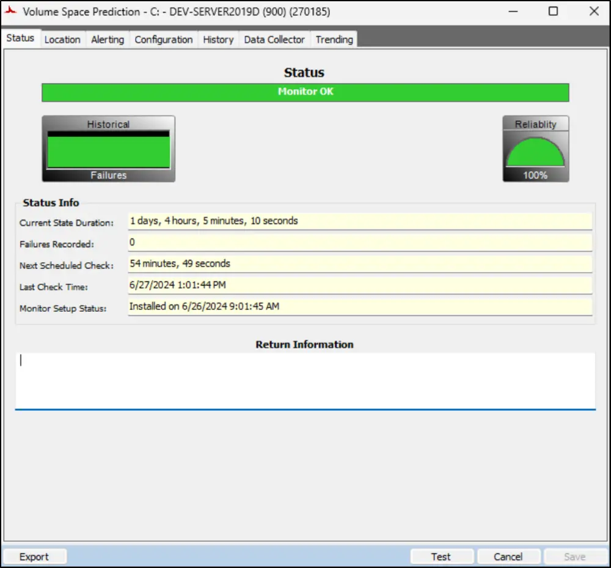
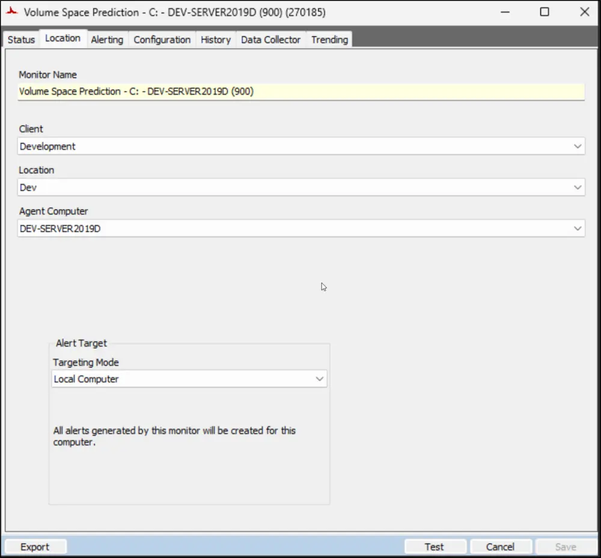
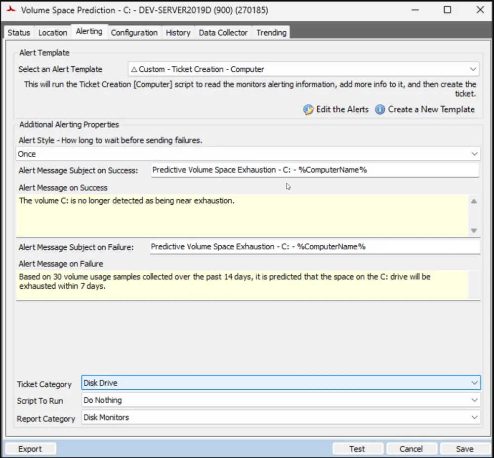
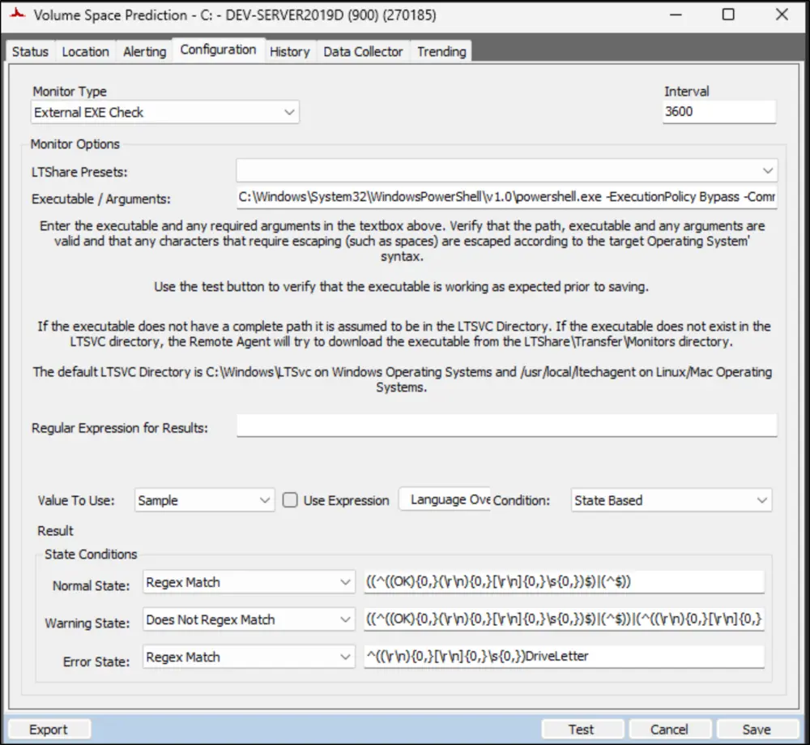
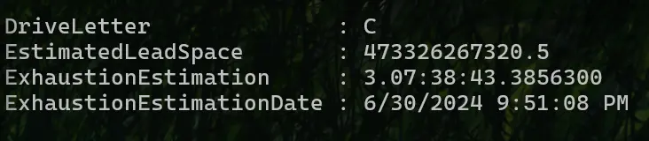

## Summary

The monitor set is generated by the [Predictive Volume Exhaustion Monitor Creation](/docs/d353ba91-e58f-4afb-b5da-1ac2eaeb2006) script. It utilizes the [Get-VolumeExhaustionEstimate](/docs/21bc13d3-b2fb-42d5-8f38-da9b43990e06) agnostic script to assess and provide an estimation of the number of days remaining before the drive space is entirely occupied, utilizing the trend data/samples gathered. The parameters for the script are configured according to the system properties detailed in the [script's](/docs/d353ba91-e58f-4afb-b5da-1ac2eaeb2006) documentation.

## Dependencies

- [Script - Predictive Volume Exhaustion Monitor Creation](/docs/d353ba91-e58f-4afb-b5da-1ac2eaeb2006)
- [Solution - Predictive Volume Space Exhaustion Monitoring](/docs/a367bf9d-8782-4500-a1b8-adbb757f23fc/)

## Monitor Set

### Status



### Location



### Alerting



### Configuration



**Executable/Arguments:**  

```shell
C:\Windows\System32\WindowsPowerShell\v1.0\powershell.exe -ExecutionPolicy Bypass -Command "$WarningPreference = 'SilentlyContinue'; $ProgressPreference = 'SilentlyContinue'; [Net.ServicePointManager]::SecurityProtocol = [enum]::ToObject([Net.SecurityProtocolType], 3072); $projectName = 'Get-VolumeExhaustionEstimate'; $workingDirectory = '{0}\_Automation\Script\{1}' -f $env:ProgramData, $projectName; $scriptpath = '{0}\{1}.ps1' -f $workingDirectory, $projectName; $scripturl = 'https://contentrepo.net/repo/script/{0}.ps1' -f $projectName; if(-not (Test-Path -Path $workingDirectory)) { New-Item -Path $workingDirectory -ItemType 'Directory' -Force -Confirm:$false | Out-Null }; try { Invoke-WebRequest -Uri $scriptUrl -OutFile $scriptPath -UseBasicParsing } catch { if (-not (Test-Path -Path $scriptPath)) { return $Error[0].Exception.Message } }; $op = & $scriptpath -MinimumSamples 30 -Path $WorkingDirectory -DaysToReport 7 -DaysToLead 2 -Quiet -Force; $op | Where-Object { $_.DriveLetter -eq 'C' } | Format-List"
```

_The parameter values highlighted in the provided example are regulated by the system properties and the Extra Data Fields (EDFs)._

## Ticketing

**Subject:**  
`Predictive Volume Space Exhaustion - <DriveLetter>: - %ComputerName%`

**Body:**  
`Based on <MinimumSamples> volume usage samples collected over the past <DaysToReport> days, it is predicted that the space on the <DriveLetter>: drive will be exhausted within <DaysToLead> days.`  

**Detailed Information:**  
`@Result@`  

**Sample @Result@:**



## Changelog

### 2026-05-05

- Optimized the command

### 2025-04-10

- Initial version of the document
