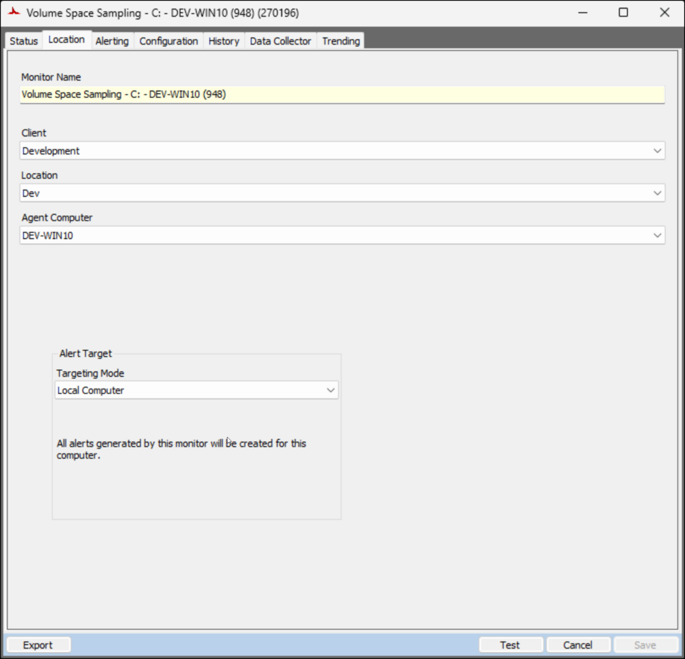
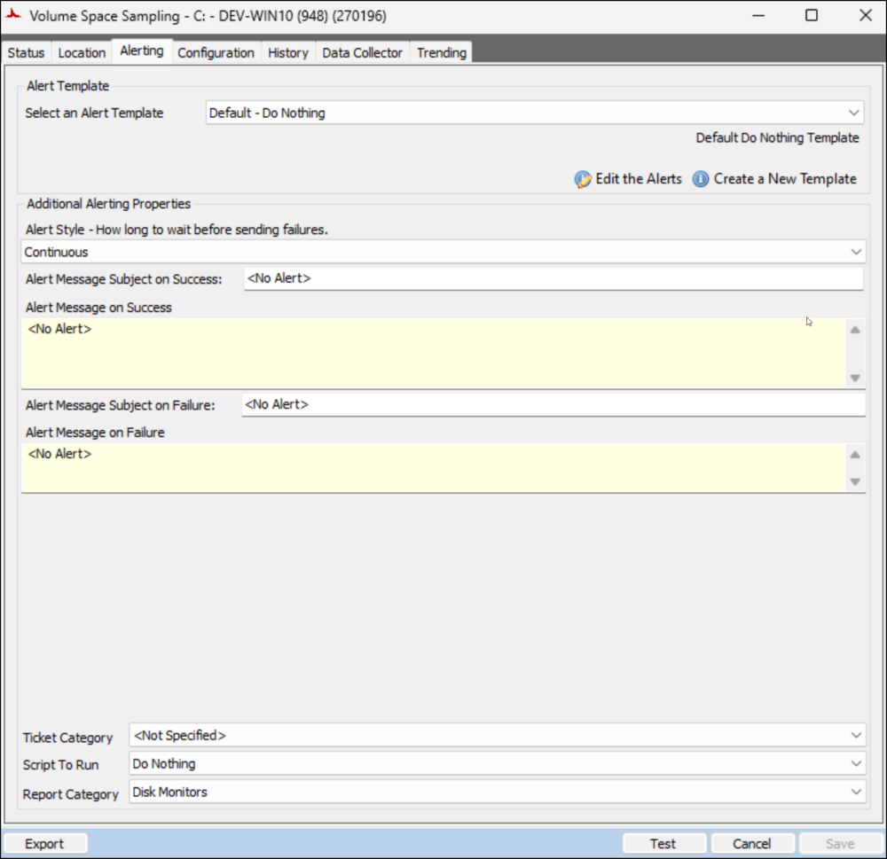
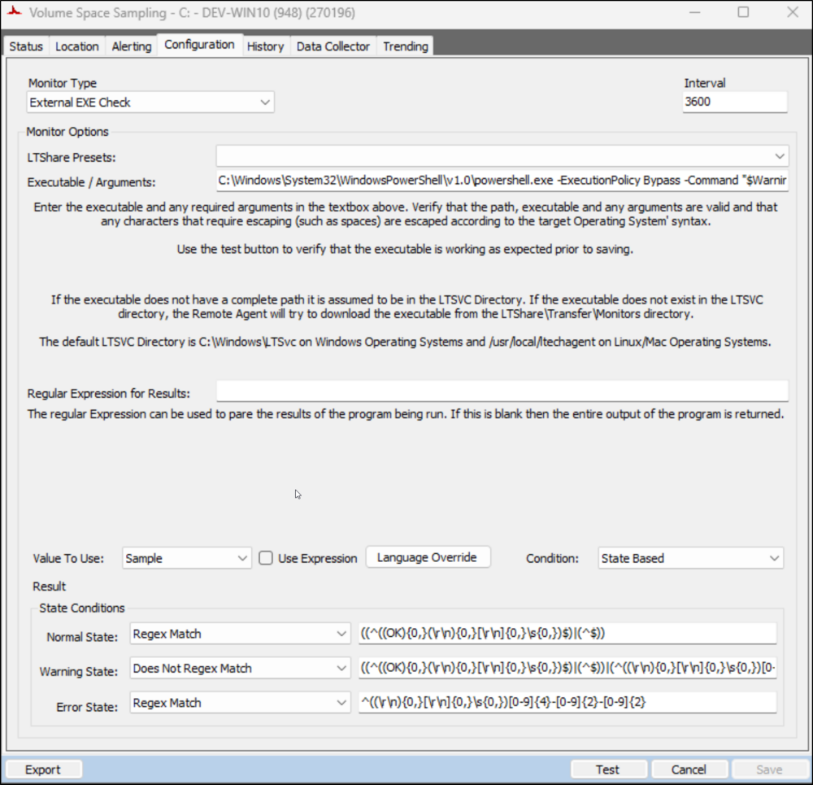

## Summary

The [Predictive Volume Exhaustion Monitor Creation](/docs/d353ba91-e58f-4afb-b5da-1ac2eaeb2006) script generates the monitor set. It utilizes the [Get-VolumeExhaustionEstimate](/docs/21bc13d3-b2fb-42d5-8f38-da9b43990e06) agnostic script to assess and return an estimation of the number of days remaining before the drive space is entirely occupied, utilizing the trend data/samples gathered. The parameters for the script are configured according to the system properties detailed in the [script's documentation](/docs/d353ba91-e58f-4afb-b5da-1ac2eaeb2006).

The data returned by the monitor set is displayed by the [Volume Exhaustion Estimations [Remote Monitor]](/docs/0db68132-d16e-4098-877c-8da269dfe587) dataview.

## Dependencies

- [EPM - Disk - Script - Predictive Volume Exhaustion Monitor Creation](/docs/d353ba91-e58f-4afb-b5da-1ac2eaeb2006)
- [EPM - Disk - Dataview - Volume Exhaustion Estimations [Remote Monitor]](/docs/0db68132-d16e-4098-877c-8da269dfe587)

## Monitor

#### Status


#### Location



#### Alerting



#### Configuration



**Executable/Arguments:** 
```shell
C:\Windows\System32\WindowsPowerShell\v1.0\powershell.exe -ExecutionPolicy Bypass -Command "$WarningPreference = 'SilentlyContinue'; [Net.ServicePointManager]::SecurityProtocol = [enum]::ToObject([Net.SecurityProtocolType], 3072); $ProjectName = 'Get-VolumeExhaustionEstimate'; $WorkingDirectory = \"C:\ProgramData\_Automation\Script\$ProjectName\"; $scriptpath = \"$($WorkingDirectory)\$($ProjectName).ps1\"; $scripturl = 'https://file.provaltech.com/repo/script/Get-VolumeExhaustionEstimate.ps1'; if (!(Test-Path $WorkingDirectory)) {mkdir $WorkingDirectory | Out-Null}; (New-Object System.Net.WebClient).DownloadFile($scripturl,$scriptpath); $op = & $scriptpath -MinimumSamples 30 -Path $WorkingDirectory -DaysToReport 14 -DaysToLead 7 -Quiet -Force; $exDate = ($op | Where-Object { $_.DriveLetter -eq 'C' }).ExhaustionEstimationDate; if ($exDate) { ($exdate).ToString('yyyy-MM-dd HH:mm:ss') }"
```

_The parameter values highlighted in the provided example are regulated by the system properties and the Extra Data Fields (EDFs)._