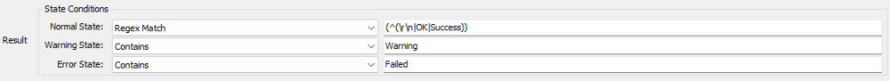
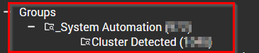

## Summary

This monitor will detect the cluster volumes where the cluster disk space is below 10% as an error and between 10-20% as a warning.

## Details

**Suggested "Limit to"**: Workstations, Windows Machines, etc.  
**Suggested Alert Style**: Once, Twice, etc.  
**Suggested Alert Template**: `△ CUSTOM - Execute Script - Windows Cluster Shared Volume`

Insert the details of the monitor in the table below.

| Check Action | Server Address | Check Type | Check Value   | Comparator   | Interval | Result                |
|--------------|----------------|------------|---------------|--------------|----------|-----------------------|
| System       | 127.0.0.1     | Run File   | \<REDACTED\>  | State Based  | 3600     | \<Screenshot below\>  |

## Dependencies

[CWA Script - Windows Cluster Shared Volume [Autofix, Ticket]](/docs/0a795741-52b7-4de6-abc2-01b5add80f99)

## Target

Should be targeted to a Cluster Detected group.

## Implementation

Please follow the implementation document below to install this content:

- [Import - Remote Monitor - Windows Cluster Shared Volume Detection](/docs/2fee5750-3a75-4256-b1b6-fcf2b81dccd6)