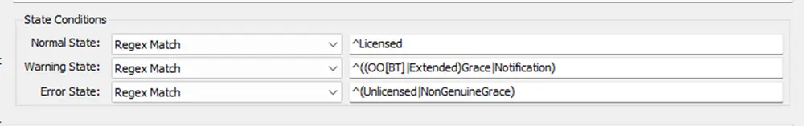
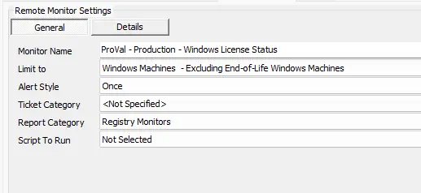
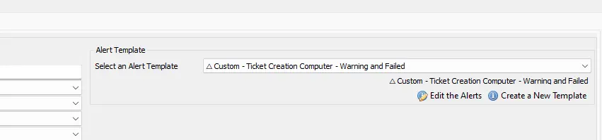

## Summary

This remote monitor checks and returns the Windows License Status via CIMInstance.

## Dependencies

[Script - Ticket Creation - Computer](/docs/63beba3c-f4a6-41a5-98e2-d4e4ce885035)

## Details

**Suggested "Limit to"**: Windows Machines - Excluding End-of-Life Windows Machines  
**Suggested Alert Style**: Once  
**Suggested Alert Template**: △ Custom - Ticket Creation Computer - Warning and Failed  

Insert the details of the monitor in the table below.

| Check Action | Server Address | Check Type | Execute Info | Comparator | Interval | Result               |
|--------------|----------------|------------|---------------|-------------|----------|----------------------|
| System       | 127.0.0.1     | Run File   | **REDACTED**  | Regex Match | 86400    | \<Screenshot Below\>   |



## Target

The suggested target for the monitor is the managed service plans for Windows devices (e.g., Managed Workstations 24x7). Please evaluate the best service plans where the monitor should be applied. It is recommended to include a "limit to" search for this remote monitor that excludes End-of-Life Windows Machines.

Windows Machines - Excluding End-of-Life Windows Machines.

**No guarantee for any machine with PowerShell Version older than 5.0**

## Ticketing

**Subject:** `Windows License Status FAILED on %COMPUTERNAME%`  

**Body:** Windows License Status for %COMPUTERNAME%: %Status% : %Result%  
Additional information on what each status means has been outlined below:

```
Normal Status:  
Licensed: This means that the Windows installation is licensed and activated.
```

```
Warning Status:
OOBGrace: This means that the Windows installation is in the Out-of-Box Grace period, which is a temporary license that allows you to use Windows for a limited time before activating the license.
OOTGrace: This means that the Windows installation is in the Out-of-Tolerance Grace period, which is a temporary license that allows you to use Windows for a limited time if the hardware configuration of the computer has changed significantly since the license was activated.
Notification: This means that the Windows installation is licensed and activated, but the license is about to expire or the product key has been blocked.
ExtendedGrace: This means that the Windows installation is in the Extended Grace period, which is a temporary license that allows you to use Windows for a limited time if the computer has been unable to contact the activation server.
```

```
Error Status:
Unlicensed: This means that the Windows installation is not licensed.
NonGenuineGrace: This means that the Windows installation is in the Non-Genuine Grace period, which is a temporary license that allows you to use Windows for a limited time if the license is suspected to be non-genuine or pirated.
```

## Implementation

### Step 1
Import the Alert Template `△ Custom - Ticket Creation Computer - Warning and Failed`.

---

### Step 2
Run this SQL query from a RAWSQL monitor set to import the required search:

```sql
INSERT INTO `sensorchecks` (`Name`, `SQL`, `QueryType`, `ListDATA`, `FolderID`, `GUID`, `SearchXML`)
SELECT
    'Windows Machines - Excluding End-of-Life Windows Machines',
    'SELECT \r\n        computers.computerid as `Computer Id`,\r\n        computers.name as `Computer Name`,\r\n        clients.name as `Client Name`,\r\n        computers.domain as `Computer Domain`,\r\n        computers.username as `Computer User`,\r\n        IF(INSTR(IFNULL(inv_operatingsystem.Name, Computers.OS), \'windows\')>0, 1, IF(INSTR(IFNULL(inv_operatingsystem.Name, Computers.OS), \'darwin\') >0, 2, 3)) as `Computer.OS.Type`,\r\n        inv_operatingsystem.name as `Computer.OS.Name`\r\n    FROM Computers \r\n    LEFT JOIN inv_operatingsystem ON (Computers.ComputerId=inv_operatingsystem.ComputerId)\r\n    LEFT JOIN Clients ON (Computers.ClientId=Clients.ClientId)\r\n    LEFT JOIN Locations ON (Computers.LocationId=Locations.LocationID)\r\n    WHERE \r\n        (\r\n            (\r\n                (\r\n                    IF(INSTR(IFNULL(inv_operatingsystem.Name, Computers.OS), \'windows\')>0, 1, IF(INSTR(IFNULL(inv_operatingsystem.Name, Computers.OS), \'darwin\') >0, 2, 3)) = \'1\'\r\n                ) \r\n                AND \r\n                (\r\n                    NOT ((inv_operatingsystem.name like \'%Windows XP%\')) \r\n                    AND \r\n                    NOT ((inv_operatingsystem.name like \'%2003%\')) \r\n                    AND \r\n                    NOT ((inv_operatingsystem.name like \'%2011%\')) \r\n                    AND \r\n                    NOT ((inv_operatingsystem.name like \'%Windows 7%\')) \r\n                    AND \r\n                    NOT ((inv_operatingsystem.name like \'%2008%\')) \r\n                    AND \r\n                    NOT ((inv_operatingsystem.name like \'%Windows 8%\')) \r\n                    AND \r\n                    NOT ((inv_operatingsystem.name like \'%2012%\'))\r\n                )\r\n            )\r\n        )',
    4,
    'Select||=||=||=|^Select|||||||^',
    3,
    '<LabTechAbstractSearch><asn><st>AndNode</st><cn><asn><st>AndNode</st><cn><asn><st>ComparisonNode</st><lon>Computer.OS.Type</lon><lok>Computer.OS.Type</lok><lmo>Equals</lmo><dv>Windows</dv><dk>1</dk></asn><asn><st>NotNode</st><cn><asn><st>ComparisonNode</st><lon>Computer.OS.Name</lon><lok>Computer.OS.Name</lok><lmo>TextLike</lmo><dv>%Windows XP%</dv><dk>%Windows XP%</dk></asn></cn></asn><asn><st>NotNode</st><cn><asn><st>ComparisonNode</st><lon>Computer.OS.Name</lon><lok>Computer.OS.Name</lok><lmo>TextLike</lmo><dv>%2003%</dv><dk>%2003%</dk></asn></cn></asn><asn><st>NotNode</st><cn><asn><st>ComparisonNode</st><lon>Computer.OS.Name</lon><lok>Computer.OS.Name</lok><lmo>TextLike</lmo><dv>%2011%</dv><dk>%2011%</dk></asn></cn></asn><asn><st>NotNode</st><cn><asn><st>ComparisonNode</st><lon>Computer.OS.Name</lon><lok>Computer.OS.Name</lok><lmo>TextLike</lmo><dv>%Windows 7%</dv><dk>%Windows 7%</dk></asn></cn></asn><asn><st>NotNode</st><cn><asn><st>ComparisonNode</st><lon>Computer.OS.Name</lon><lok>Computer.OS.Name</lok><lmo>TextLike</lmo><dv>%2008%</dv><dk>%2008%</dk></asn></cn></asn><asn><st>NotNode</st><cn><asn><st>ComparisonNode</st><lon>Computer.OS.Name</lon><lok>Computer.OS.Name</lok><lmo>TextLike</lmo><dv>%Windows 8%</dv><dk>%Windows 8%</dk></asn></cn></asn><asn><st>NotNode</st><cn><asn><st>ComparisonNode</st><lon>Computer.OS.Name</lon><lok>Computer.OS.Name</lok><lmo>TextLike</lmo><dv>%2012%</dv><dk>%2012%</dk></asn></cn></asn></cn></asn></cn></asn></LabTechAbstractSearch>'
FROM
    (SELECT MIN(computerid) FROM computers) a
WHERE
    (SELECT COUNT(*) FROM SensorChecks WHERE `GUID` = 'b7768144-8137-48e9-aea7-48ef11f341b1') = 0;
```

---

### Step 3
Obtain the group ID(s) of the group(s) that the remote monitor should be applied to.

---

### Step 4
Copy the following query and replace **YOUR COMMA SEPARATED LIST OF GROUPID(S)** with the group ID(s) of the relevant groups. (The string to replace can be found at the very bottom of the query, right after **WHERE**).

```sql
SET @searchid = (SELECT sensid FROM sensorchecks WHERE `GUID` = 'b7768144-8137-48e9-aea7-48ef11f341b1');

INSERT INTO groupagents
SELECT '' as `AgentID`,
`groupid` as `GroupID`,
@searchid as `SearchID`,
'ProVal - Production - Windows License Status' as `Name`,
'6' as `CheckAction`,
'1' as `AlertAction`,
'Windows License Status FAILED on %COMPUTERNAME%~~~Windows License Status for %COMPUTERNAME%: %Status% : %Result%\r\n\r\nAdditional information on what each status means has been outlined below:\r\n\r\nNormal Status:  \r\nLicensed: This means that the Windows installation is licensed and activated.\r\n\r\nWarning Status:\r\nOOBGrace: This means that the Windows installation is in the Out-of-Box Grace period, which is a temporary license that allows you to use Windows for a limited time before activating the license.\r\nOOTGrace: This means that the Windows installation is in the Out-of-Tolerance Grace period, which is a temporary license that allows you to use Windows for a limited time if the hardware configuration of the computer has changed significantly since the license was activated.\r\nNotification: This means that the Windows installation is licensed and activated, but the license is about to expire or the product key has been blocked.\r\nExtendedGrace: This means that the Windows installation is in the Extended Grace period, which is a temporary license that allows you to use Windows for a limited time if the computer has been unable to contact the activation server.\r\n\r\nError Status:\r\nUnlicensed: This means that the Windows installation is not licensed.\r\nNonGenuineGrace: This means that the Windows installation is in the Non-Genuine Grace period, which is a temporary license that allows you to use Windows for a limited time if the license is suspected to be non-genuine or pirated.!!! Windows License Status FAILED on %COMPUTERNAME%~~~Windows License Status for %COMPUTERNAME%: %Status% : %Result%\r\n\r\nAdditional information on what each status means has been outlined below:\r\n\r\nNormal Status:  \r\nLicensed: This means that the Windows installation is licensed and activated.\r\n\r\nWarning Status:\r\nOOBGrace: This means that the Windows installation is in the Out-of-Box Grace period, which is a temporary license that allows you to use Windows for a limited time before activating the license.\r\nOOTGrace: This means that the Windows installation is in the Out-of-Tolerance Grace period, which is a temporary license that allows you to use Windows for a limited time if the hardware configuration of the computer has changed significantly since the license was activated.\r\nNotification: This means that the Windows installation is licensed and activated, but the license is about to expire or the product key has been blocked.\r\nExtendedGrace: This means that the Windows installation is in the Extended Grace period, which is a temporary license that allows you to use Windows for a limited time if the computer has been unable to contact the activation server.\r\n\r\nError Status:\r\nUnlicensed: This means that the Windows installation is not licensed.\r\nNonGenuineGrace: This means that the Windows installation is in the Non-Genuine Grace period, which is a temporary license that allows you to use Windows for a limited time if the license is suspected to be non-genuine or pirated.'as `AlertMessage`,
'0' as `ContactID`,
'86400' as `interval`,
'127.0.0.1' as `Where`,
'7' as `What`,
'C:\\Windows\\System32\\WindowsPowerShell\\v1.0\\powershell.exe -ExecutionPolicy Bypass -Command "$ErroractionPreference = \'SilentlyContinue\'; ( Get-Ciminstance -Class SoftwareLicensingProduct -Filter \\"Name LIKE \'Windows%\'\\" | Where-Object {$_.PartialProductKey} | Select-Object @{ label=\'LStatus\' ; expression= { switch ( $_.LicenseStatus ) { 0 { \'Unlicensed\' };  1 { \'Licensed\' }; 2 { \'OOBGrace\' }; 3 { \'OOTGrace\' }; 4 { \'NonGenuineGrace\' }; 5 { \'Notification\' }; 6 { \'ExtendedGrace\' } } } } ).Lstatus"' as `DataOut`,
'16' as `Comparor`,
'10|^Licensed|10|^((OO[BT]%7CExtended)Grace%7CNotification)|10|^(Unlicensed%7CNonGenuineGrace)' as `DataIn`,
'' as `IDField`,
'1' as `AlertStyle`,
'0' as `ScriptID`,
'' as `datacollector`,
'21' as `Category`,
'0' as `TicketCategory`,
'1' as `ScriptTarget`,
UUID() as `GUID`,
'root' as `UpdatedBy`,
(NOW()) as `UpdateDate`
FROM mastergroups m
WHERE m.groupid IN (YOUR COMMA SEPARATED LIST OF GROUPID(S))
AND m.groupid NOT IN  (SELECT DISTINCT groupid FROM groupagents WHERE `Name` = 'ProVal - Production - Windows License Status');
```

---

### Step 5
An example of the query with group IDs and modified thresholds:

```sql
SET @searchid = (SELECT sensid FROM sensorchecks WHERE `GUID` = 'b7768144-8137-48e9-aea7-48ef11f341b1');

INSERT INTO groupagents
SELECT '' as `AgentID`,
`groupid` as `GroupID`,
@searchid as `SearchID`,
'ProVal - Production - Windows License Status' as `Name`,
'6' as `CheckAction`,
'1' as `AlertAction`,
'Windows License Status FAILED on %COMPUTERNAME%~~~Windows License Status for %COMPUTERNAME%: %Status% : %Result%\r\n\r\nAdditional information on what each status means has been outlined below:\r\n\r\nNormal Status:  \r\nLicensed: This means that the Windows installation is licensed and activated.\r\n\r\nWarning Status:\r\nOOBGrace: This means that the Windows installation is in the Out-of-Box Grace period, which is a temporary license that allows you to use Windows for a limited time before activating the license.\r\nOOTGrace: This means that the Windows installation is in the Out-of-Tolerance Grace period, which is a temporary license that allows you to use Windows for a limited time if the hardware configuration of the computer has changed significantly since the license was activated.\r\nNotification: This means that the Windows installation is licensed and activated, but the license is about to expire or the product key has been blocked.\r\nExtendedGrace: This means that the Windows installation is in the Extended Grace period, which is a temporary license that allows you to use Windows for a limited time if the computer has been unable to contact the activation server.\r\n\r\nError Status:\r\nUnlicensed: This means that the Windows installation is not licensed.\r\nNonGenuineGrace: This means that the Windows installation is in the Non-Genuine Grace period, which is a temporary license that allows you to use Windows for a limited time if the license is suspected to be non-genuine or pirated.!!! Windows License Status FAILED on %COMPUTERNAME%~~~Windows License Status for %COMPUTERNAME%: %Status% : %Result%\r\n\r\nAdditional information on what each status means has been outlined below:\r\n\r\nNormal Status:  \r\nLicensed: This means that the Windows installation is licensed and activated.\r\n\r\nWarning Status:\r\nOOBGrace: This means that the Windows installation is in the Out-of-Box Grace period, which is a temporary license that allows you to use Windows for a limited time before activating the license.\r\nOOTGrace: This means that the Windows installation is in the Out-of-Tolerance Grace period, which is a temporary license that allows you to use Windows for a limited time if the hardware configuration of the computer has changed significantly since the license was activated.\r\nNotification: This means that the Windows installation is licensed and activated, but the license is about to expire or the product key has been blocked.\r\nExtendedGrace: This means that the Windows installation is in the Extended Grace period, which is a temporary license that allows you to use Windows for a limited time if the computer has been unable to contact the activation server.\r\n\r\nError Status:\r\nUnlicensed: This means that the Windows installation is not licensed.\r\nNonGenuineGrace: This means that the Windows installation is in the Non-Genuine Grace period, which is a temporary license that allows you to use Windows for a limited time if the license is suspected to be non-genuine or pirated.' as `AlertMessage`,
'0' as `ContactID`,
'86400' as `interval`,
'127.0.0.1' as `Where`,
'7' as `What`,
'C:\\Windows\\System32\\WindowsPowerShell\\v1.0\\powershell.exe -ExecutionPolicy Bypass -Command "$ErroractionPreference = \'SilentlyContinue\'; ( Get-Ciminstance -Class SoftwareLicensingProduct -Filter \\"Name LIKE \'Windows%\'\\" | Where-Object {$_.PartialProductKey} | Select-Object @{ label=\'LStatus\' ; expression= { switch ( $_.LicenseStatus ) { 0 { \'Unlicensed\' };  1 { \'Licensed\' }; 2 { \'OOBGrace\' }; 3 { \'OOTGrace\' }; 4 { \'NonGenuineGrace\' }; 5 { \'Notification\' }; 6 { \'ExtendedGrace\' } } } } ).Lstatus"' as `DataOut`,
'16' as `Comparor`,
'10|^Licensed|10|^((OO[BT]%7CExtended)Grace%7CNotification)|10|^(Unlicensed%7CNonGenuineGrace)' as `DataIn`,
'' as `IDField`,
'1' as `AlertStyle`,
'0' as `ScriptID`,
'' as `datacollector`,
'21' as `Category`,
'0' as `TicketCategory`,
'1' as `ScriptTarget`,
UUID() as `GUID`,
'root' as `UpdatedBy`,
(NOW()) as `UpdateDate`
FROM mastergroups m
WHERE m.groupid IN (121,123)
AND m.groupid NOT IN  (SELECT DISTINCT groupid FROM groupagents WHERE `Name` = 'ProVal - Production - Windows License Status');
```

---

### Step 6
Check the concerned groups and ensure the monitor set is created and configured with the correct search.  
**Limit to:** `Windows Machines - Excluding End-of-Life Windows Machines`



---

### Step 7
Set the alert template to `△ Custom - Ticket Creation Computer - Warning and Failed` on the monitor.




## FAQ

**Q: Receiving unwanted results?**  
A: Exclude the End-of-Life machines from monitoring.  

**Q: Not receiving alerts for warnings?**  
A: Ensure that the [CWM - Automate - Script - Ticket Creation - Computer](/docs/63beba3c-f4a6-41a5-98e2-d4e4ce885035) script is up-to-date.  

**Q: How to opt out of Warning alerts?**  
A: Change the alert template on the group monitor to `△ Custom - Ticket Creation Computer`.