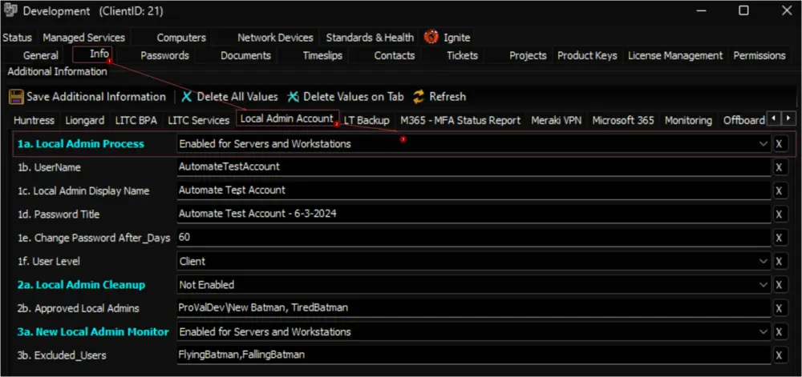

## Summary

The purpose of the monitor set is to identify machines that do not have the designated local admin account and machines where the password for the account has not been updated within the specified password age limit. The UserName and Password age parameters are configured in the system properties and client-level Extra Data Fields (EDFs), allowing for customization and adaptability to specific requirements.

Check the [Script's](/docs/a3038ecc-f851-4327-b1ca-a4ca485f6f9c) document for more information on EDFs, Script State, and System Properties used in the monitor set.

## Dependencies

[EPM - Windows Configuration - Script - Windows - Admin Account - Create/Update](/docs/a3038ecc-f851-4327-b1ca-a4ca485f6f9c)

## Target

With the exception of Domain Controllers, only Windows machines belonging to clients that have the `Enabled for Servers and Workstations` option selected for the `1a. Local Admin Process` EDF will be targeted. Selecting the `Enabled for Workstations Only` option will limit the local admin creation to workstations only.

## Alert Template

**Name:** `△ CUSTOM - Execute Script - Windows - Admin Account - Create/Update`

The alert template should run the [Windows - Admin Account - Create/Update](/docs/a3038ecc-f851-4327-b1ca-a4ca485f6f9c) script on the machines detected by the monitor set.