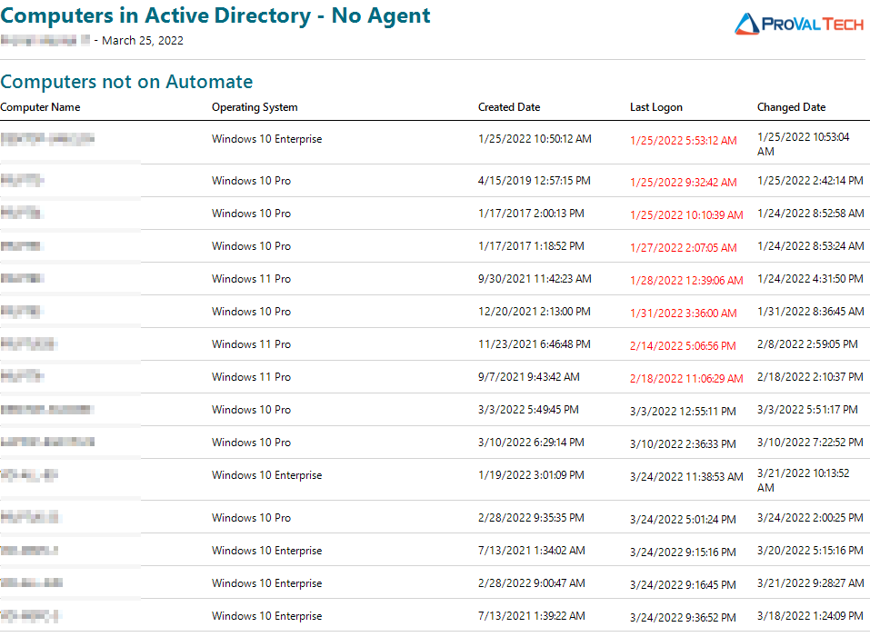

## Summary

The Computers in Active Directory - No Agent report displays a comprehensive list of all computers that are found in Active Directory while excluding those that are in ConnectWise Automate (CWA).

## Dependencies

This report is dependent on the following items:

- The Active Directory Plugin needs to be installed and configured.
- [AD - Create Views/Tables/Schedules for AD Reporting Solution](<../scripts/AD - Create ViewsTableSchedule for AD Reporting Solution.md>)

## Report Example

