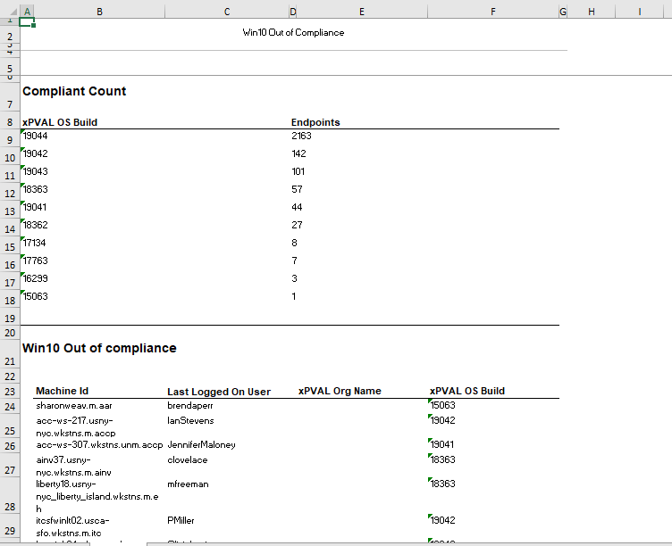

# Summary
This report is used to show the out of compliance machine and OS build count. We have combined two reports into a single report.

1. **Compliant Count**
2. **Win10 Out of Compliance**

# Dependencies
View: xpval OS Windows 10 

# Report Type
Report 

### Layout
List the report parts used. If custom report parts were designed during report creation, list their properties and attributes.

**_Compliant Count_**

- Report Parts Used
  - Audit  

- Custom Report Part 1
  - Audit Template  
  - Data Type: (table)
  - Columns: xPVAL OS Build, AgentGuid (Alias = Endpoints, Aggregate = COUNT)
  - Ordering and Grouping
    - Order By Columns (agentGuid, count, Descending)
    - Group By Columns
  - Filtering
    - Row Filter Settings (Distinct, Limit Types, Limit Values)
    - Date Filters
    - Advanced Filters (OS Information, Not Like, *Server*)
    - Advanced Filters (Operating System, Like, *Windows*)

List the report parts used. If custom report parts were designed during report creation, list their properties and attributes.

**_Win10 Out of Compliance_**

- Report Parts Used
  - Audit

- Custom Report Part 1
  - Audit Template
  - Data Type: (table)
  - Columns: Machine Id, Last Logged On User, xPVAL Org Name, xPVAL OS Build
  - Ordering and Grouping
    - Order By Columns (Group Name, None, Ascending)
    - Group By Columns (xPVAL Org Name)
  - Filtering
    - Row Filter Settings (Distinct, Limit Types, Limit Values)
    - Date Filters
    - Advanced Filters (OS Information, Not Like, *Server*)
    - Advanced Filters (Operating System, Like, *10*)
    - Advanced Filters (xPVAL OS Build, Not Like, *19044*)
    - Advanced Filters (xPVAL OS Build, Not Like, *190443*)

### General
- Report Format: (HTML)
- Paper Size
- Paper Orientation
- Custom Email Settings

### Cover Page, Header, Footer
Header, footer

### Sample Report

### Export Attachment
Attach the export XML of the report to this document.

