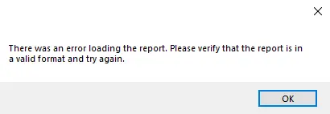
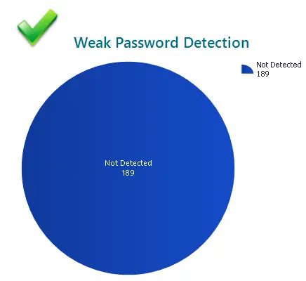
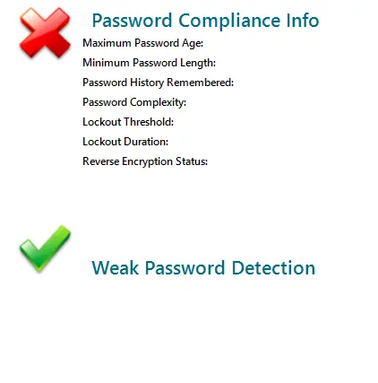

## Purpose

To provide clients with a professional-looking Active Directory report that they can present to their stakeholders and use to clean up their Active Directories.

## Reports Included

| Content                                                                                         | Type      | Function                                                                                                                              |
| ----------------------------------------------------------------------------------------------- | --------- | ------------------------------------------------------------------------------------------------------------------------------------- |
| [Report - Active Directory User Assessment](/docs/71ade073-cc5c-4833-bf2c-2d8b13472078)         | Report    | Displays an overall health view of the client's Active Directory along with a full user report                                        |
| [Report - Active Directory User Groups - Detail](/docs/e76e5bf4-d80e-4a53-ab39-a116c157e008)    | Report    | Displays a complete user list with all groups that each user is in, along with an overall view of which groups are used the most.     |
| [Report - Computers in Active Directory - No Agent](/docs/f3651662-8b77-4254-a8b3-8a945e3aab51) | Report    | Displays a list of all computers that are in Active Directory but not in Automate. Can be used to clean up client Active Directories. |
| SubPageHeaderLandscape                                                                          | Subreport | Used as the template for the page header on these reports.                                                                            |

## Associated Content

### Automate Content

| Content                                                                                                  | Type   | Function                                                                                                                                                                                                                                                                  |
| -------------------------------------------------------------------------------------------------------- | ------ | ------------------------------------------------------------------------------------------------------------------------------------------------------------------------------------------------------------------------------------------------------------------------- |
| [Weak Passwords - AD Test](/docs/cf22292d-e874-47ee-9bd1-5ec79c5f3724)                                   | Script | This script utilizes the agnostic script [Test-Credentials](/docs/9188a8e9-ba15-45aa-9391-d412866b1ebc) to test the hashed credentials in AD against a known compromised or weak list. It returns items to be placed into a custom table `plugin_proval_ad_pwd_audit`. |
| [AD - Create Views/Table/Schedule for AD Reporting Solution](/docs/f0b2fe2b-8bd8-4d9a-9428-2123b332aa49) | Script | This creates all of the necessary items in the database to ensure the [Active Directory Reporting Solution](/docs/ca5427f7-0efe-499d-9e80-c06698efa5d0) functions correctly.                                                                                              |

### Additional Content

| Content                                                                                                  | Type             | Function                                                                                                                                                                                                                                                                                                           |
| -------------------------------------------------------------------------------------------------------- | ---------------- | ------------------------------------------------------------------------------------------------------------------------------------------------------------------------------------------------------------------------------------------------------------------------------------------------------------------ |
| [Active Directory Reporting SQL Import Attachment](/docs/fff1e6ee-cc28-43da-87ef-cdb121414c76)           | Document         | Please download the Import_All_AD_Reports.sql attached to this document.                                                                                                                                                                                                                                           |
| [RSM - Active Directory - Agnostic - Test-WeakCredentials](/docs/9188a8e9-ba15-45aa-9391-d412866b1ebc  ) | Agnostic Content | Agnostic method of gathering information on users with potentially compromised passwords by querying currently available comprehensive lists of known password hashes. It is used in the Automate script [RSM - Active Directory - Script - Weak Passwords - AD Test](/docs/cf22292d-e874-47ee-9bd1-5ec79c5f3724). |

## Dependencies

These reports are dependent on the following items:

1. [AD - Create Views/Table/Schedule for AD Reporting Solution](/docs/f0b2fe2b-8bd8-4d9a-9428-2123b332aa49)
2. [RSM - Active Directory - Script - Weak Passwords - AD Test](/docs/cf22292d-e874-47ee-9bd1-5ec79c5f3724)
3. The Active Directory Plugin must be installed and configured for these reports to function.

## Implementation

1. Import the script [RSM - Active Directory - Script - Weak Passwords - AD Test](/docs/cf22292d-e874-47ee-9bd1-5ec79c5f3724) (This needs to be imported before creating the Table/Views/Schedule).
2. Import the script [AD - Create Views/Table/Schedule for AD Reporting Solution](/docs/f0b2fe2b-8bd8-4d9a-9428-2123b332aa49).
   - Run the script once to create the framework needed for the solution. **Delete the script afterward.**
3. Download the attached SQL file named 'Import_All_AD_Reports.sql'.  
   Refer to the document for the attachment:  
   [Active Directory Reporting SQL Import Attachment](/docs/fff1e6ee-cc28-43da-87ef-cdb121414c76)  
4. Import the file using System → General → Import → SQL File (The SQL file is too large for a remote monitor).

## FAQ

**Q: On the User Assessment Report, how do I get rid of the red X for Password Compliance Info?**  
A: A green check is displayed when all of the following conditions are met:  
   1. Minimum Password Length > 8 Characters  
   2. Password Complexity Enabled  
   3. Lock Threshold is not set to 'Never Lock Account'  
   4. Lockout Duration is >= 30 Minutes  
   5. Reverse Encryption is not enabled  

**Q: On the User Assessment Report, what does 'Weak Password Detection' mean?**  
A: The graph seen on the bottom right of the first page indicates whether or not the Active Directory password has been found in a password dictionary. Every password within Active Directory is audited via its hash and compared to the hashes of common passwords or breached ones. By default, the detection goes through a list of 38,647,798 different password combinations that are either common or have been compromised in some way. If a password is found in the dictionary, it will flag it as detected and highlight the user in the list below the graph.

**Q: On the User Assessment Report, what does it mean if a user account has 'Unknown' under the Account Controls column?**  
A: If you see a user that is reported as 'Unknown' status under Account Controls, it means that the user is using a combination of configuration settings that are not normally used. For example, if a user account is set up to have a non-expiring password, with reverse encryption enabled, and is also disabled, this may produce an 'Unknown' result. To fix this, you can either change the user to remove the uncommon setting (in the example case, this would be the reverse encryption enabled) or you can contact ProVal, and we should be able to update the report after getting information on that account.

**Q: On the Computers in Active Directory - No Agent Report, how can a machine in Active Directory have never logged into the domain controller?**  
A: Typically, if you see 'Never' for the last time the computer logged into the domain, this means it was a computer that was created on a past domain controller that has never logged into the new domain controller. It is normally safe to 'delete' these machines from Active Directory; however, I would recommend disabling them and then deleting them after a week or so just to be safe.

## Potential Problems

If you see the following error when opening one of the reports, it means at least one of the views or the custom table is missing and is unable to reference it. If they are all there, verify you have full permissions to the table and views.

If all of your clients do not have any detected weak passwords, the auditing script may not be scheduled. Check the following group to make sure: Service Plans/Windows Servers/Server Roles/Windows Servers Core Services/Domain Controllers. [The script should be scheduled here and limited against the 'Server Roles/Server Role - AD - Infrastructure Master' search - Running every Monday at 6:10 AM.]

If no data is displayed at all in these reports, check to make sure your Active Directory Plugin is installed and configured for the client you are running it on.

