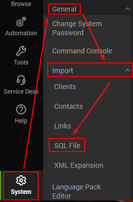

## Step 1
### Download Attached File

Please download the [Import_All_AD_Reports.SQL](https://proval.itglue.com/attachments/14013429) attached to this document for the EPM - Accounts - Report - Active Directory Reporting Solution.

## Step 2
### Import to Automate Environment

Import the file using System → General → Import → SQL File (The SQL file is too large for a remote monitor).

**Note:** Import the SQL file only after importing the script [RSM - Active Directory - Script - Weak Passwords - AD Test](/docs/cf22292d-e874-47ee-9bd1-5ec79c5f3724) and executing the script [AD - Create Views/Table/Schedule for AD Reporting Solution](/docs/f0b2fe2b-8bd8-4d9a-9428-2123b332aa49).
## Attachments
[Import_All_AD_Reports.sql](<../../../static/attachments/itg/15079008/Import_All_AD_Reports.sql>)