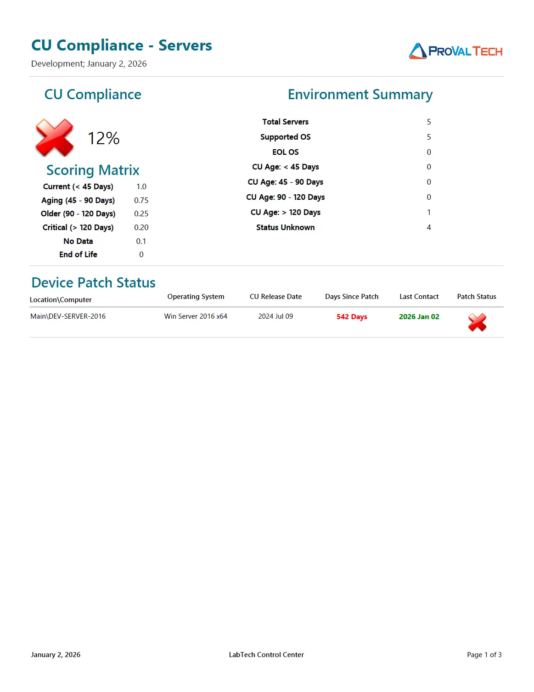

## Summary

The **CU Compliance and Audit - Servers** report provides a focused overview of the patch health for all managed server operating systems in the environment. Unlike standard patch reports that may simply count missing patches, this report focuses on the "freshness" of the operating system by calculating the age of the last installed Cumulative Update (CU).

This approach helps identify critical infrastructure that might report as "Fully Patched" in RMM but is actually stuck on an older monthly update due to failing Windows Update agents or other errors.

## Compliance Calculation

The overall **CU Compliance** percentage is calculated based on a weighted scoring system. Each server is assigned a point value between 0 and 1.0 depending on how recently its last Cumulative Update was installed.

**Formula:** `Compliance % = (Sum of all Device Scores / Total Number of Production Servers) * 100`

**Scoring Matrix:**  
The report uses the following weights to determine a server's score:

* **1.0 (100%)**: CU installed within the last **45 days**.
* **0.75 (75%)**: CU installed between **45 - 90 days** ago.
* **0.25 (25%)**: CU installed between **90 - 120 days** ago.
* **0.20 (20%)**: CU installed more than **120 days** ago.
* **0.10 (10%)**: **No Data / Unknown**. The server is supported, but Automate has not retrieved CU information.
* **0.00 (0%)**: **End of Life (EOL)**. The OS version is no longer supported by Microsoft (e.g., Server 2012 R2).

**Example Calculation:**  
Based on a sample environment with **5 Total Servers**:

* **0** servers are current (< 45 days) -> `0 * 1.0 = 0`
* **0** servers are aging (45-90 days) -> `0 * 0.75 = 0`
* **0** servers are older (90-120 days) -> `0 * 0.25 = 0`
* **1** server is critical (> 120 days) -> `1 * 0.20 = 0.20`
* **4** servers are status unknown -> `4 * 0.10 = 0.40`
* **0** servers are EOL -> `0 * 0.00 = 0`

**Total Score:** `0 + 0 + 0 + 0.20 + 0.40 + 0 = 0.60`  
**Calculation:** `(0.60 / 5) * 100`  
**Final Compliance:** `12%`

## Report Sections

**1. Environment Summary**  
This section provides a quick statistical breakdown of the server environment. It displays the total count of servers and groups them by their patch age category (Current, Aging, Critical) and Support status (Supported vs. EOL).

**2. Device Patch Status**  
This detailed list shows supported servers where the Last Cumulative Update date is known.

* **Columns**: Includes Computer Name, OS, CU Release Date, and Days Since Patch.
* **Purpose**: Use this to identify specific servers that are technically "active" but have not successfully applied a monthly update in a long time (e.g., a server showing >500 days since patch).

**3. No Audit Information**  
This section lists **Supported OS** servers (excluding EOL) where the CU information is currently missing or blank.

* **Context**: These servers result in a score of **0.1**.
* **Troubleshooting**: If this list is populated, it usually means the audit script has not run recently, or the server has been offline during the scan window.

**4. Non-Compliant Devices (EOL)**  
This section lists all servers running an Operating System version that has reached End of Life.

* **Context**: These servers automatically receive a score of **0**.
* **Risk**: EOL servers no longer receive public security updates and pose a severe security and compliance risk to the organization.

## Recommendations & Solutions

Based on the data presented in the report sections, the following actions are recommended:

* **High count in "No Audit Information"**:
If a large number of servers appear in this section, verify that the [Latest Installed Cumulative Update](/docs/991e926f-dcd2-4be3-9f3a-ea7ee9842da2) solution is scheduled and running correctly in Automate. This ensures patch dates are retrieved from the endpoint.
* **Critical Patch Age (> 120 Days)**:
For servers appearing in the "Device Patch Status" list with a high "Days Since Patch" count, manually investigate Windows Update on the server. These systems may require a manual intervention, reboot, or Windows Update component reset.
* **Servers in EOL**:
If servers appear in the "Non-Compliant Devices" list (e.g., Server 2012 R2), immediate planning for an OS migration or server replacement is required, as these cannot simply be "patched" to a compliant state.

## Dependencies

* [Custom Table - plugin_proval_windows_os_support](/docs/938cd822-f6a3-4ee3-add2-62b407e45622)
* [View - plugin_proval_computerpatchcompliance](/docs/f50c0f90-b8e1-4db9-bbb2-88887d5a21af)
* [View - plugin_proval_clientpatchstats](/docs/c553d954-7ded-4f34-ab94-91179848a280)
* [View - plugin_proval_clientpatchstatsserver](/docs/9ead43e2-1786-475d-b65b-ee600dc12c72)
* [View - plugin_proval_clientpatchstatsworkstation](/docs/56f4fea1-0a77-4014-9f2b-b587712ec308)
* [Script - MySQL - Views for Cumulative Update reports*](/docs/7174f88a-38fc-4e5a-83cc-1f48a6c29526)
* [Solution - Latest Installed Cumulative Update](/docs/991e926f-dcd2-4be3-9f3a-ea7ee9842da2)
* [Solution - CU Compliance Reporting](/docs/6dd7be85-8983-413b-8f56-1426446f25da)

## Sample Report

> Click this image to view full report

