## Ticket Example

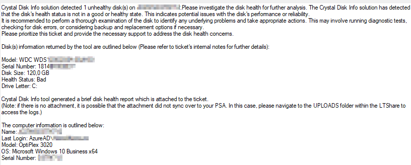

If you are reading this document, you should have received a ticket similar to the one above. This document is intended to step through the troubleshooting steps in getting this problem resolved.

### Prerequisites

Determine if the hard drive in question is an SSD or a Normal Spinning Disk:
- You can confirm whether the hard drive is an SSD by looking at the Health Status.
- **SSD** - If there is a percentage next to the health status, that indicates the life left of the SSD
  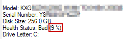
- **Spinning Disk** - If there is not a percentage, that means it is a spinning disk
  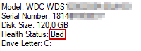

Click the section (On the left navigation section of this document) where your ticket is associated with to begin troubleshooting.

## Troubleshooting Steps:

### SSD

1. **Understanding the Flags that Crystal Disk Info is looking for:**
   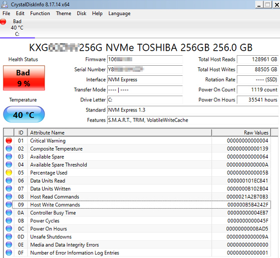
   Percentage Used - Color correlation
   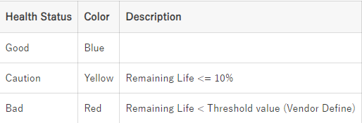
   - Note the Bad flag on the remaining life is completely Vendor defined. If the Percentage used is flagged as Red, it is recommended to replace the drive as soon as possible.
   - **The Critical Warning Flag**
     - This is vendor-controlled and the drive should be replaced if it is flagged as 'Red'
   (5 minutes)

2. You can run a different hard drive test, like seatools, on the drive to validate the hard drive is actually going bad.
   - [Seatools Download](https://www.seagate.com/support/downloads/seatools/)
   If the hard drive is not reporting bad, you can proceed to the next step. If it is reporting bad, recommend drive replacement.
   - Follow the Replacement Process, linked on the left, to recommend replacing the drive.
   (25 minutes)

3. Other than this, there is not much that can be done about a Solid State Drive other than replacing the drive or excluding it from the monitor using the 'Disks to Exclude from Disk Health Alerting' EDF.
   
   **NOTE**: Before excluding the drive from detection, it is highly recommended that this only be used as a last resort and confirm the client is fully aware the hard drive is going bad and is willing to let it die.
   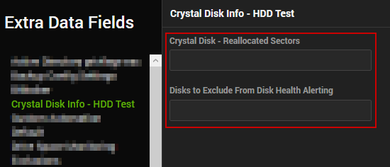
   (5 minutes)

### Spinning Disk

1. **Understanding the Flags that Crystal Disk is Looking for:**
   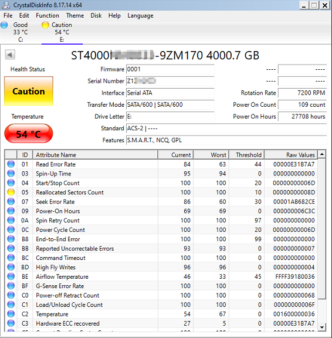
   
   The Big Flags from Spinning Disks:
   - **Reallocated Sectors Count**
     - This indicates the total number of times that the hard drive has run into an error when attempting to copy data to a specific sector of the hard drive and ultimately needed to move the data to a different spot on the hard drive. The health status is dependent on this smart value nearly every time on a spinning disk.
   
   Options:
   - You can run a different hard drive test, like seatools, on the drive to validate the hard drive is actually going bad.
     - [Seatools Download](https://www.seagate.com/support/downloads/seatools/)
   - OR - Skip to the next step
   (5 minutes)

2. If available, login to the machine using ScreenConnect Backstage Mode:
   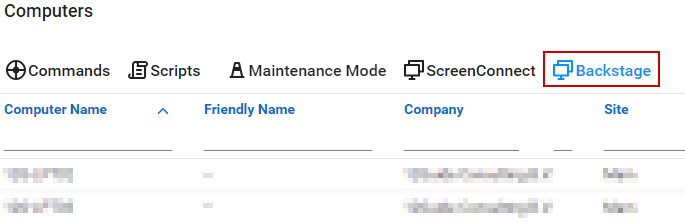
   (5 minutes)

3. Navigate out to the Storage Place for the Crystal Disk Info application. Currently, it is stored under
   ```
   C:/Programdata/_automation/CrystalDiskInfo/CrystalDiskInfo/DiskInfo64.exe
   ```
   But it may also be found here if the solution is not fully up to date:
   ```
   C:/CrystalDiskInfo/CrystalDiskInfo/DiskInfo64.exe
   ```
   Simply paste that line into the command prompt and it should open up Crystal Disk Info within backstage mode.
   
   If backstage mode was not an option, skip to the next step:
   (5 minutes)

4. Grab the HEX value of the Reallocated Sector Count stat to review how bad the drive is:
   - 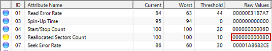
   - OR from the log file:
     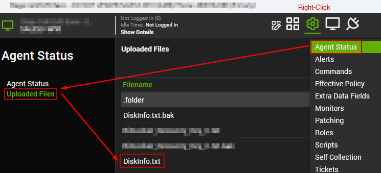
     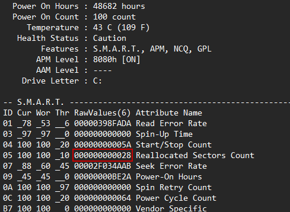
       - *Note*: The above screenshot is of a different drive which is why the values are different. This is just showing where the numbers can be found.
   - And run it through this converter: [Hex to Decimal Converter](https://www.rapidtables.com/convert/number/hex-to-decimal.html)
     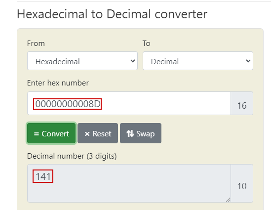
   (5 minutes)

5. Based on how high the Decimal value is, you will either want to replace the drive or watch for progression:
   - Lower values you can adjust the threshold on a per machine basis by following the steps below:
     1. Open the Computer Management screen for the machine in question.
     2. Right Click on the gear and select 'Extra Data Fields'.
     3. Navigate to the Crystal Disk Info - HDD Test tab and enter a higher value in the 'Crystal Disk - Reallocated Sectors' EDF than what was reported as the decimal number.
        - In the above example, I would set the threshold to 150.
        
   - If the Decimal value is higher than 500, I would say replace as soon as possible.
     - Follow the Replacement Process, linked on the left, to recommend replacing the drive.
   (5 minutes)

6. Then re-run the Crystal Disk Audit script on the machine to update the DB with the good information.
   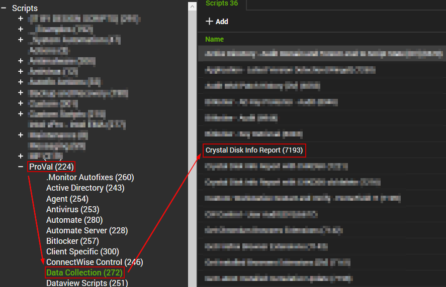
   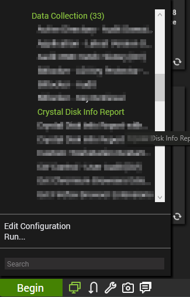
   (5 minutes)

## Replacement Process

1. Check to see if the PC is under Warranty:
   - If WarrantyMaster/ScalePad is Setup and Deployed
   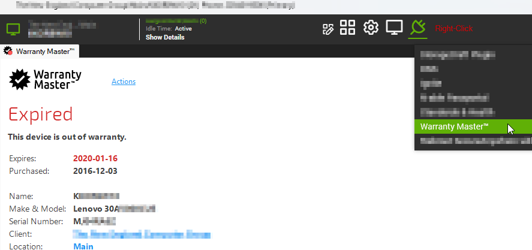
   - If this plugin is not setup, you will need to hit the 'Show Details' button in the Computer Management screen --&gt; Grab the S/N of the machine and look up the warranty status manually:
   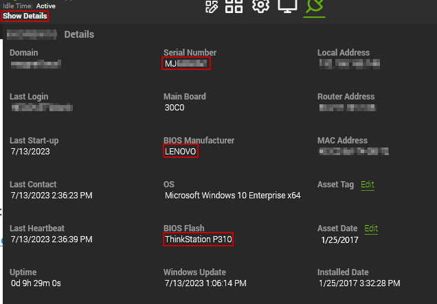
     - For Dell Machines: [Dell Warranty Check](https://www.dell.com/support/contractservices/en-us)
     - For HP Machines: [HP Warranty Check](https://support.hp.com/us-en/check-warranty)
     - For Lenovo Machines: [Lenovo Warranty Check](https://pcsupport.lenovo.com/us/en/warranty-lookup#/)

   (5 minutes)

2. If the machine is **not under warranty and is more than 5 years old**, a full PC replacement would be recommended rather than putting money towards an old machine.

3. If the **machine is under warranty**, an additional drive test may be required by the manufacturer to allow the drive to be replaced under warranty.

4. If the **machine had just recently expired with its warranty**, a replacement drive quote should be sent to the client for them to approve.
   - **NOTE**: Always recommend an SSD as the replacement. Spinning disks may be cheaper but they are much slower and not worth the headache.


